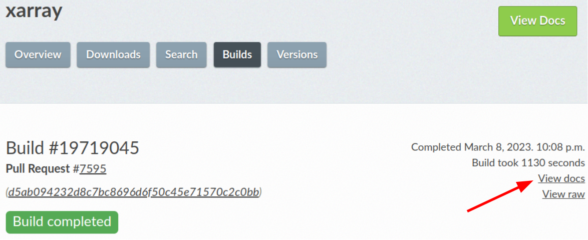

.. _contributing:

**********************
Contributing to xarray
**********************

.. note::

  Large parts of this document came from the `Pandas Contributing
  Guide <https://pandas.pydata.org/pandas-docs/stable/development/contributing.html>`_.

Overview
========

We welcome your skills and enthusiasm at the xarray project!. There are numerous opportunities to
contribute beyond just writing code.
All contributions, including bug reports, bug fixes, documentation improvements, enhancement suggestions,
and other ideas are welcome.

If you have any questions on the process or how to fix something feel free to ask us!
The recommended place to ask a question is  on `GitHub Discussions <https://github.com/pydata/xarray/discussions>`_
, but we also have a `Discord <https://discord.com/invite/wEKPCt4PDu>`_ and a
`mailing list <https://groups.google.com/g/xarray>`_. There is also a
`"python-xarray" tag on Stack Overflow <https://stackoverflow.com/questions/tagged/python-xarray>`_ which we monitor for questions.

We also have a biweekly community call, details of which are announced on the
`Developers meeting <https://docs.xarray.dev/en/stable/developers-meeting.html>`_.
You are very welcome to join! Though we would love to hear from you, there is no expectation to
contribute during the meeting either - you are always welcome to just sit in and listen.

This project is a community effort, and everyone is welcome to contribute. Everyone within the community
is expected to abide by our `code of conduct <https://github.com/pydata/xarray/blob/main/CODE_OF_CONDUCT.md>`_.

Where to start?
===============

If you are brand new to *xarray* or open-source development, we recommend going
through the `GitHub "issues" tab <https://github.com/pydata/xarray/issues>`_
to find issues that interest you.
Some issues are particularly suited for new contributors by the label `Documentation <https://github.com/pydata/xarray/labels/topic-documentation>`_
and `good first issue
<https://github.com/pydata/xarray/labels/contrib-good-first-issue>`_ where you could start out.
These are well documented issues, that do not require a deep understanding of the internals of xarray.

Once you've found an interesting issue, you can return here to get your development environment setup.
The xarray project does not assign issues. Issues are "assigned" by opening a Pull Request(PR).

.. _contributing.bug_reports:

Bug reports and enhancement requests
====================================

Bug reports are an important part of making *xarray* more stable. Having a complete bug
report will allow others to reproduce the bug and provide insight into fixing.

Trying out the bug-producing code on the *main* branch is often a worthwhile exercise
to confirm that the bug still exists. It is also worth searching existing bug reports and
pull requests to see if the issue has already been reported and/or fixed.

Submitting a bug report
-----------------------

If you find a bug in the code or documentation, do not hesitate to submit a ticket to the
`Issue Tracker <https://github.com/pydata/xarray/issues>`_.
You are also welcome to post feature requests or pull requests.

If you are reporting a bug, please use the provided template which includes the following:

#. Include a short, self-contained Python snippet reproducing the problem.
   You can format the code nicely by using `GitHub Flavored Markdown
   <https://github.github.com/github-flavored-markdown/>`_::

      ```python
      import xarray as xr
      ds = xr.Dataset(...)

      ...
      ```

#. Include the full version string of *xarray* and its dependencies. You can use the
   built in function::

      ```python
      import xarray as xr
      xr.show_versions()

      ...
      ```

#. Explain why the current behavior is wrong/not desired and what you expect instead.

The issue will then show up to the *xarray* community and be open to comments/ideas from others.

See this `stackoverflow article for tips on writing a good bug report <https://stackoverflow.com/help/mcve>`_ .


.. _contributing.github:

Now that you have an issue you want to fix, enhancement to add, or documentation
to improve, you need to learn how to work with GitHub and the *xarray* code base.

.. _contributing.version_control:

Version control, Git, and GitHub
================================

The code is hosted on `GitHub <https://www.github.com/pydata/xarray>`_. To
contribute you will need to sign up for a `free GitHub account
<https://github.com/signup/free>`_. We use `Git <https://git-scm.com/>`_ for
version control to allow many people to work together on the project.

Some great resources for learning Git:

* the `GitHub help pages <https://help.github.com/>`_.
* the `NumPy's documentation <https://numpy.org/doc/stable/dev/index.html>`_.
* Matthew Brett's `Pydagogue <https://matthew-brett.github.io/pydagogue/>`_.

Getting started with Git
------------------------

`GitHub has instructions for setting up Git <https://help.github.com/set-up-git-redirect>`__ including installing git,
setting up your SSH key, and configuring git.  All these steps need to be completed before
you can work seamlessly between your local repository and GitHub.

.. note::

    The following instructions assume you want to learn how to interact with github via the git command-line utility,
    but contributors who are new to git may find it easier to use other tools instead such as
    `Github Desktop <https://desktop.github.com/>`_.

Development workflow
====================

To keep your work well organized, with readable history, and in turn make it easier for project
maintainers to see what you've done, and why you did it, we recommend you to follow workflow:

1. `Create an account <https://github.com/>`_ on GitHub if you do not already have one.

2. You will need your own fork to work on the code. Go to the `xarray project
   page <https://github.com/pydata/xarray>`_ and hit the ``Fork`` button near the top of the page.
   This creates a copy of the code under your account on the GitHub server.

3. Clone your fork to your machine::

    git clone https://github.com/your-user-name/xarray.git
    cd xarray
    git remote add upstream https://github.com/pydata/xarray.git

   This creates the directory ``xarray`` and connects your repository to
   the upstream (main project) *xarray* repository.

Creating a development environment
----------------------------------

To test out code changes locally, you'll need to build *xarray* from source, which requires you to
`create a local development environment <https://docs.xarray.dev/en/stable/contributing.html#contributing-dev-env>`_.

Update the ``main`` branch
--------------------------

First make sure you have followed `Setting up xarray for development
<https://docs.xarray.dev/en/stable/contributing.html#creating-a-development-environment>`_

Before starting a new set of changes, fetch all changes from ``upstream/main``, and start a new
feature branch from that. From time to time you should fetch the upstream changes from GitHub: ::

    git fetch upstream
    git merge upstream/main

This will combine your commits with the latest *xarray* git ``main``.  If this
leads to merge conflicts, you must resolve these before submitting your pull
request.  If you have uncommitted changes, you will need to ``git stash`` them
prior to updating.  This will effectively store your changes, which can be
reapplied after updating.

Create a new feature branch
---------------------------

Create a branch to save your changes, even before you start making changes. You want your
``main branch`` to contain only production-ready code::

    git checkout -b shiny-new-feature

This changes your working directory to the ``shiny-new-feature`` branch.  Keep any changes in this
branch specific to one bug or feature so it is clear what the branch brings to *xarray*. You can have
many "shiny-new-features" and switch in between them using the ``git checkout`` command.

Generally, you will want to keep your feature branches on your public GitHub fork of xarray. To do this,
you ``git push`` this new branch up to your GitHub repo. Generally (if you followed the instructions in
these pages, and by default), git will have a link to your fork of the GitHub repo, called ``origin``.
You push up to your own fork with: ::

    git push origin shiny-new-feature

In git >= 1.7 you can ensure that the link is correctly set by using the ``--set-upstream`` option: ::

    git push --set-upstream origin shiny-new-feature

From now on git will know that ``shiny-new-feature`` is related to the ``shiny-new-feature branch`` in the GitHub repo.

The editing workflow
--------------------

1. Make some changes

2. See which files have changed with ``git status``. You'll see a listing like this one: ::

    # On branch shiny-new-feature
    # Changed but not updated:
    #   (use "git add <file>..." to update what will be committed)
    #   (use "git checkout -- <file>..." to discard changes in working directory)
    #
    #  modified:   README

3. Check what the actual changes are with ``git diff``.

4. Build the `documentation run <https://docs.xarray.dev/en/stable/contributing.html#building-the-documentation>`_
for the documentation changes.

`Run the test suite <https://docs.xarray.dev/en/stable/contributing.html#running-the-test-suite>`_ for code changes.

Commit and push your changes
----------------------------

1. To commit all modified files into the local copy of your repo, do ``git commit -am 'A commit message'``.

2. To push the changes up to your forked repo on GitHub, do a ``git push``.

Open a pull request
-------------------

When you're ready or need feedback on your code, open a Pull Request (PR) so that the xarray developers can
give feedback and eventually include your suggested code into the ``main`` branch.
`Pull requests (PRs) on GitHub <https://docs.github.com/en/pull-requests/collaborating-with-pull-requests/proposing-changes-to-your-work-with-pull-requests/about-pull-requests>`_
are the mechanism for contributing to xarray's code and documentation.

Enter a title for the set of changes with some explanation of what you've done.
Follow the PR template, which looks like this. ::

    [ ]Closes #xxxx
    [ ]Tests added
    [ ]User visible changes (including notable bug fixes) are documented in whats-new.rst
    [ ]New functions/methods are listed in api.rst

Mention anything you'd like particular attention for - such as a complicated change or some code you are not happy with.
If you don't think your request is ready to be merged, just say so in your pull request message and use
the "Draft PR" feature of GitHub. This is a good way of getting some preliminary code review.

.. _contributing.dev_env:

Creating a development environment
==================================

To test out code changes locally, you'll need to build *xarray* from source, which
requires a Python environment. If you're making documentation changes, you can
skip to :ref:`contributing.documentation` but you won't be able to build the
documentation locally before pushing your changes.

.. note::

    For small changes, such as fixing a typo, you don't necessarily need to build and test xarray locally.
    If you make your changes then :ref:`commit and push them to a new branch <contributing.changes>`,
    xarray's automated :ref:`continuous integration tests <contributing.ci>` will run and check your code in various ways.
    You can then try to fix these problems by committing and pushing more commits to the same branch.

    You can also avoid building the documentation locally by instead :ref:`viewing the updated documentation via the CI <contributing.pr>`.

    To speed up this feedback loop or for more complex development tasks you should build and test xarray locally.


.. _contributing.dev_python:

Creating a Python Environment
-----------------------------

Before starting any development, you'll need to create an isolated xarray
development environment:

- Install either `Anaconda <https://www.anaconda.com/download/>`_ or `miniconda
  <https://conda.io/miniconda.html>`_
- Make sure your conda is up to date (``conda update conda``)
- Make sure that you have :ref:`cloned the repository <contributing.forking>`
- ``cd`` to the *xarray* source directory

We'll now kick off a two-step process:

1. Install the build dependencies
2. Build and install xarray

.. code-block:: sh

   # Create and activate the build environment
   conda create -c conda-forge -n xarray-tests python=3.10

   # This is for Linux and MacOS
   conda env update -f ci/requirements/environment.yml

   # On windows, use environment-windows.yml instead
   conda env update -f ci/requirements/environment-windows.yml

   conda activate xarray-tests

   # or with older versions of Anaconda:
   source activate xarray-tests

   # Build and install xarray
   pip install -e .

At this point you should be able to import *xarray* from your locally
built version:

.. code-block:: sh

   $ python  # start an interpreter
   >>> import xarray
   >>> xarray.__version__
   '0.10.0+dev46.g015daca'

This will create the new environment, and not touch any of your existing environments,
nor any existing Python installation.

To view your environments::

      conda info -e

To return to your root environment::

      conda deactivate

See the full `conda docs here <https://conda.pydata.org/docs>`__.

Install pre-commit hooks
------------------------

We highly recommend that you setup `pre-commit <https://pre-commit.com/>`_ hooks to automatically
run all the above tools every time you make a git commit. To install the hooks::

    python -m pip install pre-commit
    pre-commit install

This can be done by running: ::

    pre-commit run

from the root of the xarray repository. You can skip the pre-commit checks with
``git commit --no-verify``.

.. _contributing.documentation:

Contributing to the documentation
=================================

If you're not the developer type, contributing to the documentation is still of
huge value. You don't even have to be an expert on *xarray* to do so! In fact,
there are sections of the docs that are worse off after being written by
experts. If something in the docs doesn't make sense to you, updating the
relevant section after you figure it out is a great way to ensure it will help
the next person.

.. contents:: Documentation:
   :local:


About the *xarray* documentation
--------------------------------

The documentation is written in **reStructuredText**, which is almost like writing
in plain English, and built using `Sphinx <https://www.sphinx-doc.org/>`__. The
Sphinx Documentation has an excellent `introduction to reST
<https://www.sphinx-doc.org/en/master/usage/restructuredtext/basics.html>`__. Review the Sphinx docs to perform more
complex changes to the documentation as well.

Some other important things to know about the docs:

- The *xarray* documentation consists of two parts: the docstrings in the code
  itself and the docs in this folder ``xarray/doc/``.

  The docstrings are meant to provide a clear explanation of the usage of the
  individual functions, while the documentation in this folder consists of
  tutorial-like overviews per topic together with some other information
  (what's new, installation, etc).

- The docstrings follow the **NumPy Docstring Standard**, which is used widely
  in the Scientific Python community. This standard specifies the format of
  the different sections of the docstring. Refer to the `documentation for the Numpy docstring format
  <https://numpydoc.readthedocs.io/en/latest/format.html#docstring-standard>`_
  for a detailed explanation, or look at some of the existing functions to
  extend it in a similar manner.

- The tutorials make heavy use of the `ipython directive
  <https://matplotlib.org/sampledoc/ipython_directive.html>`_ sphinx extension.
  This directive lets you put code in the documentation which will be run
  during the doc build. For example:

  .. code:: rst

      .. ipython:: python

          x = 2
          x**3

  will be rendered as::

      In [1]: x = 2

      In [2]: x**3
      Out[2]: 8

  Almost all code examples in the docs are run (and the output saved) during the
  doc build. This approach means that code examples will always be up to date,
  but it does make building the docs a bit more complex.

- Our API documentation in ``doc/api.rst`` houses the auto-generated
  documentation from the docstrings. For classes, there are a few subtleties
  around controlling which methods and attributes have pages auto-generated.

  Every method should be included in a ``toctree`` in ``api.rst``, else Sphinx
  will emit a warning.


How to build the *xarray* documentation
---------------------------------------

Requirements
~~~~~~~~~~~~
Make sure to follow the instructions on :ref:`creating a development environment above <contributing.dev_env>`, but
to build the docs you need to use the environment file ``ci/requirements/doc.yml``.
You should also use this environment and these steps if you want to view changes you've made to the docstrings.

.. code-block:: sh

    # Create and activate the docs environment
    conda env create -f ci/requirements/doc.yml
    conda activate xarray-docs

    # or with older versions of Anaconda:
    source activate xarray-docs

    # Build and install a local, editable version of xarray
    pip install -e .

Building the documentation
~~~~~~~~~~~~~~~~~~~~~~~~~~

To build the documentation run::

    cd doc/
    make html

Then you can find the HTML output files in the folder ``xarray/doc/_build/html/``.

To see what the documentation now looks like with your changes, you can view the HTML build locally by opening the files in your local browser.
For example, if you normally use Google Chrome as your browser, you could enter::

    google-chrome _build/html/quick-overview.html

in the terminal, running from within the ``doc/`` folder.
You should now see a new tab pop open in your local browser showing the ``quick-overview`` page of the documentation.
The different pages of this local build of the documentation are linked together,
so you can browse the whole documentation by following links the same way you would on the officially-hosted xarray docs site.

The first time you build the docs, it will take quite a while because it has to run
all the code examples and build all the generated docstring pages. In subsequent
evocations, Sphinx will try to only build the pages that have been modified.

If you want to do a full clean build, do::

    make clean
    make html

Writing ReST pages
------------------

Most documentation is either in the docstrings of individual classes and methods, in explicit
``.rst`` files, or in examples and tutorials. All of these use the
`ReST <https://docutils.sourceforge.io/rst.html>`_ syntax and are processed by
`Sphinx <https://www.sphinx-doc.org/en/master/>`_.

This section contains additional information and conventions how ReST is used in the
xarray documentation.

Section formatting
~~~~~~~~~~~~~~~~~~

We aim to follow the recommendations from the
`Python documentation <https://devguide.python.org/documentation/start-documenting/index.html#sections>`_
and the `Sphinx reStructuredText documentation <https://www.sphinx-doc.org/en/master/usage/restructuredtext/basics.html#sections>`_
for section markup characters,

- ``*`` with overline, for chapters

- ``=``, for heading

- ``-``, for sections

- ``~``, for subsections

- ``**`` text ``**``, for **bold** text

Referring to other documents and sections
~~~~~~~~~~~~~~~~~~~~~~~~~~~~~~~~~~~~~~~~~

`Sphinx  <https://www.sphinx-doc.org/en/master/>`_ allows internal
`references <https://www.sphinx-doc.org/en/master/usage/restructuredtext/roles.html>`_ between documents.

Documents can be linked with the ``:doc:`` directive:

::

    See the :doc:`/getting-started-guide/installing`

    See the :doc:`/getting-started-guide/quick-overview`

will render as:

See the `Installation <https://docs.xarray.dev/en/stable/getting-started-guide/installing.html>`_

See the `Quick Overview <https://docs.xarray.dev/en/stable/getting-started-guide/quick-overview.html>`_

Including figures and files
~~~~~~~~~~~~~~~~~~~~~~~~~~~

Image files can be directly included in pages with the ``image::`` directive.

.. _contributing.code:

Contributing to the code base
=============================

.. contents:: Code Base:
   :local:

Code standards
--------------

Writing good code is not just about what you write. It is also about *how* you
write it. During :ref:`Continuous Integration <contributing.ci>` testing, several
tools will be run to check your code for stylistic errors.
Generating any warnings will cause the test to fail.
Thus, good style is a requirement for submitting code to *xarray*.

In addition, because a lot of people use our library, it is important that we
do not make sudden changes to the code that could have the potential to break
a lot of user code as a result, that is, we need it to be as *backwards compatible*
as possible to avoid mass breakages.

Code Formatting
~~~~~~~~~~~~~~~

xarray uses several tools to ensure a consistent code format throughout the project:

- `ruff <https://github.com/astral-sh/ruff>`_ for formatting, code quality checks and standardized order in imports
- `absolufy-imports <https://github.com/MarcoGorelli/absolufy-imports>`_ for absolute instead of relative imports from different files,
- `mypy <https://mypy-lang.org/>`_ for static type checking on `type hints
  <https://docs.python.org/3/library/typing.html>`_.

We highly recommend that you setup `pre-commit hooks <https://pre-commit.com/>`_
to automatically run all the above tools every time you make a git commit. This
can be done by running::

   pre-commit install

from the root of the xarray repository. You can skip the pre-commit checks
with ``git commit --no-verify``.


Backwards Compatibility
~~~~~~~~~~~~~~~~~~~~~~~

Please try to maintain backwards compatibility. *xarray* has a growing number of users with
lots of existing code, so don't break it if at all possible.  If you think breakage is
required, clearly state why as part of the pull request.

Be especially careful when changing function and method signatures, because any change
may require a deprecation warning. For example, if your pull request means that the
argument ``old_arg`` to ``func`` is no longer valid, instead of simply raising an error if
a user passes ``old_arg``, we would instead catch it:

.. code-block:: python

    def func(new_arg, old_arg=None):
        if old_arg is not None:
            from warnings import warn

            warn(
                "`old_arg` has been deprecated, and in the future will raise an error."
                "Please use `new_arg` from now on.",
                DeprecationWarning,
            )

            # Still do what the user intended here

This temporary check would then be removed in a subsequent version of xarray.
This process of first warning users before actually breaking their code is known as a
"deprecation cycle", and makes changes significantly easier to handle both for users
of xarray, and for developers of other libraries that depend on xarray.


.. _contributing.ci:

Testing With Continuous Integration
-----------------------------------

The *xarray* test suite runs automatically via the
`GitHub Actions <https://docs.github.com/en/free-pro-team@latest/actions>`__,
continuous integration service, once your pull request is submitted.

A pull-request will be considered for merging when you have an all 'green' build. If any
tests are failing, then you will get a red 'X', where you can click through to see the
individual failed tests. This is an example of a green build.

.. image:: _static/ci.png

.. note::

   Each time you push to your PR branch, a new run of the tests will be
   triggered on the CI. If they haven't already finished, tests for any older
   commits on the same branch will be automatically cancelled.

.. _contributing.tdd:


Test-driven development/code writing
------------------------------------

*xarray* is serious about testing and strongly encourages contributors to embrace
`test-driven development (TDD) <https://en.wikipedia.org/wiki/Test-driven_development>`_.
This development process "relies on the repetition of a very short development cycle:
first the developer writes an (initially failing) automated test case that defines a desired
improvement or new function, then produces the minimum amount of code to pass that test."
So, before actually writing any code, you should write your tests.  Often the test can be
taken from the original GitHub issue.  However, it is always worth considering additional
use cases and writing corresponding tests.

Adding tests is one of the most common requests after code is pushed to *xarray*.  Therefore,
it is worth getting in the habit of writing tests ahead of time so that this is never an issue.

Like many packages, *xarray* uses `pytest
<https://doc.pytest.org/en/latest/>`_ and the convenient
extensions in `numpy.testing
<https://numpy.org/doc/stable/reference/routines.testing.html>`_.

Writing tests
~~~~~~~~~~~~~

All tests should go into the ``tests`` subdirectory of the specific package.
This folder contains many current examples of tests, and we suggest looking to these for
inspiration.

The ``xarray.testing`` module has many special ``assert`` functions that
make it easier to make statements about whether DataArray or Dataset objects are
equivalent. The easiest way to verify that your code is correct is to
explicitly construct the result you expect, then compare the actual result to
the expected correct result::

    def test_constructor_from_0d():
        expected = Dataset({None: ([], 0)})[None]
        actual = DataArray(0)
        assert_identical(expected, actual)

Transitioning to ``pytest``
~~~~~~~~~~~~~~~~~~~~~~~~~~~

*xarray* existing test structure is *mostly* class-based, meaning that you will
typically find tests wrapped in a class.

.. code-block:: python

    class TestReallyCoolFeature: ...

Going forward, we are moving to a more *functional* style using the
`pytest <https://doc.pytest.org/en/latest/>`__ framework, which offers a richer
testing framework that will facilitate testing and developing. Thus, instead of
writing test classes, we will write test functions like this:

.. code-block:: python

    def test_really_cool_feature(): ...

Using ``pytest``
~~~~~~~~~~~~~~~~

Here is an example of a self-contained set of tests that illustrate multiple
features that we like to use.

- functional style: tests are like ``test_*`` and *only* take arguments that are either
  fixtures or parameters
- ``pytest.mark`` can be used to set metadata on test functions, e.g. ``skip`` or ``xfail``.
- using ``parametrize``: allow testing of multiple cases
- to set a mark on a parameter, ``pytest.param(..., marks=...)`` syntax should be used
- ``fixture``, code for object construction, on a per-test basis
- using bare ``assert`` for scalars and truth-testing
- ``assert_equal`` and ``assert_identical`` from the ``xarray.testing`` module for xarray object comparisons.
- the typical pattern of constructing an ``expected`` and comparing versus the ``result``

We would name this file ``test_cool_feature.py`` and put in an appropriate place in the
``xarray/tests/`` structure.

.. code-block:: python

    import pytest
    import numpy as np
    import xarray as xr
    from xarray.testing import assert_equal


    @pytest.mark.parametrize("dtype", ["int8", "int16", "int32", "int64"])
    def test_dtypes(dtype):
        assert str(np.dtype(dtype)) == dtype


    @pytest.mark.parametrize(
        "dtype",
        [
            "float32",
            pytest.param("int16", marks=pytest.mark.skip),
            pytest.param(
                "int32", marks=pytest.mark.xfail(reason="to show how it works")
            ),
        ],
    )
    def test_mark(dtype):
        assert str(np.dtype(dtype)) == "float32"


    @pytest.fixture
    def dataarray():
        return xr.DataArray([1, 2, 3])


    @pytest.fixture(params=["int8", "int16", "int32", "int64"])
    def dtype(request):
        return request.param


    def test_series(dataarray, dtype):
        result = dataarray.astype(dtype)
        assert result.dtype == dtype

        expected = xr.DataArray(np.array([1, 2, 3], dtype=dtype))
        assert_equal(result, expected)


A test run of this yields

.. code-block:: shell

    ((xarray) $ pytest test_cool_feature.py -v
    ================================= test session starts ==================================
    platform darwin -- Python 3.10.6, pytest-7.2.0, pluggy-1.0.0 --
    cachedir: .pytest_cache
    plugins: hypothesis-6.56.3, cov-4.0.0
    collected 11 items

    xarray/tests/test_cool_feature.py::test_dtypes[int8] PASSED                       [  9%]
    xarray/tests/test_cool_feature.py::test_dtypes[int16] PASSED                      [ 18%]
    xarray/tests/test_cool_feature.py::test_dtypes[int32] PASSED                      [ 27%]
    xarray/tests/test_cool_feature.py::test_dtypes[int64] PASSED                      [ 36%]
    xarray/tests/test_cool_feature.py::test_mark[float32] PASSED                      [ 45%]
    xarray/tests/test_cool_feature.py::test_mark[int16] SKIPPED (unconditional skip)  [ 54%]
    xarray/tests/test_cool_feature.py::test_mark[int32] XFAIL (to show how it works)  [ 63%]
    xarray/tests/test_cool_feature.py::test_series[int8] PASSED                       [ 72%]
    xarray/tests/test_cool_feature.py::test_series[int16] PASSED                      [ 81%]
    xarray/tests/test_cool_feature.py::test_series[int32] PASSED                      [ 90%]
    xarray/tests/test_cool_feature.py::test_series[int64] PASSED                      [100%]


    ==================== 9 passed, 1 skipped, 1 xfailed in 1.83 seconds ====================

Tests that we have ``parametrized`` are now accessible via the test name, for
example we could run these with ``-k int8`` to sub-select *only* those tests
which match ``int8``.


.. code-block:: shell

   ((xarray) bash-3.2$ pytest  test_cool_feature.py  -v -k int8
   ================================== test session starts ==================================
   platform darwin -- Python 3.10.6, pytest-7.2.0, pluggy-1.0.0 --
   cachedir: .pytest_cache
   plugins: hypothesis-6.56.3, cov-4.0.0
   collected 11 items

   test_cool_feature.py::test_dtypes[int8] PASSED
   test_cool_feature.py::test_series[int8] PASSED


Running the test suite
----------------------

The tests can then be run directly inside your Git clone (without having to
install *xarray*) by typing::

    pytest xarray

The tests suite is exhaustive and takes a few minutes.  Often it is
worth running only a subset of tests first around your changes before running the
entire suite.

The easiest way to do this is with::

    pytest xarray/path/to/test.py -k regex_matching_test_name

Or with one of the following constructs::

    pytest xarray/tests/[test-module].py
    pytest xarray/tests/[test-module].py::[TestClass]
    pytest xarray/tests/[test-module].py::[TestClass]::[test_method]

Using `pytest-xdist <https://pypi.python.org/pypi/pytest-xdist>`_, one can
speed up local testing on multicore machines, by running pytest with the optional -n argument::

    pytest xarray -n 4

This can significantly reduce the time it takes to locally run tests before
submitting a pull request.

For more, see the `pytest <https://doc.pytest.org/en/latest/>`_ documentation.

Running the performance test suite
----------------------------------

Performance matters and it is worth considering whether your code has introduced
performance regressions.  *xarray* is starting to write a suite of benchmarking tests
using `asv <https://github.com/airspeed-velocity/asv>`__
to enable easy monitoring of the performance of critical *xarray* operations.
These benchmarks are all found in the ``xarray/asv_bench`` directory.

To use all features of asv, you will need either ``conda`` or
``virtualenv``. For more details please check the `asv installation
webpage <https://asv.readthedocs.io/en/stable/installing.html>`_.

To install asv::

    python -m pip install asv

If you need to run a benchmark, change your directory to ``asv_bench/`` and run::

    asv continuous -f 1.1 upstream/main HEAD

You can replace ``HEAD`` with the name of the branch you are working on,
and report benchmarks that changed by more than 10%.
The command uses ``conda`` by default for creating the benchmark
environments. If you want to use virtualenv instead, write::

    asv continuous -f 1.1 -E virtualenv upstream/main HEAD

The ``-E virtualenv`` option should be added to all ``asv`` commands
that run benchmarks. The default value is defined in ``asv.conf.json``.

Running the full benchmark suite can take up to one hour and use up a few GBs of RAM.
Usually it is sufficient to paste only a subset of the results into the pull
request to show that the committed changes do not cause unexpected performance
regressions.  You can run specific benchmarks using the ``-b`` flag, which
takes a regular expression.  For example, this will only run tests from a
``xarray/asv_bench/benchmarks/groupby.py`` file::

    asv continuous -f 1.1 upstream/main HEAD -b ^groupby

If you want to only run a specific group of tests from a file, you can do it
using ``.`` as a separator. For example::

    asv continuous -f 1.1 upstream/main HEAD -b groupby.GroupByMethods

will only run the ``GroupByMethods`` benchmark defined in ``groupby.py``.

You can also run the benchmark suite using the version of *xarray*
already installed in your current Python environment. This can be
useful if you do not have ``virtualenv`` or ``conda``, or are using the
``setup.py develop`` approach discussed above; for the in-place build
you need to set ``PYTHONPATH``, e.g.
``PYTHONPATH="$PWD/.." asv [remaining arguments]``.
You can run benchmarks using an existing Python
environment by::

    asv run -e -E existing

or, to use a specific Python interpreter,::

    asv run -e -E existing:python3.10

This will display stderr from the benchmarks, and use your local
``python`` that comes from your ``$PATH``.

Learn `how to write a benchmark and how to use asv from the documentation <https://asv.readthedocs.io/en/latest/writing_benchmarks.html>`_ .


..
   TODO: uncomment once we have a working setup
         see https://github.com/pydata/xarray/pull/5066

   The *xarray* benchmarking suite is run remotely and the results are
   available `here <https://pandas.pydata.org/speed/xarray/>`_.

Documenting your code
---------------------

Changes should be reflected in the release notes located in ``doc/whats-new.rst``.
This file contains an ongoing change log for each release.  Add an entry to this file to
document your fix, enhancement or (unavoidable) breaking change.  Make sure to include the
GitHub issue number when adding your entry (using ``:issue:`1234```, where ``1234`` is the
issue/pull request number).

If your code is an enhancement, it is most likely necessary to add usage
examples to the existing documentation.  This can be done by following the :ref:`guidelines for contributing to the documentation <contributing.documentation>`.

.. _contributing.changes:

Contributing your changes to *xarray*
=====================================

.. _contributing.committing:

Committing your code
--------------------

Keep style fixes to a separate commit to make your pull request more readable.

Once you've made changes, you can see them by typing::

    git status

If you have created a new file, it is not being tracked by git. Add it by typing::

    git add path/to/file-to-be-added.py

Doing 'git status' again should give something like::

    # On branch shiny-new-feature
    #
    #       modified:   /relative/path/to/file-you-added.py
    #

The following defines how a commit message should ideally be structured:

* A subject line with ``< 72`` chars.
* One blank line.
* Optionally, a commit message body.

Please reference the relevant GitHub issues in your commit message using ``GH1234`` or
``#1234``.  Either style is fine, but the former is generally preferred.

Now you can commit your changes in your local repository::

    git commit -m


.. _contributing.pushing:

Pushing your changes
--------------------

When you want your changes to appear publicly on your GitHub page, push your
forked feature branch's commits::

    git push origin shiny-new-feature

Here ``origin`` is the default name given to your remote repository on GitHub.
You can see the remote repositories::

    git remote -v

If you added the upstream repository as described above you will see something
like::

    origin  git@github.com:yourname/xarray.git (fetch)
    origin  git@github.com:yourname/xarray.git (push)
    upstream        git://github.com/pydata/xarray.git (fetch)
    upstream        git://github.com/pydata/xarray.git (push)

Now your code is on GitHub, but it is not yet a part of the *xarray* project.  For that to
happen, a pull request needs to be submitted on GitHub.

.. _contributing.review:

Review your code
----------------

When you're ready to ask for a code review, file a pull request. Before you do, once
again make sure that you have followed all the guidelines outlined in this document
regarding code style, tests, performance tests, and documentation. You should also
double check your branch changes against the branch it was based on:

#. Navigate to your repository on GitHub -- https://github.com/your-user-name/xarray
#. Click on ``Branches``
#. Click on the ``Compare`` button for your feature branch
#. Select the ``base`` and ``compare`` branches, if necessary. This will be ``main`` and
   ``shiny-new-feature``, respectively.

.. _contributing.pr:

Finally, make the pull request
------------------------------

If everything looks good, you are ready to make a pull request.  A pull request is how
code from a local repository becomes available to the GitHub community and can be looked
at and eventually merged into the ``main`` version.  This pull request and its associated
changes will eventually be committed to the ``main`` branch and available in the next
release.  To submit a pull request:

#. Navigate to your repository on GitHub
#. Click on the ``Pull Request`` button
#. You can then click on ``Commits`` and ``Files Changed`` to make sure everything looks
   okay one last time
#. Write a description of your changes in the ``Preview Discussion`` tab
#. Click ``Send Pull Request``.

This request then goes to the repository maintainers, and they will review
the code.

If you have made updates to the documentation, you can now see a preview of the updated docs by clicking on "Details" under
the ``docs/readthedocs.org`` check near the bottom of the list of checks that run automatically when submitting a PR,
then clicking on the "View Docs" button on the right (not the big green button, the small black one further down).




If you need to make more changes, you can make them in
your branch, add them to a new commit, push them to GitHub, and the pull request
will automatically be updated.  Pushing them to GitHub again is done by::

    git push origin shiny-new-feature

This will automatically update your pull request with the latest code and restart the
:ref:`Continuous Integration <contributing.ci>` tests.


.. _contributing.delete:

Delete your merged branch (optional)
------------------------------------

Once your feature branch is accepted into upstream, you'll probably want to get rid of
the branch. First, update your ``main`` branch to check that the merge was successful::

    git fetch upstream
    git checkout main
    git merge upstream/main

Then you can do::

    git branch -D shiny-new-feature

You need to use a upper-case ``-D`` because the branch was squashed into a
single commit before merging. Be careful with this because ``git`` won't warn
you if you accidentally delete an unmerged branch.

If you didn't delete your branch using GitHub's interface, then it will still exist on
GitHub. To delete it there do::

    git push origin --delete shiny-new-feature


.. _contributing.checklist:

PR checklist
------------

- **Properly comment and document your code.** See `"Documenting your code" <https://docs.xarray.dev/en/stable/contributing.html#documenting-your-code>`_.
- **Test that the documentation builds correctly** by typing ``make html`` in the ``doc`` directory. This is not strictly necessary, but this may be easier than waiting for CI to catch a mistake. See `"Contributing to the documentation" <https://docs.xarray.dev/en/stable/contributing.html#contributing-to-the-documentation>`_.
- **Test your code**.

  - Write new tests if needed. See `"Test-driven development/code writing" <https://docs.xarray.dev/en/stable/contributing.html#test-driven-development-code-writing>`_.
  - Test the code using `Pytest <https://doc.pytest.org/en/latest/>`_. Running all tests (type ``pytest`` in the root directory) takes a while, so feel free to only run the tests you think are needed based on your PR (example: ``pytest xarray/tests/test_dataarray.py``). CI will catch any failing tests.
  - By default, the upstream dev CI is disabled on pull request and push events. You can override this behavior per commit by adding a ``[test-upstream]`` tag to the first line of the commit message. For documentation-only commits, you can skip the CI per commit by adding a ``[skip-ci]`` tag to the first line of the commit message.

- **Properly format your code** and verify that it passes the formatting guidelines set by `ruff <https://github.com/astral-sh/ruff>`_. See `"Code formatting" <https://docs.xarray.dev/en/stablcontributing.html#code-formatting>`_. You can use `pre-commit <https://pre-commit.com/>`_ to run these automatically on each commit.

  - Run ``pre-commit run --all-files`` in the root directory. This may modify some files. Confirm and commit any formatting changes.

- **Push your code** and `create a PR on GitHub <https://help.github.com/en/articles/creating-a-pull-request>`_.
- **Use a helpful title for your pull request** by summarizing the main contributions rather than using the latest commit message. If the PR addresses an `issue <https://github.com/pydata/xarray/issues>`_, please `reference it <https://help.github.com/en/articles/autolinked-references-and-urls>`_.
