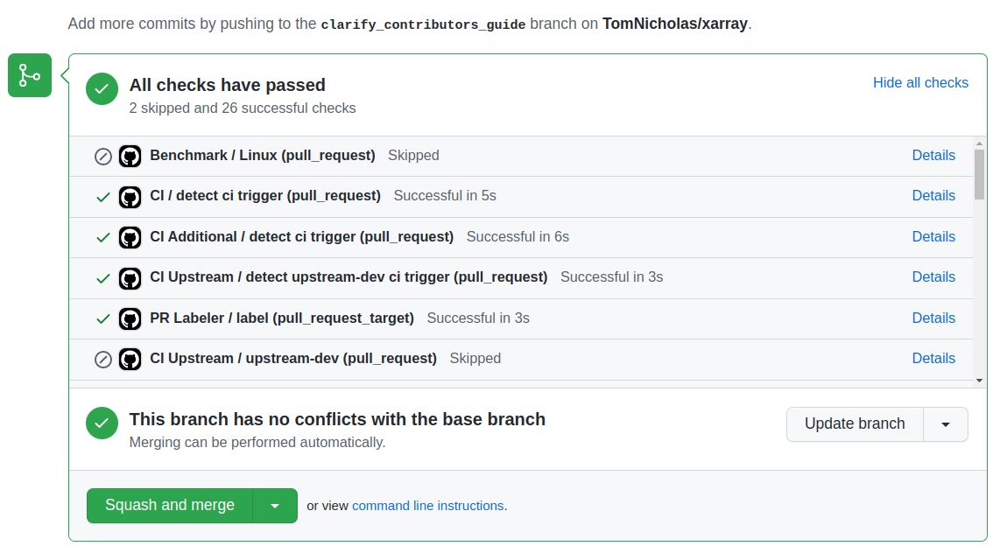

.. _contributing:

**********************
Contributing to xarray
**********************

.. contents:: Table of contents:
   :local:

.. note::

  Large parts of this document came from the `Pandas Contributing
  Guide <http://pandas.pydata.org/pandas-docs/stable/contributing.html>`_.

Where to start?
===============

All contributions, bug reports, bug fixes, documentation improvements,
enhancements, and ideas are welcome.

If you are brand new to *xarray* or open-source development, we recommend going
through the `GitHub "issues" tab <https://github.com/pydata/xarray/issues>`_
to find issues that interest you. There are a number of issues listed under
`Documentation <https://github.com/pydata/xarray/issues?q=is%3Aissue+is%3Aopen+label%3Adocumentation>`_
and `good first issue
<https://github.com/pydata/xarray/issues?q=is%3Aissue+is%3Aopen+label%3A%22good+first+issue%22>`_
where you could start out. Once you've found an interesting issue, you can
return here to get your development environment setup.

Feel free to ask questions on the `mailing list
<https://groups.google.com/forum/?utm_medium=email&utm_source=footer#!forum/xarray>`_.

.. _contributing.bug_reports:

Bug reports and enhancement requests
====================================

Bug reports are an important part of making *xarray* more stable. Having a complete bug
report will allow others to reproduce the bug and provide insight into fixing. See
`this stackoverflow article <https://stackoverflow.com/help/mcve>`_ for tips on
writing a good bug report.

Trying the bug-producing code out on the *master* branch is often a worthwhile exercise
to confirm the bug still exists. It is also worth searching existing bug reports and
pull requests to see if the issue has already been reported and/or fixed.

Bug reports must:

#. Include a short, self-contained Python snippet reproducing the problem.
   You can format the code nicely by using `GitHub Flavored Markdown
   <http://github.github.com/github-flavored-markdown/>`_::

      ```python
      >>> from xarray import Dataset
      >>> df = Dataset(...)
      ...
      ```

#. Include the full version string of *xarray* and its dependencies. You can use the
   built in function::

      >>> import xarray as xr
      >>> xr.show_versions()

#. Explain why the current behavior is wrong/not desired and what you expect instead.

The issue will then show up to the *xarray* community and be open to comments/ideas
from others.

.. _contributing.github:

Working with the code
=====================

Now that you have an issue you want to fix, enhancement to add, or documentation
to improve, you need to learn how to work with GitHub and the *xarray* code base.

.. _contributing.version_control:

Version control, Git, and GitHub
--------------------------------

To the new user, working with Git is one of the more daunting aspects of contributing
to *xarray*.  It can very quickly become overwhelming, but sticking to the guidelines
below will help keep the process straightforward and mostly trouble free.  As always,
if you are having difficulties please feel free to ask for help.

The code is hosted on `GitHub <https://www.github.com/pydata/xarray>`_. To
contribute you will need to sign up for a `free GitHub account
<https://github.com/signup/free>`_. We use `Git <http://git-scm.com/>`_ for
version control to allow many people to work together on the project.

Some great resources for learning Git:

* the `GitHub help pages <http://help.github.com/>`_.
* the `NumPy's documentation <http://docs.scipy.org/doc/numpy/dev/index.html>`_.
* Matthew Brett's `Pydagogue <http://matthew-brett.github.com/pydagogue/>`_.

Getting started with Git
------------------------

`GitHub has instructions <http://help.github.com/set-up-git-redirect>`__ for installing git,
setting up your SSH key, and configuring git.  All these steps need to be completed before
you can work seamlessly between your local repository and GitHub.

.. _contributing.forking:

Forking
-------

You will need your own fork to work on the code. Go to the `xarray project
page <https://github.com/pydata/xarray>`_ and hit the ``Fork`` button. You will
want to clone your fork to your machine::

    git clone https://github.com/your-user-name/xarray.git
    cd xarray
    git remote add upstream https://github.com/pydata/xarray.git

This creates the directory `xarray` and connects your repository to
the upstream (main project) *xarray* repository.

.. _contributing.dev_env:

Creating a development environment
----------------------------------

To test out code changes, you'll need to build *xarray* from source, which
requires a Python environment. If you're making documentation changes, you can
skip to :ref:`contributing.documentation` but you won't be able to build the
documentation locally before pushing your changes.

.. _contributiong.dev_python:

Creating a Python Environment
~~~~~~~~~~~~~~~~~~~~~~~~~~~~~

Before starting any development, you'll need to create an isolated xarray
development environment:

- Install either `Anaconda <https://www.anaconda.com/download/>`_ or `miniconda
  <https://conda.io/miniconda.html>`_
- Make sure your conda is up to date (``conda update conda``)
- Make sure that you have :ref:`cloned the repository <contributing.forking>`
- ``cd`` to the *xarray* source directory

We'll now kick off a two-step process:

1. Install the build dependencies
2. Build and install xarray

.. code-block:: none

   # Create and activate the build environment
   conda env create -f ci/requirements/py36.yml
   conda activate xarray-tests

   # or with older versions of Anaconda:
   source activate xarray-tests

   # Build and install xarray
   pip install -e .

At this point you should be able to import *xarray* from your locally built version::

   $ python  # start an interpreter
   >>> import xarray
   >>> xarray.__version__
   '0.10.0+dev46.g015daca'

This will create the new environment, and not touch any of your existing environments,
nor any existing Python installation.

To view your environments::

      conda info -e

To return to your root environment::

      conda deactivate

See the full conda docs `here <http://conda.pydata.org/docs>`__.

Creating a branch
-----------------

You want your master branch to reflect only production-ready code, so create a
feature branch for making your changes. For example::

    git branch shiny-new-feature
    git checkout shiny-new-feature

The above can be simplified to::

    git checkout -b shiny-new-feature

This changes your working directory to the shiny-new-feature branch.  Keep any
changes in this branch specific to one bug or feature so it is clear
what the branch brings to *xarray*. You can have many "shiny-new-features"
and switch in between them using the ``git checkout`` command.

To update this branch, you need to retrieve the changes from the master branch::

    git fetch upstream
    git rebase upstream/master

This will replay your commits on top of the latest *xarray* git master.  If this
leads to merge conflicts, you must resolve these before submitting your pull
request.  If you have uncommitted changes, you will need to ``git stash`` them
prior to updating.  This will effectively store your changes and they can be
reapplied after updating.

.. _contributing.documentation:

Contributing to the documentation
=================================

If you're not the developer type, contributing to the documentation is still of
huge value. You don't even have to be an expert on *xarray* to do so! In fact,
there are sections of the docs that are worse off after being written by
experts. If something in the docs doesn't make sense to you, updating the
relevant section after you figure it out is a great way to ensure it will help
the next person.

.. contents:: Documentation:
   :local:


About the *xarray* documentation
--------------------------------

The documentation is written in **reStructuredText**, which is almost like writing
in plain English, and built using `Sphinx <http://sphinx.pocoo.org/>`__. The
Sphinx Documentation has an excellent `introduction to reST
<http://sphinx.pocoo.org/rest.html>`__. Review the Sphinx docs to perform more
complex changes to the documentation as well.

Some other important things to know about the docs:

- The *xarray* documentation consists of two parts: the docstrings in the code
  itself and the docs in this folder ``xarray/doc/``.

  The docstrings are meant to provide a clear explanation of the usage of the
  individual functions, while the documentation in this folder consists of
  tutorial-like overviews per topic together with some other information
  (what's new, installation, etc).

- The docstrings follow the **Numpy Docstring Standard**, which is used widely
  in the Scientific Python community. This standard specifies the format of
  the different sections of the docstring. See `this document
  <https://github.com/numpy/numpy/blob/master/doc/HOWTO_DOCUMENT.rst.txt>`_
  for a detailed explanation, or look at some of the existing functions to
  extend it in a similar manner.

- The tutorials make heavy use of the `ipython directive
  <http://matplotlib.org/sampledoc/ipython_directive.html>`_ sphinx extension.
  This directive lets you put code in the documentation which will be run
  during the doc build. For example::

      .. ipython:: python

          x = 2
          x**3

  will be rendered as::

      In [1]: x = 2

      In [2]: x**3
      Out[2]: 8

  Almost all code examples in the docs are run (and the output saved) during the
  doc build. This approach means that code examples will always be up to date,
  but it does make the doc building a bit more complex.

- Our API documentation in ``doc/api.rst`` houses the auto-generated
  documentation from the docstrings. For classes, there are a few subtleties
  around controlling which methods and attributes have pages auto-generated.

  Every method should be included in a ``toctree`` in ``api.rst``, else Sphinx
  will emit a warning.


How to build the *xarray* documentation
---------------------------------------

Requirements
~~~~~~~~~~~~
Make sure to follow the instructions on :ref:`creating a development environment above <contributing.dev_env>`, but
to build the docs you need to use the environment file ``doc/environment.yml``.

.. code-block:: none

    # Create and activate the docs environment
    conda env create -f doc/environment.yml
    conda activate xarray-docs

    # or with older versions of Anaconda:
    source activate xarray-docs

    # Build and install xarray
    pip install -e .

Building the documentation
~~~~~~~~~~~~~~~~~~~~~~~~~~

Navigate to your local ``xarray/doc/`` directory in the console and run::

    make html

Then you can find the HTML output in the folder ``xarray/doc/_build/html/``.

The first time you build the docs, it will take quite a while because it has to run
all the code examples and build all the generated docstring pages. In subsequent
evocations, sphinx will try to only build the pages that have been modified.

If you want to do a full clean build, do::

    make clean
    make html

.. _contributing.code:

Contributing to the code base
=============================

.. contents:: Code Base:
   :local:

Code standards
--------------

Writing good code is not just about what you write. It is also about *how* you
write it. During :ref:`Continuous Integration <contributing.ci>` testing, several
tools will be run to check your code for stylistic errors.
Generating any warnings will cause the test to fail.
Thus, good style is a requirement for submitting code to *xarray*.

In addition, because a lot of people use our library, it is important that we
do not make sudden changes to the code that could have the potential to break
a lot of user code as a result, that is, we need it to be as *backwards compatible*
as possible to avoid mass breakages.

Code Formatting
~~~~~~~~~~~~~~~

Xarray uses `Black <https://black.readthedocs.io/en/stable/>`_ and
`Flake8 <http://flake8.pycqa.org/en/latest/>`_ to ensure a consistent code
format throughout the project. ``black`` and ``flake8`` can be installed with
``pip``::

   pip install black flake8

and then run from the root of the Xarray repository::

   black .
   flake8

to auto-format your code. Additionally, many editors have plugins that will
apply ``black`` as you edit files.

Other recommended but optional tools for checking code quality (not currently
enforced in CI):

- `mypy <http://mypy-lang.org/>`_ performs static type checking, which can
  make it easier to catch bugs. Please run ``mypy xarray`` if you annotate any
  code with `type hints <https://docs.python.org/3/library/typing.html>`_.
- `isort <https://github.com/timothycrosley/isort>`_ will highlight
  incorrectly sorted imports. ``isort -y`` will automatically fix them. See
  also `flake8-isort <https://github.com/gforcada/flake8-isort>`_.

Optionally, you may wish to setup `pre-commit hooks <https://pre-commit.com/>`_
to automatically run ``black`` and ``flake8`` when you make a git commit. This
can be done by installing ``pre-commit``::

   pip install pre-commit

and then running::

   pre-commit install

from the root of the Xarray repository. Now ``black`` and ``flake8`` will be run
each time you commit changes. You can skip these checks with
``git commit --no-verify``.

.. note::

  If you were working on a branch *prior* to the code being reformatted with black,
  you will likely face some merge conflicts. These steps can eliminate many of those
  conflicts. Because they have had limited testing, please reach out to the core devs
  on your pull request if you face any issues, and we'll help with the merge:

  - Merge the commit on master prior to the ``black`` commit into your branch
    ``git merge f172c673``. If you have conflicts here, resolve and commit.
  - Apply ``black .`` to your branch and commit ``git commit -am "black"``
  - Apply a patch of other changes we made on that commit: ``curl https://gist.githubusercontent.com/max-sixty/3cceb8472ed4ea806353999ca43aed52/raw/03cbee4e386156bddb61acaa250c0bfc726f596d/xarray%2520black%2520diff | git apply -``
  - Commit (``git commit -am "black2"``)
  - Merge master at the ``black`` commit, resolving in favor of 'our' changes:
    ``git merge d089df38 -X ours``. You shouldn't have any merge conflicts
  - Merge current master ``git merge master``; resolve and commit any conflicts

Backwards Compatibility
~~~~~~~~~~~~~~~~~~~~~~~

Please try to maintain backward compatibility. *xarray* has growing number of users with
lots of existing code, so don't break it if at all possible.  If you think breakage is
required, clearly state why as part of the pull request.  Also, be careful when changing
method signatures and add deprecation warnings where needed.

.. _contributing.ci:

Testing With Continuous Integration
-----------------------------------

The *xarray* test suite runs automatically the
`Azure Pipelines <https://azure.microsoft.com/en-us/services/devops/pipelines//>`__,
continuous integration service, once your pull request is submitted. However,
if you wish to run the test suite on a branch prior to submitting the pull
request, then Azure Pipelines
`needs to be configured <https://docs.microsoft.com/en-us/azure/devops/pipelines/>`_
for your GitHub repository.

A pull-request will be considered for merging when you have an all 'green' build. If any
tests are failing, then you will get a red 'X', where you can click through to see the
individual failed tests. This is an example of a green build.



.. note::

   Each time you push to your PR branch, a new run of the tests will be
   triggered on the CI. If they haven't already finished, tests for any older
   commits on the same branch will be automatically cancelled.

.. _contributing.tdd:


Test-driven development/code writing
------------------------------------

*xarray* is serious about testing and strongly encourages contributors to embrace
`test-driven development (TDD) <http://en.wikipedia.org/wiki/Test-driven_development>`_.
This development process "relies on the repetition of a very short development cycle:
first the developer writes an (initially failing) automated test case that defines a desired
improvement or new function, then produces the minimum amount of code to pass that test."
So, before actually writing any code, you should write your tests.  Often the test can be
taken from the original GitHub issue.  However, it is always worth considering additional
use cases and writing corresponding tests.

Adding tests is one of the most common requests after code is pushed to *xarray*.  Therefore,
it is worth getting in the habit of writing tests ahead of time so this is never an issue.

Like many packages, *xarray* uses `pytest
<http://doc.pytest.org/en/latest/>`_ and the convenient
extensions in `numpy.testing
<http://docs.scipy.org/doc/numpy/reference/routines.testing.html>`_.

Writing tests
~~~~~~~~~~~~~

All tests should go into the ``tests`` subdirectory of the specific package.
This folder contains many current examples of tests, and we suggest looking to these for
inspiration.  If your test requires working with files or
network connectivity, there is more information on the `testing page
<https://github.com/pydata/xarray/wiki/Testing>`_ of the wiki.

The ``xarray.testing`` module has many special ``assert`` functions that
make it easier to make statements about whether DataArray or Dataset objects are
equivalent. The easiest way to verify that your code is correct is to
explicitly construct the result you expect, then compare the actual result to
the expected correct result::

    def test_constructor_from_0d():
        expected = Dataset({None: ([], 0)})[None]
        actual = DataArray(0)
        assert_identical(expected, actual)

Transitioning to ``pytest``
~~~~~~~~~~~~~~~~~~~~~~~~~~~

*xarray* existing test structure is *mostly* classed based, meaning that you will
typically find tests wrapped in a class.

.. code-block:: python

    class TestReallyCoolFeature:
        ....

Going forward, we are moving to a more *functional* style using the
`pytest <http://doc.pytest.org/en/latest/>`__ framework, which offers a richer
testing framework that will facilitate testing and developing. Thus, instead of
writing test classes, we will write test functions like this:

.. code-block:: python

    def test_really_cool_feature():
        ....

Using ``pytest``
~~~~~~~~~~~~~~~~

Here is an example of a self-contained set of tests that illustrate multiple
features that we like to use.

- functional style: tests are like ``test_*`` and *only* take arguments that are either
  fixtures or parameters
- ``pytest.mark`` can be used to set metadata on test functions, e.g. ``skip`` or ``xfail``.
- using ``parametrize``: allow testing of multiple cases
- to set a mark on a parameter, ``pytest.param(..., marks=...)`` syntax should be used
- ``fixture``, code for object construction, on a per-test basis
- using bare ``assert`` for scalars and truth-testing
- ``assert_equal`` and ``assert_identical`` from the ``xarray.testing`` module for xarray object comparisons.
- the typical pattern of constructing an ``expected`` and comparing versus the ``result``

We would name this file ``test_cool_feature.py`` and put in an appropriate place in the
``xarray/tests/`` structure.

.. TODO: confirm that this actually works

.. code-block:: python

    import pytest
    import numpy as np
    import xarray as xr
    from xarray.testing import assert_equal


    @pytest.mark.parametrize('dtype', ['int8', 'int16', 'int32', 'int64'])
    def test_dtypes(dtype):
        assert str(np.dtype(dtype)) == dtype


    @pytest.mark.parametrize('dtype', ['float32',
                             pytest.param('int16', marks=pytest.mark.skip),
                             pytest.param('int32', marks=pytest.mark.xfail(
                                reason='to show how it works'))])
    def test_mark(dtype):
        assert str(np.dtype(dtype)) == 'float32'


    @pytest.fixture
    def dataarray():
        return xr.DataArray([1, 2, 3])


    @pytest.fixture(params=['int8', 'int16', 'int32', 'int64'])
    def dtype(request):
        return request.param


    def test_series(dataarray, dtype):
        result = dataarray.astype(dtype)
        assert result.dtype == dtype

        expected = xr.DataArray(np.array([1, 2, 3], dtype=dtype))
        assert_equal(result, expected)


A test run of this yields

.. code-block:: shell

   ((xarray) $ pytest test_cool_feature.py -v
    =============================== test session starts ================================
    platform darwin -- Python 3.6.4, pytest-3.2.1, py-1.4.34, pluggy-0.4.0 --
    cachedir: ../../.cache
    plugins: cov-2.5.1, hypothesis-3.23.0
    collected 11 items

    test_cool_feature.py::test_dtypes[int8] PASSED
    test_cool_feature.py::test_dtypes[int16] PASSED
    test_cool_feature.py::test_dtypes[int32] PASSED
    test_cool_feature.py::test_dtypes[int64] PASSED
    test_cool_feature.py::test_mark[float32] PASSED
    test_cool_feature.py::test_mark[int16] SKIPPED
    test_cool_feature.py::test_mark[int32] xfail
    test_cool_feature.py::test_series[int8] PASSED
    test_cool_feature.py::test_series[int16] PASSED
    test_cool_feature.py::test_series[int32] PASSED
    test_cool_feature.py::test_series[int64] PASSED

    ================== 9 passed, 1 skipped, 1 xfailed in 1.83 seconds ==================

Tests that we have ``parametrized`` are now accessible via the test name, for
example we could run these with ``-k int8`` to sub-select *only* those tests
which match ``int8``.


.. code-block:: shell

   ((xarray) bash-3.2$ pytest  test_cool_feature.py  -v -k int8
   =========================== test session starts ===========================
   platform darwin -- Python 3.6.2, pytest-3.2.1, py-1.4.31, pluggy-0.4.0
   collected 11 items

   test_cool_feature.py::test_dtypes[int8] PASSED
   test_cool_feature.py::test_series[int8] PASSED


Running the test suite
----------------------

The tests can then be run directly inside your Git clone (without having to
install *xarray*) by typing::

    pytest xarray

The tests suite is exhaustive and takes a few minutes.  Often it is
worth running only a subset of tests first around your changes before running the
entire suite.

The easiest way to do this is with::

    pytest xarray/path/to/test.py -k regex_matching_test_name

Or with one of the following constructs::

    pytest xarray/tests/[test-module].py
    pytest xarray/tests/[test-module].py::[TestClass]
    pytest xarray/tests/[test-module].py::[TestClass]::[test_method]

Using `pytest-xdist <https://pypi.python.org/pypi/pytest-xdist>`_, one can
speed up local testing on multicore machines. To use this feature, you will
need to install `pytest-xdist` via::

    pip install pytest-xdist


Then, run pytest with the optional -n argument:

    pytest xarray -n 4

This can significantly reduce the time it takes to locally run tests before
submitting a pull request.

For more, see the `pytest <http://doc.pytest.org/en/latest/>`_ documentation.

Running the performance test suite
----------------------------------

Performance matters and it is worth considering whether your code has introduced
performance regressions.  *xarray* is starting to write a suite of benchmarking tests
using `asv <https://github.com/spacetelescope/asv>`__
to enable easy monitoring of the performance of critical *xarray* operations.
These benchmarks are all found in the ``xarray/asv_bench`` directory.  asv
supports both python2 and python3.

To use all features of asv, you will need either ``conda`` or
``virtualenv``. For more details please check the `asv installation
webpage <https://asv.readthedocs.io/en/latest/installing.html>`_.

To install asv::

    pip install git+https://github.com/spacetelescope/asv

If you need to run a benchmark, change your directory to ``asv_bench/`` and run::

    asv continuous -f 1.1 upstream/master HEAD

You can replace ``HEAD`` with the name of the branch you are working on,
and report benchmarks that changed by more than 10%.
The command uses ``conda`` by default for creating the benchmark
environments. If you want to use virtualenv instead, write::

    asv continuous -f 1.1 -E virtualenv upstream/master HEAD

The ``-E virtualenv`` option should be added to all ``asv`` commands
that run benchmarks. The default value is defined in ``asv.conf.json``.

Running the full benchmark suite can take up to one hour and use up a few GBs of RAM.
Usually it is sufficient to paste only a subset of the results into the pull
request to show that the committed changes do not cause unexpected performance
regressions.  You can run specific benchmarks using the ``-b`` flag, which
takes a regular expression.  For example, this will only run tests from a
``xarray/asv_bench/benchmarks/groupby.py`` file::

    asv continuous -f 1.1 upstream/master HEAD -b ^groupby

If you want to only run a specific group of tests from a file, you can do it
using ``.`` as a separator. For example::

    asv continuous -f 1.1 upstream/master HEAD -b groupby.GroupByMethods

will only run the ``GroupByMethods`` benchmark defined in ``groupby.py``.

You can also run the benchmark suite using the version of *xarray*
already installed in your current Python environment. This can be
useful if you do not have ``virtualenv`` or ``conda``, or are using the
``setup.py develop`` approach discussed above; for the in-place build
you need to set ``PYTHONPATH``, e.g.
``PYTHONPATH="$PWD/.." asv [remaining arguments]``.
You can run benchmarks using an existing Python
environment by::

    asv run -e -E existing

or, to use a specific Python interpreter,::

    asv run -e -E existing:python3.6

This will display stderr from the benchmarks, and use your local
``python`` that comes from your ``$PATH``.

Information on how to write a benchmark and how to use asv can be found in the
`asv documentation <https://asv.readthedocs.io/en/latest/writing_benchmarks.html>`_.

The *xarray* benchmarking suite is run remotely and the results are
available `here <http://pandas.pydata.org/speed/xarray/>`_.

Documenting your code
---------------------

Changes should be reflected in the release notes located in ``doc/whats-new.rst``.
This file contains an ongoing change log for each release.  Add an entry to this file to
document your fix, enhancement or (unavoidable) breaking change.  Make sure to include the
GitHub issue number when adding your entry (using ``:issue:`1234```, where ``1234`` is the
issue/pull request number).

If your code is an enhancement, it is most likely necessary to add usage
examples to the existing documentation.  This can be done following the section
regarding documentation :ref:`above <contributing.documentation>`.

Contributing your changes to *xarray*
=====================================

Committing your code
--------------------

Keep style fixes to a separate commit to make your pull request more readable.

Once you've made changes, you can see them by typing::

    git status

If you have created a new file, it is not being tracked by git. Add it by typing::

    git add path/to/file-to-be-added.py

Doing 'git status' again should give something like::

    # On branch shiny-new-feature
    #
    #       modified:   /relative/path/to/file-you-added.py
    #

The following defines how a commit message should be structured:

    * A subject line with `< 72` chars.
    * One blank line.
    * Optionally, a commit message body.

Please reference the relevant GitHub issues in your commit message using ``GH1234`` or
``#1234``.  Either style is fine, but the former is generally preferred.

Now you can commit your changes in your local repository::

    git commit -m

Pushing your changes
--------------------

When you want your changes to appear publicly on your GitHub page, push your
forked feature branch's commits::

    git push origin shiny-new-feature

Here ``origin`` is the default name given to your remote repository on GitHub.
You can see the remote repositories::

    git remote -v

If you added the upstream repository as described above you will see something
like::

    origin  git@github.com:yourname/xarray.git (fetch)
    origin  git@github.com:yourname/xarray.git (push)
    upstream        git://github.com/pydata/xarray.git (fetch)
    upstream        git://github.com/pydata/xarray.git (push)

Now your code is on GitHub, but it is not yet a part of the *xarray* project.  For that to
happen, a pull request needs to be submitted on GitHub.

Review your code
----------------

When you're ready to ask for a code review, file a pull request. Before you do, once
again make sure that you have followed all the guidelines outlined in this document
regarding code style, tests, performance tests, and documentation. You should also
double check your branch changes against the branch it was based on:

#. Navigate to your repository on GitHub -- https://github.com/your-user-name/xarray
#. Click on ``Branches``
#. Click on the ``Compare`` button for your feature branch
#. Select the ``base`` and ``compare`` branches, if necessary. This will be ``master`` and
   ``shiny-new-feature``, respectively.

Finally, make the pull request
------------------------------

If everything looks good, you are ready to make a pull request.  A pull request is how
code from a local repository becomes available to the GitHub community and can be looked
at and eventually merged into the master version.  This pull request and its associated
changes will eventually be committed to the master branch and available in the next
release.  To submit a pull request:

#. Navigate to your repository on GitHub
#. Click on the ``Pull Request`` button
#. You can then click on ``Commits`` and ``Files Changed`` to make sure everything looks
   okay one last time
#. Write a description of your changes in the ``Preview Discussion`` tab
#. Click ``Send Pull Request``.

This request then goes to the repository maintainers, and they will review
the code. If you need to make more changes, you can make them in
your branch, add them to a new commit, push them to GitHub, and the pull request
will be automatically updated.  Pushing them to GitHub again is done by::

    git push origin shiny-new-feature

This will automatically update your pull request with the latest code and restart the
:ref:`Continuous Integration <contributing.ci>` tests.


Delete your merged branch (optional)
------------------------------------

Once your feature branch is accepted into upstream, you'll probably want to get rid of
the branch. First, merge upstream master into your branch so git knows it is safe to
delete your branch::

    git fetch upstream
    git checkout master
    git merge upstream/master

Then you can do::

    git branch -d shiny-new-feature

Make sure you use a lower-case ``-d``, or else git won't warn you if your feature
branch has not actually been merged.

The branch will still exist on GitHub, so to delete it there do::

    git push origin --delete shiny-new-feature


PR checklist
------------

- **Properly comment and document your code.** See `"Documenting your code" <https://xarray.pydata.org/en/stable/contributing.html#documenting-your-code>`_.
- **Test that the documentation builds correctly** by typing ``make html`` in the ``doc`` directory. This is not strictly necessary, but this may be easier than waiting for CI to catch a mistake. See `"Contributing to the documentation" <https://xarray.pydata.org/en/stable/contributing.html#contributing-to-the-documentation>`_.
- **Test your code**.

    - Write new tests if needed. See `"Test-driven development/code writing" <https://xarray.pydata.org/en/stable/contributing.html#test-driven-development-code-writing>`_.
    - Test the code using `Pytest <http://doc.pytest.org/en/latest/>`_. Running all tests (type ``pytest`` in the root directory) takes a while, so feel free to only run the tests you think are needed based on your PR (example: ``pytest xarray/tests/test_dataarray.py``). CI will catch any failing tests.

- **Properly format your code** and verify that it passes the formatting guidelines set by `Black <https://black.readthedocs.io/en/stable/>`_ and `Flake8 <http://flake8.pycqa.org/en/latest/>`_. See `"Code formatting" <https://xarray.pydata.org/en/stablcontributing.html#code-formatting>`_. You can use `pre-commit <https://pre-commit.com/>`_ to run these automatically on each commit.

    - Run ``black .`` in the root directory. This may modify some files. Confirm and commit any formatting changes.
    - Run ``flake8`` in the root directory. If this fails, it will log an error message.

- **Push your code and** `create a PR on GitHub <https://help.github.com/en/articles/creating-a-pull-request>`_.
- **Use a helpful title for your pull request** by summarizing the main contributions rather than using the latest commit message. If this addresses an `issue <https://github.com/pydata/xarray/issues>`_, please `reference it <https://help.github.com/en/articles/autolinked-references-and-urls>`_.
