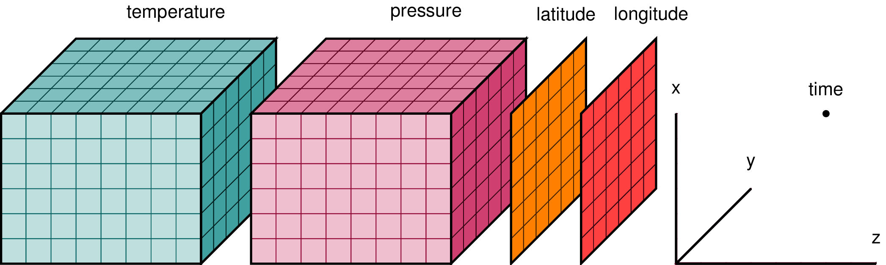

.. _data structures:

Data Structures
===============

.. ipython:: python
   :suppress:

    import numpy as np
    import pandas as pd
    import xarray as xr
    np.random.seed(123456)
    np.set_printoptions(threshold=10)

DataArray
---------

:py:class:`xarray.DataArray` is xarray's implementation of a labeled,
multi-dimensional array. It has several key properties:

- ``values``: a :py:class:`numpy.ndarray` holding the array's values
- ``dims``: dimension names for each axis (e.g., ``('x', 'y', 'z')``)
- ``coords``: a dict-like container of arrays (*coordinates*) that label each
  point (e.g., 1-dimensional arrays of numbers, datetime objects or
  strings)
- ``attrs``: :py:class:`dict` to hold arbitrary metadata (*attributes*)

xarray uses ``dims`` and ``coords`` to enable its core metadata aware operations.
Dimensions provide names that xarray uses instead of the ``axis`` argument found
in many numpy functions. Coordinates enable fast label based indexing and
alignment, building on the functionality of the ``index`` found on a pandas
:py:class:`~pandas.DataFrame` or :py:class:`~pandas.Series`.

DataArray objects also can have a ``name`` and can hold arbitrary metadata in
the form of their ``attrs`` property. Names and attributes are strictly for
users and user-written code: xarray makes no attempt to interpret them, and
propagates them only in unambiguous cases
(see FAQ, :ref:`approach to metadata`).

.. _creating a dataarray:

Creating a DataArray
~~~~~~~~~~~~~~~~~~~~

The :py:class:`~xarray.DataArray` constructor takes:

- ``data``: a multi-dimensional array of values (e.g., a numpy ndarray,
  :py:class:`~pandas.Series`, :py:class:`~pandas.DataFrame` or :py:class:`~pandas.Panel`)
- ``coords``: a list or dictionary of coordinates. If a list, it should be a
  list of tuples where the first element is the dimension name and the second
  element is the corresponding coordinate array_like object.
- ``dims``: a list of dimension names. If omitted and ``coords`` is a list of
  tuples, dimension names are taken from ``coords``.
- ``attrs``: a dictionary of attributes to add to the instance
- ``name``: a string that names the instance

.. ipython:: python

    data = np.random.rand(4, 3)
    locs = ['IA', 'IL', 'IN']
    times = pd.date_range('2000-01-01', periods=4)
    foo = xr.DataArray(data, coords=[times, locs], dims=['time', 'space'])
    foo

Only ``data`` is required; all of other arguments will be filled
in with default values:

.. ipython:: python

    xr.DataArray(data)

As you can see, dimension names are always present in the xarray data model: if
you do not provide them, defaults of the form ``dim_N`` will be created.
However, coordinates are always optional, and dimensions do not have automatic
coordinate labels.

.. note::

  This is different from pandas, where axes always have tick labels, which
  default to the integers ``[0, ..., n-1]``.

  Prior to xarray v0.9, xarray copied this behavior: default coordinates for
  each dimension would be created if coordinates were not supplied explicitly.
  This is no longer the case.

Coordinates can be specified in the following ways:

- A list of values with length equal to the number of dimensions, providing
  coordinate labels for each dimension. Each value must be of one of the
  following forms:

  * A :py:class:`~xarray.DataArray` or :py:class:`~xarray.Variable`
  * A tuple of the form ``(dims, data[, attrs])``, which is converted into
    arguments for :py:class:`~xarray.Variable`
  * A pandas object or scalar value, which is converted into a ``DataArray``
  * A 1D array or list, which is interpreted as values for a one dimensional
    coordinate variable along the same dimension as it's name

- A dictionary of ``{coord_name: coord}`` where values are of the same form
  as the list. Supplying coordinates as a dictionary allows other coordinates
  than those corresponding to dimensions (more on these later). If you supply
  ``coords`` as a dictionary, you must explicitly provide ``dims``.

As a list of tuples:

.. ipython:: python

    xr.DataArray(data, coords=[('time', times), ('space', locs)])

As a dictionary:

.. ipython:: python

    xr.DataArray(data, coords={'time': times, 'space': locs, 'const': 42,
                               'ranking': ('space', [1, 2, 3])},
                 dims=['time', 'space'])

As a dictionary with coords across multiple dimensions:

.. ipython:: python

    xr.DataArray(data, coords={'time': times, 'space': locs, 'const': 42,
                               'ranking': (('time', 'space'), np.arange(12).reshape(4,3))},
                 dims=['time', 'space'])

If you create a ``DataArray`` by supplying a pandas
:py:class:`~pandas.Series`, :py:class:`~pandas.DataFrame` or
:py:class:`~pandas.Panel`, any non-specified arguments in the
``DataArray`` constructor will be filled in from the pandas object:

.. ipython:: python

    df = pd.DataFrame({'x': [0, 1], 'y': [2, 3]}, index=['a', 'b'])
    df.index.name = 'abc'
    df.columns.name = 'xyz'
    df
    xr.DataArray(df)

DataArray properties
~~~~~~~~~~~~~~~~~~~~

Let's take a look at the important properties on our array:

.. ipython:: python

    foo.values
    foo.dims
    foo.coords
    foo.attrs
    print(foo.name)

You can modify ``values`` inplace:

.. ipython:: python

   foo.values = 1.0 * foo.values

.. note::

    The array values in a :py:class:`~xarray.DataArray` have a single
    (homogeneous) data type. To work with heterogeneous or structured data
    types in xarray, use coordinates, or put separate ``DataArray`` objects
    in a single :py:class:`~xarray.Dataset` (see below).

Now fill in some of that missing metadata:

.. ipython:: python

    foo.name = 'foo'
    foo.attrs['units'] = 'meters'
    foo

The :py:meth:`~xarray.DataArray.rename` method is another option, returning a
new data array:

.. ipython:: python

   foo.rename('bar')

DataArray Coordinates
~~~~~~~~~~~~~~~~~~~~~

The ``coords`` property is ``dict`` like. Individual coordinates can be
accessed from the coordinates by name, or even by indexing the data array
itself:

.. ipython:: python

    foo.coords['time']
    foo['time']

These are also :py:class:`~xarray.DataArray` objects, which contain tick-labels
for each dimension.

Coordinates can also be set or removed by using the dictionary like syntax:

.. ipython:: python

    foo['ranking'] = ('space', [1, 2, 3])
    foo.coords
    del foo['ranking']
    foo.coords

For more details, see :ref:`coordinates` below.

Dataset
-------

:py:class:`xarray.Dataset` is xarray's multi-dimensional equivalent of a
:py:class:`~pandas.DataFrame`. It is a dict-like
container of labeled arrays (:py:class:`~xarray.DataArray` objects) with aligned
dimensions. It is designed as an in-memory representation of the data model
from the `netCDF`__ file format.

__ http://www.unidata.ucar.edu/software/netcdf/

In addition to the dict-like interface of the dataset itself, which can be used
to access any variable in a dataset, datasets have four key properties:

- ``dims``: a dictionary mapping from dimension names to the fixed length of
  each dimension (e.g., ``{'x': 6, 'y': 6, 'time': 8}``)
- ``data_vars``: a dict-like container of DataArrays corresponding to variables
- ``coords``: another dict-like container of DataArrays intended to label points
  used in ``data_vars`` (e.g., arrays of numbers, datetime objects or strings)
- ``attrs``: :py:class:`dict` to hold arbitrary metadata

The distinction between whether a variables falls in data or coordinates
(borrowed from `CF conventions`_) is mostly semantic, and you can probably get
away with ignoring it if you like: dictionary like access on a dataset will
supply variables found in either category. However, xarray does make use of the
distinction for indexing and computations. Coordinates indicate
constant/fixed/independent quantities, unlike the varying/measured/dependent
quantities that belong in data.

.. _CF conventions: http://cfconventions.org/

Here is an example of how we might structure a dataset for a weather forecast:

In this example, it would be natural to call ``temperature`` and
``precipitation`` "data variables" and all the other arrays "coordinate
variables" because they label the points along the dimensions. (see [1]_ for
more background on this example).

.. _dataarray constructor:

Creating a Dataset
~~~~~~~~~~~~~~~~~~

To make an :py:class:`~xarray.Dataset` from scratch, supply dictionaries for any
variables (``data_vars``), coordinates (``coords``) and attributes (``attrs``).

- ``data_vars`` should be a dictionary with each key as the name of the variable
  and each value as one of:

  * A :py:class:`~xarray.DataArray` or :py:class:`~xarray.Variable`
  * A tuple of the form ``(dims, data[, attrs])``, which is converted into
    arguments for :py:class:`~xarray.Variable`
  * A pandas object, which is converted into a ``DataArray``
  * A 1D array or list, which is interpreted as values for a one dimensional
    coordinate variable along the same dimension as it's name

- ``coords`` should be a dictionary of the same form as ``data_vars``.

- ``attrs`` should be a dictionary.

Let's create some fake data for the example we show above:

.. ipython:: python

    temp = 15 + 8 * np.random.randn(2, 2, 3)
    precip = 10 * np.random.rand(2, 2, 3)
    lon = [[-99.83, -99.32], [-99.79, -99.23]]
    lat = [[42.25, 42.21], [42.63, 42.59]]

    # for real use cases, its good practice to supply array attributes such as
    # units, but we won't bother here for the sake of brevity
    ds = xr.Dataset({'temperature': (['x', 'y', 'time'],  temp),
                     'precipitation': (['x', 'y', 'time'], precip)},
                    coords={'lon': (['x', 'y'], lon),
                            'lat': (['x', 'y'], lat),
                            'time': pd.date_range('2014-09-06', periods=3),
                            'reference_time': pd.Timestamp('2014-09-05')})
    ds

Here we pass :py:class:`xarray.DataArray` objects or a pandas object as values
in the dictionary:

.. ipython:: python

    xr.Dataset({'bar': foo})

.. ipython:: python

    xr.Dataset({'bar': foo.to_pandas()})

Where a pandas object is supplied as a value, the names of its indexes are used as dimension
names, and its data is aligned to any existing dimensions.

You can also create an dataset from:

- A :py:class:`pandas.DataFrame` or :py:class:`pandas.Panel` along its columns and items
  respectively, by passing it into the :py:class:`~xarray.Dataset` directly
- A :py:class:`pandas.DataFrame` with :py:meth:`Dataset.from_dataframe <xarray.Dataset.from_dataframe>`,
  which will additionally handle MultiIndexes See :ref:`pandas`
- A netCDF file on disk with :py:func:`~xarray.open_dataset`. See :ref:`io`.

Dataset contents
~~~~~~~~~~~~~~~~

:py:class:`~xarray.Dataset` implements the Python mapping interface, with
values given by :py:class:`xarray.DataArray` objects:

.. ipython:: python

    'temperature' in ds
    ds['temperature']

Valid keys include each listed coordinate and data variable.

Data and coordinate variables are also contained separately in the
:py:attr:`~xarray.Dataset.data_vars` and :py:attr:`~xarray.Dataset.coords`
dictionary-like attributes:

.. ipython:: python

    ds.data_vars
    ds.coords

Finally, like data arrays, datasets also store arbitrary metadata in the form
of `attributes`:

.. ipython:: python

    ds.attrs

    ds.attrs['title'] = 'example attribute'
    ds

xarray does not enforce any restrictions on attributes, but serialization to
some file formats may fail if you use objects that are not strings, numbers
or :py:class:`numpy.ndarray` objects.

As a useful shortcut, you can use attribute style access for reading (but not
setting) variables and attributes:

.. ipython:: python

    ds.temperature

This is particularly useful in an exploratory context, because you can
tab-complete these variable names with tools like IPython.

Dictionary like methods
~~~~~~~~~~~~~~~~~~~~~~~

We can update a dataset in-place using Python's standard dictionary syntax. For
example, to create this example dataset from scratch, we could have written:

.. ipython:: python

    ds = xr.Dataset()
    ds['temperature'] = (('x', 'y', 'time'), temp)
    ds['temperature_double'] = (('x', 'y', 'time'), temp * 2 )
    ds['precipitation'] = (('x', 'y', 'time'), precip)
    ds.coords['lat'] = (('x', 'y'), lat)
    ds.coords['lon'] = (('x', 'y'), lon)
    ds.coords['time'] = pd.date_range('2014-09-06', periods=3)
    ds.coords['reference_time'] = pd.Timestamp('2014-09-05')

To change the variables in a ``Dataset``, you can use all the standard dictionary
methods, including ``values``, ``items``, ``__delitem__``, ``get`` and
:py:meth:`~xarray.Dataset.update`. Note that assigning a ``DataArray`` or pandas
object to a ``Dataset`` variable using ``__setitem__`` or ``update`` will
:ref:`automatically align<update>` the array(s) to the original
dataset's indexes.

You can copy a ``Dataset`` by calling the :py:meth:`~xarray.Dataset.copy`
method. By default, the copy is shallow, so only the container will be copied:
the arrays in the ``Dataset`` will still be stored in the same underlying
:py:class:`numpy.ndarray` objects. You can copy all data by calling
``ds.copy(deep=True)``.

.. _transforming datasets:

Transforming datasets
~~~~~~~~~~~~~~~~~~~~~

In addition to dictionary-like methods (described above), xarray has additional
methods (like pandas) for transforming datasets into new objects.

For removing variables, you can select and drop an explicit list of
variables by indexing with a list of names or using the
:py:meth:`~xarray.Dataset.drop` methods to return a new ``Dataset``. These
operations keep around coordinates:

.. ipython:: python

    ds[['temperature']]
    ds[['temperature', 'temperature_double']]
    ds.drop('temperature')

To remove a dimension, you can use :py:meth:`~xarray.Dataset.drop_dims` method.
Any variables using that dimension are dropped:

.. ipython:: python

    ds.drop_dims('time')

As an alternate to dictionary-like modifications, you can use
:py:meth:`~xarray.Dataset.assign` and :py:meth:`~xarray.Dataset.assign_coords`.
These methods return a new dataset with additional (or replaced) or values:

.. ipython:: python

    ds.assign(temperature2 = 2 * ds.temperature)

There is also the :py:meth:`~xarray.Dataset.pipe` method that allows you to use
a method call with an external function (e.g., ``ds.pipe(func)``) instead of
simply calling it (e.g., ``func(ds)``). This allows you to write pipelines for
transforming you data (using "method chaining") instead of writing hard to
follow nested function calls:

.. ipython:: python

    # these lines are equivalent, but with pipe we can make the logic flow
    # entirely from left to right
    plt.plot((2 * ds.temperature.sel(x=0)).mean('y'))
    (ds.temperature
     .sel(x=0)
     .pipe(lambda x: 2 * x)
     .mean('y')
     .pipe(plt.plot))

Both ``pipe`` and ``assign`` replicate the pandas methods of the same names
(:py:meth:`DataFrame.pipe <pandas.DataFrame.pipe>` and
:py:meth:`DataFrame.assign <pandas.DataFrame.assign>`).

With xarray, there is no performance penalty for creating new datasets, even if
variables are lazily loaded from a file on disk. Creating new objects instead
of mutating existing objects often results in easier to understand code, so we
encourage using this approach.

Renaming variables
~~~~~~~~~~~~~~~~~~

Another useful option is the :py:meth:`~xarray.Dataset.rename` method to rename
dataset variables:

.. ipython:: python

    ds.rename({'temperature': 'temp', 'precipitation': 'precip'})

The related :py:meth:`~xarray.Dataset.swap_dims` method allows you do to swap
dimension and non-dimension variables:

.. ipython:: python

    ds.coords['day'] = ('time', [6, 7, 8])
    ds.swap_dims({'time': 'day'})

.. _coordinates:

Coordinates
-----------

Coordinates are ancillary variables stored for ``DataArray`` and ``Dataset``
objects in the ``coords`` attribute:

.. ipython:: python

    ds.coords

Unlike attributes, xarray *does* interpret and persist coordinates in
operations that transform xarray objects. There are two types of coordinates
in xarray:

- **dimension coordinates** are one dimensional coordinates with a name equal
  to their sole dimension (marked by ``*`` when printing a dataset or data
  array). They are used for label based indexing and alignment,
  like the ``index`` found on a pandas :py:class:`~pandas.DataFrame` or
  :py:class:`~pandas.Series`. Indeed, these "dimension" coordinates use a
  :py:class:`pandas.Index` internally to store their values.

- **non-dimension coordinates** are variables that contain coordinate
  data, but are not a dimension coordinate. They can  be multidimensional
  (see :ref:`examples.multidim`), and there is no relationship between the
  name of a non-dimension coordinate and the name(s) of its dimension(s).
  Non-dimension coordinates can be useful for indexing or plotting; otherwise,
  xarray does not make any direct use of the values associated with them.
  They are not used for alignment or automatic indexing, nor are they required
  to match when doing arithmetic
  (see :ref:`coordinates math`).

.. note::

  xarray's terminology differs from the `CF terminology`_, where the
  "dimension coordinates" are called "coordinate variables", and the
  "non-dimension coordinates" are called "auxiliary coordinate variables"
  (see :issue:`1295` for more details).

.. _CF terminology: http://cfconventions.org/cf-conventions/v1.6.0/cf-conventions.html#terminology

Modifying coordinates
~~~~~~~~~~~~~~~~~~~~~

To entirely add or remove coordinate arrays, you can use dictionary like
syntax, as shown above.

To convert back and forth between data and coordinates, you can use the
:py:meth:`~xarray.Dataset.set_coords` and
:py:meth:`~xarray.Dataset.reset_coords` methods:

.. ipython:: python

    ds.reset_coords()
    ds.set_coords(['temperature', 'precipitation'])
    ds['temperature'].reset_coords(drop=True)

Notice that these operations skip coordinates with names given by dimensions,
as used for indexing. This mostly because we are not entirely sure how to
design the interface around the fact that xarray cannot store a coordinate and
variable with the name but different values in the same dictionary. But we do
recognize that supporting something like this would be useful.

Coordinates methods
~~~~~~~~~~~~~~~~~~~

``Coordinates`` objects also have a few useful methods, mostly for converting
them into dataset objects:

.. ipython:: python

    ds.coords.to_dataset()

The merge method is particularly interesting, because it implements the same
logic used for merging coordinates in arithmetic operations
(see :ref:`comput`):

.. ipython:: python

    alt = xr.Dataset(coords={'z': [10], 'lat': 0, 'lon': 0})
    ds.coords.merge(alt.coords)

The ``coords.merge`` method may be useful if you want to implement your own
binary operations that act on xarray objects. In the future, we hope to write
more helper functions so that you can easily make your functions act like
xarray's built-in arithmetic.

Indexes
~~~~~~~

To convert a coordinate (or any ``DataArray``) into an actual
:py:class:`pandas.Index`, use the :py:meth:`~xarray.DataArray.to_index` method:

.. ipython:: python

    ds['time'].to_index()

A useful shortcut is the ``indexes`` property (on both ``DataArray`` and
``Dataset``), which lazily constructs a dictionary whose keys are given by each
dimension and whose the values are ``Index`` objects:

.. ipython:: python

    ds.indexes

MultiIndex coordinates
~~~~~~~~~~~~~~~~~~~~~~

Xarray supports labeling coordinate values with a :py:class:`pandas.MultiIndex`:

.. ipython:: python

    midx = pd.MultiIndex.from_arrays([['R', 'R', 'V', 'V'], [.1, .2, .7, .9]],
                                     names=('band', 'wn'))
    mda = xr.DataArray(np.random.rand(4), coords={'spec': midx}, dims='spec')
    mda

For convenience multi-index levels are directly accessible as "virtual" or
"derived" coordinates (marked by ``-`` when printing a dataset or data array):

.. ipython:: python

     mda['band']
     mda.wn

Indexing with multi-index levels is also possible using the ``sel`` method
(see :ref:`multi-level indexing`).

Unlike other coordinates, "virtual" level coordinates are not stored in
the ``coords`` attribute of ``DataArray`` and ``Dataset`` objects
(although they are shown when printing the ``coords`` attribute).
Consequently, most of the coordinates related methods don't apply for them.
It also can't be used to replace one particular level.

Because in a ``DataArray`` or ``Dataset`` object each multi-index level is
accessible as a "virtual" coordinate, its name must not conflict with the names
of the other levels, coordinates and data variables of the same object.
Even though Xarray set default names for multi-indexes with unnamed levels,
it is recommended that you explicitly set the names of the levels.

.. [1] Latitude and longitude are 2D arrays because the dataset uses
   `projected coordinates`__. ``reference_time`` refers to the reference time
   at which the forecast was made, rather than ``time`` which is the valid time
   for which the forecast applies.

__ http://en.wikipedia.org/wiki/Map_projection
