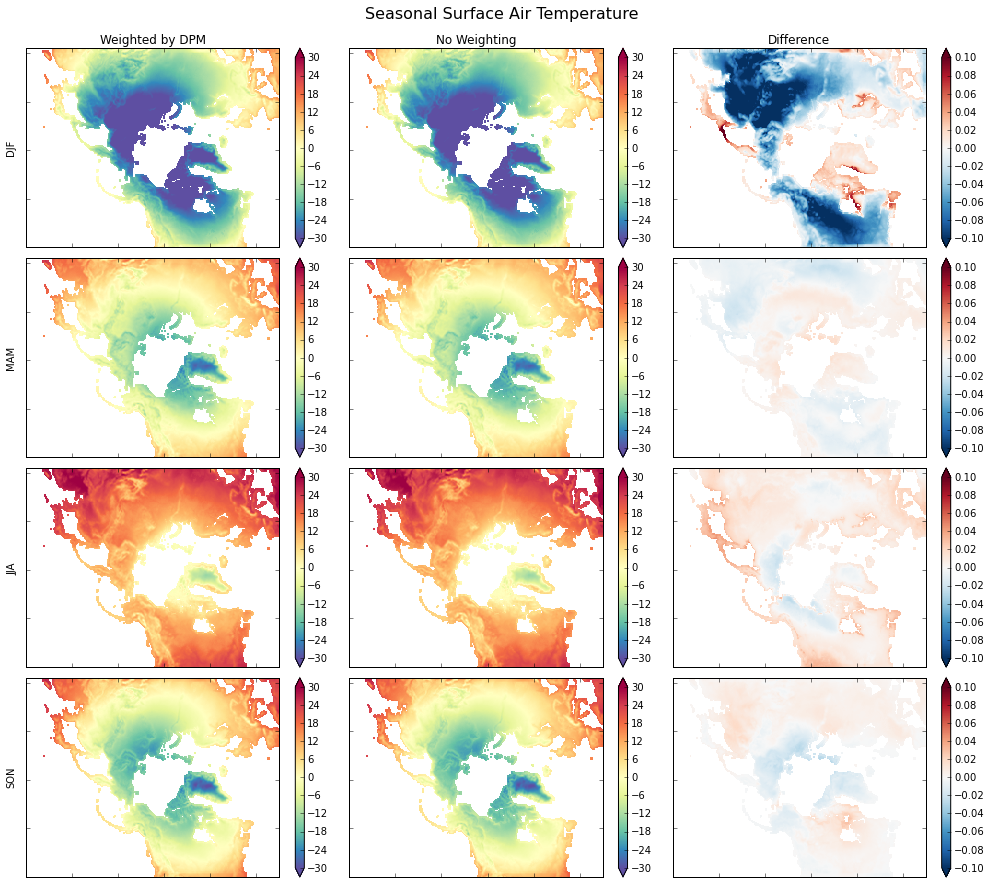

.. _monthly means example:

Calculating Seasonal Averages from Timeseries of Monthly Means
==============================================================

Author: `Joe Hamman <https://github.com/jhamman/>`__

The data used for this example can be found in the
`xarray-data <https://github.com/pydata/xarray-data>`__ repository.

Suppose we have a netCDF or ``xarray.Dataset`` of monthly mean data and
we want to calculate the seasonal average. To do this properly, we need
to calculate the weighted average considering that each month has a
different number of days.

.. code:: python

    %matplotlib inline
    import numpy as np
    import pandas as pd
    import xarray as xr
    from netCDF4 import num2date
    import matplotlib.pyplot as plt

    print("numpy version  : ", np.__version__)
    print("pandas version : ", pd.__version__)
    print("xarray version : ", xr.__version__)

.. parsed-literal::

    numpy version  :  1.11.1
    pandas version :  0.18.1
    xarray version :  0.8.2

Some calendar information so we can support any netCDF calendar.
^^^^^^^^^^^^^^^^^^^^^^^^^^^^^^^^^^^^^^^^^^^^^^^^^^^^^^^^^^^^^^^^

.. code:: python

    dpm = {'noleap': [0, 31, 28, 31, 30, 31, 30, 31, 31, 30, 31, 30, 31],
           '365_day': [0, 31, 28, 31, 30, 31, 30, 31, 31, 30, 31, 30, 31],
           'standard': [0, 31, 28, 31, 30, 31, 30, 31, 31, 30, 31, 30, 31],
           'gregorian': [0, 31, 28, 31, 30, 31, 30, 31, 31, 30, 31, 30, 31],
           'proleptic_gregorian': [0, 31, 28, 31, 30, 31, 30, 31, 31, 30, 31, 30, 31],
           'all_leap': [0, 31, 29, 31, 30, 31, 30, 31, 31, 30, 31, 30, 31],
           '366_day': [0, 31, 29, 31, 30, 31, 30, 31, 31, 30, 31, 30, 31],
           '360_day': [0, 30, 30, 30, 30, 30, 30, 30, 30, 30, 30, 30, 30]}

A few calendar functions to determine the number of days in each month
^^^^^^^^^^^^^^^^^^^^^^^^^^^^^^^^^^^^^^^^^^^^^^^^^^^^^^^^^^^^^^^^^^^^^^

If you were just using the standard calendar, it would be easy to use
the ``calendar.month_range`` function.

.. code:: python

    def leap_year(year, calendar='standard'):
        """Determine if year is a leap year"""
        leap = False
        if ((calendar in ['standard', 'gregorian',
            'proleptic_gregorian', 'julian']) and
            (year % 4 == 0)):
            leap = True
            if ((calendar == 'proleptic_gregorian') and
                (year % 100 == 0) and
                (year % 400 != 0)):
                leap = False
            elif ((calendar in ['standard', 'gregorian']) and
                     (year % 100 == 0) and (year % 400 != 0) and
                     (year < 1583)):
                leap = False
        return leap

    def get_dpm(time, calendar='standard'):
        """
        return a array of days per month corresponding to the months provided in `months`
        """
        month_length = np.zeros(len(time), dtype=np.int)

        cal_days = dpm[calendar]

        for i, (month, year) in enumerate(zip(time.month, time.year)):
            month_length[i] = cal_days[month]
            if leap_year(year, calendar=calendar):
                month_length[i] += 1
        return month_length

Open the ``Dataset``
^^^^^^^^^^^^^^^^^^^^

.. code:: python

    ds = xr.tutorial.load_dataset('rasm')
    print(ds)

.. parsed-literal::

    <xarray.Dataset>
    Dimensions:  (time: 36, x: 275, y: 205)
    Coordinates:
      * time     (time) datetime64[ns] 1980-09-16T12:00:00 1980-10-17 ...
      * y        (y) int64 0 1 2 3 4 5 6 7 8 9 10 11 12 13 14 15 16 17 18 19 20 ...
      * x        (x) int64 0 1 2 3 4 5 6 7 8 9 10 11 12 13 14 15 16 17 18 19 20 ...
    Data variables:
        Tair     (time, y, x) float64 nan nan nan nan nan nan nan nan nan nan ...
        yc       (y, x) float64 16.53 16.78 17.02 17.27 17.51 17.76 18.0 18.25 ...
        xc       (y, x) float64 189.2 189.4 189.6 189.7 189.9 190.1 190.2 190.4 ...
    Attributes:
        title: /workspace/jhamman/processed/R1002RBRxaaa01a/lnd/temp/R1002RBRxaaa01a.vic.ha.1979-09-01.nc
        institution: U.W.
        source: RACM R1002RBRxaaa01a
        output_frequency: daily
        output_mode: averaged
        convention: CF-1.4
        references: Based on the initial model of Liang et al., 1994, JGR, 99, 14,415- 14,429.
        comment: Output from the Variable Infiltration Capacity (VIC) model.
        nco_openmp_thread_number: 1
        NCO: 4.3.7
        history: history deleted for brevity

Now for the heavy lifting:
^^^^^^^^^^^^^^^^^^^^^^^^^^

We first have to come up with the weights, - calculate the month lengths
for each monthly data record - calculate weights using
``groupby('time.season')``

Finally, we just need to multiply our weights by the ``Dataset`` and sum
along the time dimension.

.. code:: python

    # Make a DataArray with the number of days in each month, size = len(time)
    month_length = xr.DataArray(get_dpm(ds.time.to_index(), calendar='noleap'),
                                coords=[ds.time], name='month_length')

    # Calculate the weights by grouping by 'time.season'.
    # Conversion to float type ('astype(float)') only necessary for Python 2.x
    weights = month_length.groupby('time.season') / month_length.astype(float).groupby('time.season').sum()

    # Test that the sum of the weights for each season is 1.0
    np.testing.assert_allclose(weights.groupby('time.season').sum().values, np.ones(4))

    # Calculate the weighted average
    ds_weighted = (ds * weights).groupby('time.season').sum(dim='time')

.. code:: python

    print(ds_weighted)

.. parsed-literal::

    <xarray.Dataset>
    Dimensions:  (season: 4, x: 275, y: 205)
    Coordinates:
      * y        (y) int64 0 1 2 3 4 5 6 7 8 9 10 11 12 13 14 15 16 17 18 19 20 ...
      * x        (x) int64 0 1 2 3 4 5 6 7 8 9 10 11 12 13 14 15 16 17 18 19 20 ...
      * season   (season) object 'DJF' 'JJA' 'MAM' 'SON'
    Data variables:
        Tair     (season, y, x) float64 0.0 0.0 0.0 0.0 0.0 0.0 0.0 0.0 0.0 0.0 ...
        xc       (season, y, x) float64 189.2 189.4 189.6 189.7 189.9 190.1 ...
        yc       (season, y, x) float64 16.53 16.78 17.02 17.27 17.51 17.76 18.0 ...

.. code:: python

    # only used for comparisons
    ds_unweighted = ds.groupby('time.season').mean('time')
    ds_diff = ds_weighted - ds_unweighted

.. code:: python

    # Quick plot to show the results
    notnull = pd.notnull(ds_unweighted['Tair'][0])

    fig, axes = plt.subplots(nrows=4, ncols=3, figsize=(14,12))
    for i, season in enumerate(('DJF', 'MAM', 'JJA', 'SON')):
        ds_weighted['Tair'].sel(season=season).where(notnull).plot.pcolormesh(
            ax=axes[i, 0], vmin=-30, vmax=30, cmap='Spectral_r',
            add_colorbar=True, extend='both')

        ds_unweighted['Tair'].sel(season=season).where(notnull).plot.pcolormesh(
            ax=axes[i, 1], vmin=-30, vmax=30, cmap='Spectral_r',
            add_colorbar=True, extend='both')

        ds_diff['Tair'].sel(season=season).where(notnull).plot.pcolormesh(
            ax=axes[i, 2], vmin=-0.1, vmax=.1, cmap='RdBu_r',
            add_colorbar=True, extend='both')

        axes[i, 0].set_ylabel(season)
        axes[i, 1].set_ylabel('')
        axes[i, 2].set_ylabel('')

    for ax in axes.flat:
        ax.axes.get_xaxis().set_ticklabels([])
        ax.axes.get_yaxis().set_ticklabels([])
        ax.axes.axis('tight')
        ax.set_xlabel('')

    axes[0, 0].set_title('Weighted by DPM')
    axes[0, 1].set_title('Equal Weighting')
    axes[0, 2].set_title('Difference')

    plt.tight_layout()

    fig.suptitle('Seasonal Surface Air Temperature', fontsize=16, y=1.02)

.. parsed-literal::

    <matplotlib.text.Text at 0x117c18048>

.. code:: python

    # Wrap it into a simple function
    def season_mean(ds, calendar='standard'):
        # Make a DataArray of season/year groups
        year_season = xr.DataArray(ds.time.to_index().to_period(freq='Q-NOV').to_timestamp(how='E'),
                                   coords=[ds.time], name='year_season')

        # Make a DataArray with the number of days in each month, size = len(time)
        month_length = xr.DataArray(get_dpm(ds.time.to_index(), calendar=calendar),
                                    coords=[ds.time], name='month_length')
        # Calculate the weights by grouping by 'time.season'
        weights = month_length.groupby('time.season') / month_length.groupby('time.season').sum()

        # Test that the sum of the weights for each season is 1.0
        np.testing.assert_allclose(weights.groupby('time.season').sum().values, np.ones(4))

        # Calculate the weighted average
        return (ds * weights).groupby('time.season').sum(dim='time')
