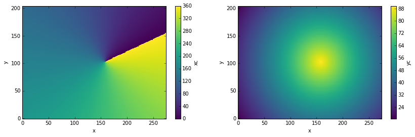
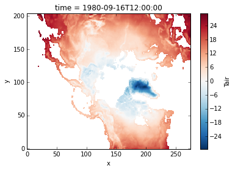
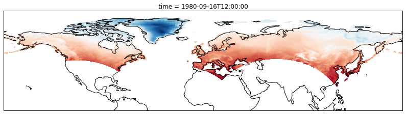
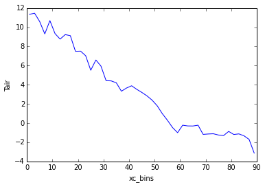

.. _examples.multidim:

Working with Multidimensional Coordinates
=========================================

Author: `Ryan Abernathey <http://github.org/rabernat>`__

Many datasets have *physical coordinates* which differ from their
*logical coordinates*. Xarray provides several ways to plot and analyze
such datasets.

.. code:: python

    %matplotlib inline
    import numpy as np
    import pandas as pd
    import xarray as xr
    import cartopy.crs as ccrs
    from matplotlib import pyplot as plt

    print("numpy version  : ", np.__version__)
    print("pandas version : ", pd.__version__)
    print("xarray version   : ", xr.version.version)

.. parsed-literal::

    ('numpy version  : ', '1.11.0')
    ('pandas version : ', u'0.18.0')
    ('xarray version   : ', '0.7.2-32-gf957eb8')

As an example, consider this dataset from the
`xarray-data <https://github.com/pydata/xarray-data>`__ repository.

.. code:: python

    ! curl -L -O https://github.com/pydata/xarray-data/raw/master/RASM_example_data.nc

.. code:: python

    ds = xr.open_dataset('RASM_example_data.nc')
    ds

.. parsed-literal::

    <xarray.Dataset>
    Dimensions:  (time: 36, x: 275, y: 205)
    Coordinates:
      * time     (time) datetime64[ns] 1980-09-16T12:00:00 1980-10-17 ...
        yc       (y, x) float64 16.53 16.78 17.02 17.27 17.51 17.76 18.0 18.25 ...
        xc       (y, x) float64 189.2 189.4 189.6 189.7 189.9 190.1 190.2 190.4 ...
      * x        (x) int64 0 1 2 3 4 5 6 7 8 9 10 11 12 13 14 15 16 17 18 19 20 ...
      * y        (y) int64 0 1 2 3 4 5 6 7 8 9 10 11 12 13 14 15 16 17 18 19 20 ...
    Data variables:
        Tair     (time, y, x) float64 nan nan nan nan nan nan nan nan nan nan ...
    Attributes:
        title: /workspace/jhamman/processed/R1002RBRxaaa01a/lnd/temp/R1002RBRxaaa01a.vic.ha.1979-09-01.nc
        institution: U.W.
        source: RACM R1002RBRxaaa01a
        output_frequency: daily
        output_mode: averaged
        convention: CF-1.4
        references: Based on the initial model of Liang et al., 1994, JGR, 99, 14,415- 14,429.
        comment: Output from the Variable Infiltration Capacity (VIC) model.
        nco_openmp_thread_number: 1
        NCO: 4.3.7
        history: history deleted for brevity

In this example, the *logical coordinates* are ``x`` and ``y``, while
the *physical coordinates* are ``xc`` and ``yc``, which represent the
latitudes and longitude of the data.

.. code:: python

    print(ds.xc.attrs)
    print(ds.yc.attrs)

.. parsed-literal::

    OrderedDict([(u'long_name', u'longitude of grid cell center'), (u'units', u'degrees_east'), (u'bounds', u'xv')])
    OrderedDict([(u'long_name', u'latitude of grid cell center'), (u'units', u'degrees_north'), (u'bounds', u'yv')])

Plotting
--------

Let's examine these coordinate variables by plotting them.

.. code:: python

    fig, (ax1, ax2) = plt.subplots(ncols=2, figsize=(14,4))
    ds.xc.plot(ax=ax1)
    ds.yc.plot(ax=ax2)

.. parsed-literal::

    <matplotlib.collections.QuadMesh at 0x118688fd0>

.. parsed-literal::

    /Users/rpa/anaconda/lib/python2.7/site-packages/matplotlib/collections.py:590: FutureWarning: elementwise comparison failed; returning scalar instead, but in the future will perform elementwise comparison
      if self._edgecolors == str('face'):

Note that the variables ``xc`` (longitude) and ``yc`` (latitude) are
two-dimensional scalar fields.

If we try to plot the data variable ``Tair``, by default we get the
logical coordinates.

.. code:: python

    ds.Tair[0].plot()

.. parsed-literal::

    <matplotlib.collections.QuadMesh at 0x11b6da890>

In order to visualize the data on a conventional latitude-longitude
grid, we can take advantage of xarray's ability to apply
`cartopy <http://scitools.org.uk/cartopy/index.html>`__ map projections.

.. code:: python

    plt.figure(figsize=(14,6))
    ax = plt.axes(projection=ccrs.PlateCarree())
    ax.set_global()
    ds.Tair[0].plot.pcolormesh(ax=ax, transform=ccrs.PlateCarree(), x='xc', y='yc', add_colorbar=False)
    ax.coastlines()
    ax.set_ylim([0,90]);

Multidimensional Groupby
------------------------

The above example allowed us to visualize the data on a regular
latitude-longitude grid. But what if we want to do a calculation that
involves grouping over one of these physical coordinates (rather than
the logical coordinates), for example, calculating the mean temperature
at each latitude. This can be achieved using xarray's ``groupby``
function, which accepts multidimensional variables. By default,
``groupby`` will use every unique value in the variable, which is
probably not what we want. Instead, we can use the ``groupby_bins``
function to specify the output coordinates of the group.

.. code:: python

    # define two-degree wide latitude bins
    lat_bins = np.arange(0,91,2)
    # define a label for each bin corresponding to the central latitude
    lat_center = np.arange(1,90,2)
    # group according to those bins and take the mean
    Tair_lat_mean = ds.Tair.groupby_bins('xc', lat_bins, labels=lat_center).mean()
    # plot the result
    Tair_lat_mean.plot()

.. parsed-literal::

    [<matplotlib.lines.Line2D at 0x11cb92e90>]

Note that the resulting coordinate for the ``groupby_bins`` operation
got the ``_bins`` suffix appended: ``xc_bins``. This help us distinguish
it from the original multidimensional variable ``xc``.
