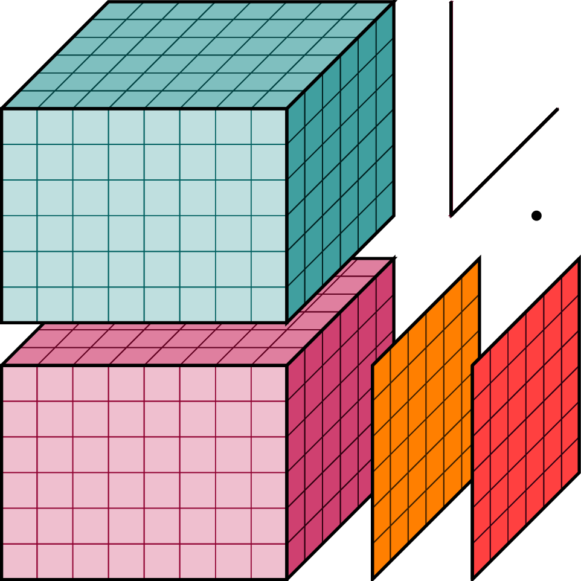

|

N-D labeled arrays and datasets in Python
=========================================

**xray** is an open source project and Python package that aims to bring the
labeled data power of pandas_ to the physical sciences, by providing
N-dimensional variants of the core pandas data structures.

Our goal is to provide a pandas-like and pandas-compatible toolkit for
analytics on multi-dimensional arrays, rather than the tabular data for which
pandas excels. Our approach adopts the `Common Data Model`_ for self-
describing scientific data in widespread use in the Earth sciences:
``xray.Dataset`` is an in-memory representation of a netCDF file.

.. _pandas: http://pandas.pydata.org
.. _Common Data Model: http://www.unidata.ucar.edu/software/thredds/current/netcdf-java/CDM
.. _netCDF: http://www.unidata.ucar.edu/software/netcdf
.. _OPeNDAP: http://www.opendap.org/

Documentation
-------------

.. toctree::
   :maxdepth: 1

   why-xray
   examples
   installing
   data-structures
   indexing
   computation
   groupby
   combining
   time-series
   pandas
   io
   dask
   api
   faq
   whats-new

See also
--------

- `Stephan Hoyer's PyData talk`_ introducing the original version of xray.
- `Nicolas Fauchereau's tutorial`_ on xray for netCDF users.

.. _Stephan Hoyer's PyData talk: https://www.youtube.com/watch?v=T5CZyNwBa9c
.. _Nicolas Fauchereau's tutorial: http://nbviewer.ipython.org/github/nicolasfauchereau/metocean/blob/master/notebooks/xray.ipynb

Get in touch
------------

- To ask questions or discuss xray, use the `mailing list`_.
- Report bugs or view the source code `on GitHub`_.
- You can also get in touch `on Twitter`_.

.. _mailing list: https://groups.google.com/forum/#!forum/xray-dev
.. _on GitHub: http://github.com/xray/xray
.. _on Twitter: http://twitter.com/shoyer

License
-------

xray is available under the open source `Apache License`__.

__ http://www.apache.org/licenses/LICENSE-2.0.html

History
-------

xray is an evolution of an internal tool developed at `The Climate
Corporation`__, and was originally written by current and former Climate Corp
researchers Stephan Hoyer, Alex Kleeman and Eugene Brevdo.

__ http://climate.com/
