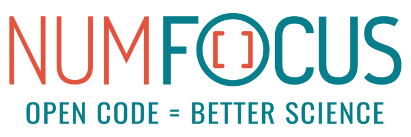

xarray: N-D labeled arrays and datasets in Python
=================================================

**xarray** (formerly **xray**) is an open source project and Python package
that makes working with labelled multi-dimensional arrays simple,
efficient, and fun!

Xarray introduces labels in the form of dimensions, coordinates and
attributes on top of raw NumPy_-like arrays, which allows for a more
intuitive, more concise, and less error-prone developer experience.
The package includes a large and growing library of domain-agnostic functions
for advanced analytics and visualization with these data structures.

Xarray is inspired by and borrows heavily from pandas_, the popular data
analysis package focused on labelled tabular data.
It is particularly tailored to working with netCDF_ files, which were the
source of xarray's data model, and integrates tightly with dask_ for parallel
computing.

.. _NumPy: http://www.numpy.org
.. _pandas: http://pandas.pydata.org
.. _dask: http://dask.org
.. _netCDF: http://www.unidata.ucar.edu/software/netcdf

Documentation
-------------

**Getting Started**

* :doc:`why-xarray`
* :doc:`faq`
* :doc:`quick-overview`
* :doc:`examples`
* :doc:`installing`

.. toctree::
   :maxdepth: 1
   :hidden:
   :caption: Getting Started

   why-xarray
   faq
   quick-overview
   examples
   installing

**User Guide**

* :doc:`terminology`
* :doc:`data-structures`
* :doc:`indexing`
* :doc:`interpolation`
* :doc:`computation`
* :doc:`groupby`
* :doc:`reshaping`
* :doc:`combining`
* :doc:`time-series`
* :doc:`weather-climate`
* :doc:`pandas`
* :doc:`io`
* :doc:`dask`
* :doc:`plotting`

.. toctree::
   :maxdepth: 1
   :hidden:
   :caption: User Guide

   terminology
   data-structures
   indexing
   interpolation
   computation
   groupby
   reshaping
   combining
   time-series
   weather-climate
   pandas
   io
   dask
   plotting

**Help & reference**

* :doc:`whats-new`
* :doc:`howdoi`
* :doc:`api`
* :doc:`internals`
* :doc:`roadmap`
* :doc:`contributing`
* :doc:`related-projects`

.. toctree::
   :maxdepth: 1
   :hidden:
   :caption: Help & reference

   whats-new
   howdoi
   api
   internals
   roadmap
   contributing
   related-projects

See also
--------

- Stephan Hoyer and Joe Hamman's `Journal of Open Research Software paper`_ describing the xarray project.
- The `UW eScience Institute's Geohackweek`_ tutorial on xarray for geospatial data scientists.
- Stephan Hoyer's `SciPy2015 talk`_ introducing xarray to a general audience.
- Stephan Hoyer's `2015 Unidata Users Workshop talk`_ and `tutorial`_ (`with answers`_) introducing
  xarray to users familiar with netCDF.
- `Nicolas Fauchereau's tutorial`_ on xarray for netCDF users.

.. _Journal of Open Research Software paper: http://doi.org/10.5334/jors.148
.. _UW eScience Institute's Geohackweek : https://geohackweek.github.io/nDarrays/
.. _SciPy2015 talk: https://www.youtube.com/watch?v=X0pAhJgySxk
.. _2015 Unidata Users Workshop talk: https://www.youtube.com/watch?v=J9ypQOnt5l8
.. _tutorial: https://github.com/Unidata/unidata-users-workshop/blob/master/notebooks/xray-tutorial.ipynb
.. _with answers: https://github.com/Unidata/unidata-users-workshop/blob/master/notebooks/xray-tutorial-with-answers.ipynb
.. _Nicolas Fauchereau's tutorial: http://nbviewer.iPython.org/github/nicolasfauchereau/metocean/blob/master/notebooks/xray.ipynb

Get in touch
------------

- Ask usage questions ("How do I?") on `StackOverflow`_.
- Report bugs, suggest features or view the source code `on GitHub`_.
- For less well defined questions or ideas, or to announce other projects of
  interest to xarray users, use the `mailing list`_.

.. _StackOverFlow: http://stackoverflow.com/questions/tagged/python-xarray
.. _mailing list: https://groups.google.com/forum/#!forum/xarray
.. _on GitHub: http://github.com/pydata/xarray

NumFOCUS
--------

Xarray is a fiscally sponsored project of NumFOCUS_, a nonprofit dedicated
to supporting the open source scientific computing community. If you like
Xarray and want to support our mission, please consider making a donation_
to support our efforts.

.. _donation: https://numfocus.salsalabs.org/donate-to-xarray/

History
-------

xarray is an evolution of an internal tool developed at `The Climate
Corporation`__. It was originally written by Climate Corp researchers Stephan
Hoyer, Alex Kleeman and Eugene Brevdo and was released as open source in
May 2014. The project was renamed from "xray" in January 2016. Xarray became a
fiscally sponsored project of NumFOCUS_ in August 2018.

__ http://climate.com/
.. _NumFOCUS: https://numfocus.org

License
-------

xarray is available under the open source `Apache License`__.

__ http://www.apache.org/licenses/LICENSE-2.0.html
