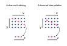

.. _interp:

Interpolating data
==================

.. ipython:: python
   :suppress:

    import numpy as np
    import pandas as pd
    import xarray as xr
    np.random.seed(123456)

xarray offers flexible interpolation routines, which has a similar interface
to our :ref:`indexing <indexing>`.

.. note::

  ``interp`` requires `scipy` installed.

Scalar and 1-dimensional interpolation
--------------------------------------

Interpolating a :py:class:`~xarray.DataArray` works mostly like labeled
indexing of a :py:class:`~xarray.DataArray`,

.. ipython:: python

    da = xr.DataArray(np.sin(0.3 * np.arange(12).reshape(4, 3)),
                      [('time', np.arange(4)),
                       ('space', [0.1, 0.2, 0.3])])
    # label lookup
    da.sel(time=3)

    # interpolation
    da.interp(time=3.5)

Similar to the indexing, :py:meth:`~xarray.DataArray.interp` also accepts an
array-like, which gives the interpolated result as an array.

.. ipython:: python

    # label lookup
    da.sel(time=[2, 3])

    # interpolation
    da.interp(time=[2.5, 3.5])

.. note::

  Currently, our interpolation only works for gridded (structured) arrays
  Therefore, as similar to :py:meth:`~xarray.DataArray.sel`,
  only dimensional coordinates can be used for the original coordinate to be
  interpolated.

Multi-dimensional Interpolation
-------------------------------

Like :py:meth:`~xarray.DataArray.sel`, :py:meth:`~xarray.DataArray.interp`
accepts multiple coordinates. In this case, multidimensional interpolation
is carried out.

.. ipython:: python

    # label lookup
    da.sel(time=2, space=0.1)

    # interpolation
    da.interp(time=2.5, space=0.15)

array-like coordinates can be also accepted

.. ipython:: python

    # label lookup
    da.sel(time=[2, 3], space=[0.1, 0.2])

    # interpolation
    da.interp(time=[1.5, 2.5], space=[0.15, 0.25])

Interpolation methods
---------------------

We use scipy.interpolate.interp1d for 1-dimensional interpolation and
scipy.interpolate.interpn for multi-dimensional interpolation.

The interpolation method can be specified by the ``method`` optional argument.

.. ipython:: python

    da = xr.DataArray(np.sin(np.linspace(0, 2 * np.pi, 10)), dims='x',
                      coords={'x': np.linspace(0, 1, 10)})

    da.plot.line('o', label='original')
    da.interp(x=np.linspace(0, 1, 100)).plot.line(label='linear (default)')
    da.interp(x=np.linspace(0, 1, 100), method='cubic').plot.line(label='cubic')
    @savefig interpolation_sample1.png width=4in
    plt.legend()

Additional keyword arguments can be passed to scipy's functions.

.. ipython:: python

    # fill 0 for the outside of the original coordinates.
    da.interp(x=np.linspace(-0.5, 1.5, 10), kwargs={'fill_value': 0.0})
    # extrapolation
    da.interp(x=np.linspace(-0.5, 1.5, 10), kwargs={'fill_value': 'extrapolate'})

Advanced Interpolation
----------------------

:py:meth:`~xarray.DataArray.interp` accepts :py:class:`~xarray.DataArray`
as similar to :py:meth:`~xarray.DataArray.sel`, which enables us more advanced interpolation.
Based on the dimension of the new coordinate passed to :py:meth:`~xarray.DataArray.interp`, the dimension of the result are determined.

For example, if you want to interpolate a two dimensional array along a particular dimension, as illustrated below,
you can pass two 1-dimensional :py:class:`~xarray.DataArray` s with
a common dimension as new coordinate.

For example:

.. ipython:: python

    da = xr.DataArray(np.sin(0.3 * np.arange(20).reshape(5, 4)),
                      [('x', np.arange(5)),
                       ('y', [0.1, 0.2, 0.3, 0.4])])
    # advanced indexing
    x = xr.DataArray([0, 2, 4], dims='z')
    y = xr.DataArray([0.1, 0.2, 0.3], dims='z')
    da.sel(x=x, y=y)

    # advanced interpolation
    x = xr.DataArray([0.5, 1.5, 2.5], dims='z')
    y = xr.DataArray([0.15, 0.25, 0.35], dims='z')
    da.interp(x=x, y=y)

where values on the original coordinates
``(x, y) = ((0.5, 0.15), (1.5, 0.25), (2.5, 0.35))`` are obtained by the
2-dimensional interpolation and mapped along a new dimension ``z``.

If you want to add a coordinate to the new dimension ``z``, you can supply
:py:class:`~xarray.DataArray` s with a coordinate,

.. ipython:: python

    x = xr.DataArray([0.5, 1.5, 2.5], dims='z', coords={'z': ['a', 'b','c']})
    y = xr.DataArray([0.15, 0.25, 0.35], dims='z')
    da.interp(x=x, y=y)

For the details of the advanced indexing,
see :ref:`more advanced indexing <more_advanced_indexing>`.

Interpolating arrays with NaN
-----------------------------

Our :py:meth:`~xarray.DataArray.interp` works with arrays with NaN
the same way that
`scipy.interpolate.interp1d <https://docs.scipy.org/doc/scipy/reference/generated/scipy.interpolate.interp1d.html>`_ and
`scipy.interpolate.interpn <https://docs.scipy.org/doc/scipy/reference/generated/scipy.interpolate.interpn.html>`_ do.
``linear`` and ``nearest`` methods return arrays including NaN,
while other methods such as ``cubic`` or ``quadratic`` return all NaN arrays.

.. ipython:: python

    da = xr.DataArray([0, 1, np.nan, 3], dims='x', coords={'x': range(4)})
    da.interp(x=[0.5, 1.5, 2.5])
    da.interp(x=[0.5, 1.5, 2.5], method='cubic')

Example
-------

Our interpolation can be used to remap the coordinate of the data,
