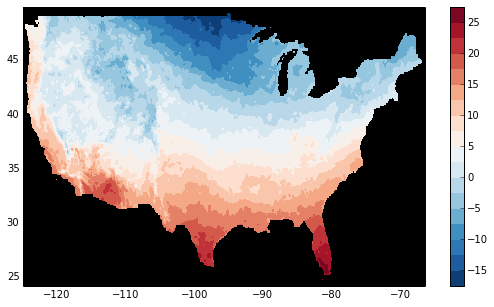

.. _io:

Reading and writing files
=========================

xarray supports direct serialization and IO to several file formats, from
simple :ref:`io.pickle` files to the more flexible :ref:`io.netcdf`
format (recommended).

.. ipython:: python
   :suppress:

    import numpy as np
    import pandas as pd
    import xarray as xr
    np.random.seed(123456)

.. _io.netcdf:

netCDF
------

The recommended way to store xarray data structures is `netCDF`__, which
is a binary file format for self-described datasets that originated
in the geosciences. xarray is based on the netCDF data model, so netCDF files
on disk directly correspond to :py:class:`~xarray.Dataset` objects (more accurately,
a group in a netCDF file directly corresponds to a to :py:class:`~xarray.Dataset` object.
See :ref:`io.netcdf_groups` for more.)

NetCDF is supported on almost all platforms, and parsers exist
for the vast majority of scientific programming languages. Recent versions of
netCDF are based on the even more widely used HDF5 file-format.

__ http://www.unidata.ucar.edu/software/netcdf/

.. tip::

    If you aren't familiar with this data format, the `netCDF FAQ`_ is a good
    place to start.

.. _netCDF FAQ: http://www.unidata.ucar.edu/software/netcdf/docs/faq.html#What-Is-netCDF

Reading and writing netCDF files with xarray requires scipy or the
`netCDF4-Python`__ library to be installed (the later is required to
read/write netCDF V4 files and use the compression options described below).

__ https://github.com/Unidata/netcdf4-python

We can save a Dataset to disk using the
:py:meth:`~Dataset.to_netcdf` method:

.. ipython:: python

    ds = xr.Dataset({'foo': (('x', 'y'), np.random.rand(4, 5))},
                    coords={'x': [10, 20, 30, 40],
                            'y': pd.date_range('2000-01-01', periods=5),
                            'z': ('x', list('abcd'))})

    ds.to_netcdf('saved_on_disk.nc')

By default, the file is saved as netCDF4 (assuming netCDF4-Python is
installed). You can control the format and engine used to write the file with
the ``format`` and ``engine`` arguments.

.. tip::

   Using the `h5netcdf <https://github.com/shoyer/h5netcdf>`_  package
   by passing ``engine='h5netcdf'`` to :py:meth:`~xarray.open_dataset` can
   sometimes be quicker than the default ``engine='netcdf4'`` that uses the
   `netCDF4 <https://github.com/Unidata/netcdf4-python>`_ package.

We can load netCDF files to create a new Dataset using
:py:func:`~xarray.open_dataset`:

.. ipython:: python

    ds_disk = xr.open_dataset('saved_on_disk.nc')
    ds_disk

Similarly, a DataArray can be saved to disk using the
:py:attr:`DataArray.to_netcdf <xarray.DataArray.to_netcdf>` method, and loaded
from disk using the :py:func:`~xarray.open_dataarray` function. As netCDF files
correspond to :py:class:`~xarray.Dataset` objects, these functions internally
convert the ``DataArray`` to a ``Dataset`` before saving, and then convert back
when loading, ensuring that the ``DataArray`` that is loaded is always exactly
the same as the one that was saved.

A dataset can also be loaded or written to a specific group within a netCDF
file. To load from a group, pass a ``group`` keyword argument to the
``open_dataset`` function. The group can be specified as a path-like
string, e.g., to access subgroup 'bar' within group 'foo' pass
'/foo/bar' as the ``group`` argument. When writing multiple groups in one file,
pass ``mode='a'`` to ``to_netcdf`` to ensure that each call does not delete the
file.

Data is *always* loaded lazily from netCDF files. You can manipulate, slice and subset
Dataset and DataArray objects, and no array values are loaded into memory until
you try to perform some sort of actual computation. For an example of how these
lazy arrays work, see the OPeNDAP section below.

It is important to note that when you modify values of a Dataset, even one
linked to files on disk, only the in-memory copy you are manipulating in xarray
is modified: the original file on disk is never touched.

.. tip::

    xarray's lazy loading of remote or on-disk datasets is often but not always
    desirable. Before performing computationally intense operations, it is
    often a good idea to load a Dataset (or DataArray) entirely into memory by
    invoking the :py:meth:`~xarray.Dataset.load` method.

Datasets have a :py:meth:`~xarray.Dataset.close` method to close the associated
netCDF file. However, it's often cleaner to use a ``with`` statement:

.. ipython:: python

    # this automatically closes the dataset after use
    with xr.open_dataset('saved_on_disk.nc') as ds:
        print(ds.keys())

Although xarray provides reasonable support for incremental reads of files on
disk, it does not support incremental writes, which can be a useful strategy
for dealing with datasets too big to fit into memory. Instead, xarray integrates
with dask.array (see :ref:`dask`), which provides a fully featured engine for
streaming computation.

It is possible to append or overwrite netCDF variables using the ``mode='a'``
argument. When using this option, all variables in the dataset will be written
to the original netCDF file, regardless if they exist in the original dataset.

.. _io.netcdf_groups:

Groups
~~~~~~

NetCDF groups are not supported as part of the :py:class:`~xarray.Dataset` data model.
Instead, groups can be loaded individually as Dataset objects.
To do so, pass a ``group`` keyword argument to the
:py:func:`~xarray.open_dataset` function. The group can be specified as a path-like
string, e.g., to access subgroup ``'bar'`` within group ``'foo'`` pass
``'/foo/bar'`` as the ``group`` argument.
In a similar way, the ``group`` keyword argument can be given to the
:py:meth:`~xarray.Dataset.to_netcdf` method to write to a group
in a netCDF file.
When writing multiple groups in one file, pass ``mode='a'`` to
:py:meth:`~xarray.Dataset.to_netcdf` to ensure that each call does not delete the file.

.. _io.encoding:

Reading encoded data
~~~~~~~~~~~~~~~~~~~~

NetCDF files follow some conventions for encoding datetime arrays (as numbers
with a "units" attribute) and for packing and unpacking data (as
described by the "scale_factor" and "add_offset" attributes). If the argument
``decode_cf=True`` (default) is given to :py:func:`~xarray.open_dataset`, xarray will attempt
to automatically decode the values in the netCDF objects according to
`CF conventions`_. Sometimes this will fail, for example, if a variable
has an invalid "units" or "calendar" attribute. For these cases, you can
turn this decoding off manually.

.. _CF conventions: http://cfconventions.org/

You can view this encoding information (among others) in the
:py:attr:`DataArray.encoding <xarray.DataArray.encoding>` and
:py:attr:`DataArray.encoding <xarray.DataArray.encoding>` attributes:

.. ipython::
    :verbatim:

    In [1]: ds_disk['y'].encoding
    Out[1]:
    {'zlib': False,
     'shuffle': False,
     'complevel': 0,
     'fletcher32': False,
     'contiguous': True,
     'chunksizes': None,
     'source': 'saved_on_disk.nc',
     'original_shape': (5,),
     'dtype': dtype('int64'),
     'units': 'days since 2000-01-01 00:00:00',
     'calendar': 'proleptic_gregorian'}

    In [9]: ds_disk.encoding
    Out[9]:
    {'unlimited_dims': set(),
     'source': 'saved_on_disk.nc'}

Note that all operations that manipulate variables other than indexing
will remove encoding information.

.. ipython:: python
    :suppress:

    ds_disk.close()

.. _combining multiple files:

Reading multi-file datasets
...........................

NetCDF files are often encountered in collections, e.g., with different files
corresponding to different model runs or one file per timestamp.
xarray can straightforwardly combine such files into a single Dataset by making use of
:py:func:`~xarray.concat`, :py:func:`~xarray.merge`, :py:func:`~xarray.combine_nested` and
:py:func:`~xarray.combine_by_coords`. For details on the difference between these
functions see :ref:`combining data`.

Xarray includes support for manipulating datasets that don't fit into memory
with dask_. If you have dask installed, you can open multiple files
simultaneously in parallel using :py:func:`~xarray.open_mfdataset`::

    xr.open_mfdataset('my/files/*.nc', parallel=True)

This function automatically concatenates and merges multiple files into a
single xarray dataset.
It is the recommended way to open multiple files with xarray.
For more details on parallel reading, see :ref:`combining.multi`, :ref:`dask.io` and a
`blog post`_ by Stephan Hoyer.
:py:func:`~xarray.open_mfdataset` takes many kwargs that allow you to
control its behaviour (for e.g. ``parallel``, ``combine``, ``compat``, ``join``, ``concat_dim``).
See its docstring for more details.

.. note::

    A common use-case involves a dataset distributed across a large number of files with
    each file containing a large number of variables. Commonly a few of these variables
    need to be concatenated along a dimension (say ``"time"``), while the rest are equal
    across the datasets (ignoring floating point differences). The following command
    with suitable modifications (such as ``parallel=True``) works well with such datasets::

         xr.open_mfdataset('my/files/*.nc', concat_dim="time",
     	              	   data_vars='minimal', coords='minimal', compat='override')

    This command concatenates variables along the ``"time"`` dimension, but only those that
    already contain the ``"time"`` dimension (``data_vars='minimal', coords='minimal'``).
    Variables that lack the ``"time"`` dimension are taken from the first dataset
    (``compat='override'``).

.. _dask: http://dask.pydata.org
.. _blog post: http://stephanhoyer.com/2015/06/11/xray-dask-out-of-core-labeled-arrays/

Sometimes multi-file datasets are not conveniently organized for easy use of :py:func:`~xarray.open_mfdataset`.
One can use the ``preprocess`` argument to provide a function that takes a dataset
and returns a modified Dataset.
:py:func:`~xarray.open_mfdataset` will call ``preprocess`` on every dataset
(corresponding to each file) prior to combining them.

If :py:func:`~xarray.open_mfdataset` does not meet your needs, other approaches are possible.
The general pattern for parallel reading of multiple files
using dask, modifying those datasets and then combining into a single ``Dataset`` is::

     def modify(ds):
         # modify ds here
         return ds

     # this is basically what open_mfdataset does
     open_kwargs = dict(decode_cf=True, decode_times=False)
     open_tasks = [dask.delayed(xr.open_dataset)(f, **open_kwargs) for f in file_names]
     tasks = [dask.delayed(modify)(task) for task in open_tasks]
     datasets = dask.compute(tasks)  # get a list of xarray.Datasets
     combined = xr.combine_nested(datasets)  # or some combination of concat, merge

As an example, here's how we could approximate ``MFDataset`` from the netCDF4
library::

    from glob import glob
    import xarray as xr

    def read_netcdfs(files, dim):
        # glob expands paths with * to a list of files, like the unix shell
        paths = sorted(glob(files))
        datasets = [xr.open_dataset(p) for p in paths]
        combined = xr.concat(dataset, dim)
        return combined

    combined = read_netcdfs('/all/my/files/*.nc', dim='time')

This function will work in many cases, but it's not very robust. First, it
never closes files, which means it will fail one you need to load more than
a few thousands file. Second, it assumes that you want all the data from each
file and that it can all fit into memory. In many situations, you only need
a small subset or an aggregated summary of the data from each file.

Here's a slightly more sophisticated example of how to remedy these
deficiencies::

    def read_netcdfs(files, dim, transform_func=None):
        def process_one_path(path):
            # use a context manager, to ensure the file gets closed after use
            with xr.open_dataset(path) as ds:
                # transform_func should do some sort of selection or
                # aggregation
                if transform_func is not None:
                    ds = transform_func(ds)
                # load all data from the transformed dataset, to ensure we can
                # use it after closing each original file
                ds.load()
                return ds

        paths = sorted(glob(files))
        datasets = [process_one_path(p) for p in paths]
        combined = xr.concat(datasets, dim)
        return combined

    # here we suppose we only care about the combined mean of each file;
    # you might also use indexing operations like .sel to subset datasets
    combined = read_netcdfs('/all/my/files/*.nc', dim='time',
                            transform_func=lambda ds: ds.mean())

This pattern works well and is very robust. We've used similar code to process
tens of thousands of files constituting 100s of GB of data.

.. _io.netcdf.writing_encoded:

Writing encoded data
~~~~~~~~~~~~~~~~~~~~

Conversely, you can customize how xarray writes netCDF files on disk by
providing explicit encodings for each dataset variable. The ``encoding``
argument takes a dictionary with variable names as keys and variable specific
encodings as values. These encodings are saved as attributes on the netCDF
variables on disk, which allows xarray to faithfully read encoded data back into
memory.

It is important to note that using encodings is entirely optional: if you do not
supply any of these encoding options, xarray will write data to disk using a
default encoding, or the options in the ``encoding`` attribute, if set.
This works perfectly fine in most cases, but encoding can be useful for
additional control, especially for enabling compression.

In the file on disk, these encodings as saved as attributes on each variable, which
allow xarray and other CF-compliant tools for working with netCDF files to correctly
read the data.

Scaling and type conversions
............................

These encoding options work on any version of the netCDF file format:

- ``dtype``: Any valid NumPy dtype or string convertable to a dtype, e.g., ``'int16'``
  or ``'float32'``. This controls the type of the data written on disk.
- ``_FillValue``:  Values of ``NaN`` in xarray variables are remapped to this value when
  saved on disk. This is important when converting floating point with missing values
  to integers on disk, because ``NaN`` is not a valid value for integer dtypes. As a
  default, variables with float types are attributed a ``_FillValue`` of ``NaN`` in the
  output file, unless explicitly disabled with an encoding ``{'_FillValue': None}``.
- ``scale_factor`` and ``add_offset``: Used to convert from encoded data on disk to
  to the decoded data in memory, according to the formula
  ``decoded = scale_factor * encoded + add_offset``.

These parameters can be fruitfully combined to compress discretized data on disk. For
example, to save the variable ``foo`` with a precision of 0.1 in 16-bit integers while
converting ``NaN`` to ``-9999``, we would use
``encoding={'foo': {'dtype': 'int16', 'scale_factor': 0.1, '_FillValue': -9999}}``.
Compression and decompression with such discretization is extremely fast.

.. _io.string-encoding:

String encoding
...............

xarray can write unicode strings to netCDF files in two ways:

- As variable length strings. This is only supported on netCDF4 (HDF5) files.
- By encoding strings into bytes, and writing encoded bytes as a character
  array. The default encoding is UTF-8.

By default, we use variable length strings for compatible files and fall-back
to using encoded character arrays. Character arrays can be selected even for
netCDF4 files by setting the ``dtype`` field in ``encoding`` to ``S1``
(corresponding to NumPy's single-character bytes dtype).

If character arrays are used:

- The string encoding that was used is stored on
  disk in the ``_Encoding`` attribute, which matches an ad-hoc convention
  `adopted by the netCDF4-Python library <https://github.com/Unidata/netcdf4-python/pull/665>`_.
  At the time of this writing (October 2017), a standard convention for indicating
  string encoding for character arrays in netCDF files was
  `still under discussion <https://github.com/Unidata/netcdf-c/issues/402>`_.
  Technically, you can use
  `any string encoding recognized by Python <https://docs.python.org/3/library/codecs.html#standard-encodings>`_ if you feel the need to deviate from UTF-8,
  by setting the ``_Encoding`` field in ``encoding``. But
  `we don't recommend it <http://utf8everywhere.org/>`_.
- The character dimension name can be specifed by the ``char_dim_name`` field of a variable's
  ``encoding``. If this is not specified the default name for the character dimension is
  ``'string%s' % data.shape[-1]``. When decoding character arrays from existing files, the
  ``char_dim_name`` is added to the variables ``encoding`` to preserve if encoding happens, but
  the field can be edited by the user.

.. warning::

  Missing values in bytes or unicode string arrays (represented by ``NaN`` in
  xarray) are currently written to disk as empty strings ``''``. This means
  missing values will not be restored when data is loaded from disk.
  This behavior is likely to change in the future (:issue:`1647`).
  Unfortunately, explicitly setting a ``_FillValue`` for string arrays to handle
  missing values doesn't work yet either, though we also hope to fix this in the
  future.

Chunk based compression
.......................

``zlib``, ``complevel``, ``fletcher32``, ``continguous`` and ``chunksizes``
can be used for enabling netCDF4/HDF5's chunk based compression, as described
in the `documentation for createVariable`_ for netCDF4-Python. This only works
for netCDF4 files and thus requires using ``format='netCDF4'`` and either
``engine='netcdf4'`` or ``engine='h5netcdf'``.

.. _documentation for createVariable: http://unidata.github.io/netcdf4-python/#netCDF4.Dataset.createVariable

Chunk based gzip compression can yield impressive space savings, especially
for sparse data, but it comes with significant performance overhead. HDF5
libraries can only read complete chunks back into memory, and maximum
decompression speed is in the range of 50-100 MB/s. Worse, HDF5's compression
and decompression currently cannot be parallelized with dask. For these reasons, we
recommend trying discretization based compression (described above) first.

Time units
..........

The ``units`` and ``calendar`` attributes control how xarray serializes ``datetime64`` and
``timedelta64`` arrays to datasets on disk as numeric values. The ``units`` encoding
should be a string like ``'days since 1900-01-01'`` for ``datetime64`` data or a string
like ``'days'`` for ``timedelta64`` data. ``calendar`` should be one of the calendar types
supported by netCDF4-python: 'standard', 'gregorian', 'proleptic_gregorian' 'noleap',
'365_day', '360_day', 'julian', 'all_leap', '366_day'.

By default, xarray uses the 'proleptic_gregorian' calendar and units of the smallest time
difference between values, with a reference time of the first time value.

Invalid netCDF files
~~~~~~~~~~~~~~~~~~~~

The library ``h5netcdf`` allows writing some dtypes (booleans, complex, ...) that aren't 
allowed in netCDF4 (see
`h5netcdf documentation <https://github.com/shoyer/h5netcdf#invalid-netcdf-files)>`_.
This feature is availabe through :py:func:`DataArray.to_netcdf` and
:py:func:`Dataset.to_netcdf` when used with ``engine="h5netcdf"``
and currently raises a warning unless ``invalid_netcdf=True`` is set:

.. ipython:: python
    :okwarning:

    # Writing complex valued data
    da = xr.DataArray([1.+1.j, 2.+2.j, 3.+3.j])
    da.to_netcdf("complex.nc", engine="h5netcdf", invalid_netcdf=True)

    # Reading it back
    xr.open_dataarray("complex.nc", engine="h5netcdf")

.. ipython:: python
    :suppress:

    import os
    os.remove('complex.nc')

.. warning::

  Note that this produces a file that is likely to be not readable by other netCDF
  libraries!

.. _io.iris:

Iris
----

The Iris_ tool allows easy reading of common meteorological and climate model formats
(including GRIB and UK MetOffice PP files) into ``Cube`` objects which are in many ways very
similar to ``DataArray`` objects, while enforcing a CF-compliant data model. If iris is
installed xarray can convert a ``DataArray`` into a ``Cube`` using
:py:meth:`~xarray.DataArray.to_iris`:

.. ipython:: python

    da = xr.DataArray(np.random.rand(4, 5), dims=['x', 'y'],
                      coords=dict(x=[10, 20, 30, 40],
                                  y=pd.date_range('2000-01-01', periods=5)))

    cube = da.to_iris()
    cube

Conversely, we can create a new ``DataArray`` object from a ``Cube`` using
:py:meth:`~xarray.DataArray.from_iris`:

.. ipython:: python

    da_cube = xr.DataArray.from_iris(cube)
    da_cube

.. _Iris: http://scitools.org.uk/iris

OPeNDAP
-------

xarray includes support for `OPeNDAP`__ (via the netCDF4 library or Pydap), which
lets us access large datasets over HTTP.

__ http://www.opendap.org/

For example, we can open a connection to GBs of weather data produced by the
`PRISM`__ project, and hosted by `IRI`__ at Columbia:

__ http://www.prism.oregonstate.edu/
__ http://iri.columbia.edu/

.. ipython source code for this section
   we don't use this to avoid hitting the DAP server on every doc build.

   remote_data = xr.open_dataset(
       'http://iridl.ldeo.columbia.edu/SOURCES/.OSU/.PRISM/.monthly/dods',
       decode_times=False)
   tmax = remote_data.tmax[:500, ::3, ::3]
   tmax

   @savefig opendap-prism-tmax.png
   tmax[0].plot()

.. ipython::
    :verbatim:

    In [3]: remote_data = xr.open_dataset(
       ...:     'http://iridl.ldeo.columbia.edu/SOURCES/.OSU/.PRISM/.monthly/dods',
       ...:     decode_times=False)

    In [4]: remote_data
    Out[4]:
    <xarray.Dataset>
    Dimensions:  (T: 1422, X: 1405, Y: 621)
    Coordinates:
      * X        (X) float32 -125.0 -124.958 -124.917 -124.875 -124.833 -124.792 -124.75 ...
      * T        (T) float32 -779.5 -778.5 -777.5 -776.5 -775.5 -774.5 -773.5 -772.5 -771.5 ...
      * Y        (Y) float32 49.9167 49.875 49.8333 49.7917 49.75 49.7083 49.6667 49.625 ...
    Data variables:
        ppt      (T, Y, X) float64 ...
        tdmean   (T, Y, X) float64 ...
        tmax     (T, Y, X) float64 ...
        tmin     (T, Y, X) float64 ...
    Attributes:
        Conventions: IRIDL
        expires: 1375315200

.. TODO: update this example to show off decode_cf?

.. note::

    Like many real-world datasets, this dataset does not entirely follow
    `CF conventions`_. Unexpected formats will usually cause xarray's automatic
    decoding to fail. The way to work around this is to either set
    ``decode_cf=False`` in ``open_dataset`` to turn off all use of CF
    conventions, or by only disabling the troublesome parser.
    In this case, we set ``decode_times=False`` because the time axis here
    provides the calendar attribute in a format that xarray does not expect
    (the integer ``360`` instead of a string like ``'360_day'``).

We can select and slice this data any number of times, and nothing is loaded
over the network until we look at particular values:

.. ipython::
    :verbatim:

    In [4]: tmax = remote_data['tmax'][:500, ::3, ::3]

    In [5]: tmax
    Out[5]:
    <xarray.DataArray 'tmax' (T: 500, Y: 207, X: 469)>
    [48541500 values with dtype=float64]
    Coordinates:
      * Y        (Y) float32 49.9167 49.7917 49.6667 49.5417 49.4167 49.2917 ...
      * X        (X) float32 -125.0 -124.875 -124.75 -124.625 -124.5 -124.375 ...
      * T        (T) float32 -779.5 -778.5 -777.5 -776.5 -775.5 -774.5 -773.5 ...
    Attributes:
        pointwidth: 120
        standard_name: air_temperature
        units: Celsius_scale
        expires: 1443657600

    # the data is downloaded automatically when we make the plot
    In [6]: tmax[0].plot()

Some servers require authentication before we can access the data. For this
purpose we can explicitly create a :py:class:`~xarray.backends.PydapDataStore`
and pass in a `Requests`__ session object. For example for
HTTP Basic authentication::

    import xarray as xr
    import requests

    session = requests.Session()
    session.auth = ('username', 'password')

    store = xr.backends.PydapDataStore.open('http://example.com/data',
                                            session=session)
    ds = xr.open_dataset(store)

`Pydap's cas module`__ has functions that generate custom sessions for
servers that use CAS single sign-on. For example, to connect to servers
that require NASA's URS authentication::

  import xarray as xr
  from pydata.cas.urs import setup_session

  ds_url = 'https://gpm1.gesdisc.eosdis.nasa.gov/opendap/hyrax/example.nc'

  session = setup_session('username', 'password', check_url=ds_url)
  store = xr.backends.PydapDataStore.open(ds_url, session=session)

  ds = xr.open_dataset(store)

__ http://docs.python-requests.org
__ http://pydap.readthedocs.io/en/latest/client.html#authentication

.. _io.pickle:

Pickle
------

The simplest way to serialize an xarray object is to use Python's built-in pickle
module:

.. ipython:: python

    import pickle

    # use the highest protocol (-1) because it is way faster than the default
    # text based pickle format
    pkl = pickle.dumps(ds, protocol=-1)

    pickle.loads(pkl)

Pickling is important because it doesn't require any external libraries
and lets you use xarray objects with Python modules like
:py:mod:`multiprocessing` or :ref:`Dask <dask>`. However, pickling is
**not recommended for long-term storage**.

Restoring a pickle requires that the internal structure of the types for the
pickled data remain unchanged. Because the internal design of xarray is still
being refined, we make no guarantees (at this point) that objects pickled with
this version of xarray will work in future versions.

.. note::

  When pickling an object opened from a NetCDF file, the pickle file will
  contain a reference to the file on disk. If you want to store the actual
  array values, load it into memory first with :py:meth:`~xarray.Dataset.load`
  or :py:meth:`~xarray.Dataset.compute`.

.. _dictionary io:

Dictionary
----------

We can convert a ``Dataset`` (or a ``DataArray``) to a dict using
:py:meth:`~xarray.Dataset.to_dict`:

.. ipython:: python

    d = ds.to_dict()
    d

We can create a new xarray object from a dict using
:py:meth:`~xarray.Dataset.from_dict`:

.. ipython:: python

    ds_dict = xr.Dataset.from_dict(d)
    ds_dict

Dictionary support allows for flexible use of xarray objects. It doesn't
require external libraries and dicts can easily be pickled, or converted to
json, or geojson. All the values are converted to lists, so dicts might
be quite large.

To export just the dataset schema, without the data itself, use the
``data=False`` option:

.. ipython:: python

    ds.to_dict(data=False)

This can be useful for generating indices of dataset contents to expose to
search indices or other automated data discovery tools.

.. ipython:: python
    :suppress:

    import os
    os.remove('saved_on_disk.nc')

.. _io.rasterio:

Rasterio
--------

GeoTIFFs and other gridded raster datasets can be opened using `rasterio`_, if
rasterio is installed. Here is an example of how to use
:py:func:`~xarray.open_rasterio` to read one of rasterio's `test files`_:

.. ipython::
    :verbatim:

    In [7]: rio = xr.open_rasterio('RGB.byte.tif')

    In [8]: rio
    Out[8]:
    <xarray.DataArray (band: 3, y: 718, x: 791)>
    [1703814 values with dtype=uint8]
    Coordinates:
      * band     (band) int64 1 2 3
      * y        (y) float64 2.827e+06 2.826e+06 2.826e+06 2.826e+06 2.826e+06 ...
      * x        (x) float64 1.021e+05 1.024e+05 1.027e+05 1.03e+05 1.033e+05 ...
    Attributes:
        res:        (300.0379266750948, 300.041782729805)
        transform:  (300.0379266750948, 0.0, 101985.0, 0.0, -300.041782729805, 28...
        is_tiled:   0
        crs:        +init=epsg:32618

The ``x`` and ``y`` coordinates are generated out of the file's metadata
(``bounds``, ``width``, ``height``), and they can be understood as cartesian
coordinates defined in the file's projection provided by the ``crs`` attribute.
``crs`` is a PROJ4 string which can be parsed by e.g. `pyproj`_ or rasterio.
See :ref:`recipes.rasterio` for an example of how to convert these to
longitudes and latitudes.

.. warning::

    This feature has been added in xarray v0.9.6 and should still be
    considered as being experimental. Please report any bug you may find
    on xarray's github repository.

.. _rasterio: https://rasterio.readthedocs.io/en/latest/
.. _test files: https://github.com/mapbox/rasterio/blob/master/tests/data/RGB.byte.tif
.. _pyproj: https://github.com/jswhit/pyproj

.. _io.zarr:

Zarr
----

`Zarr`_ is a Python package providing an implementation of chunked, compressed,
N-dimensional arrays.
Zarr has the ability to store arrays in a range of ways, including in memory,
in files, and in cloud-based object storage such as `Amazon S3`_ and
`Google Cloud Storage`_.
Xarray's Zarr backend allows xarray to leverage these capabilities.

.. warning::

    Zarr support is still an experimental feature. Please report any bugs or
    unexepected behavior via github issues.

Xarray can't open just any zarr dataset, because xarray requires special
metadata (attributes) describing the dataset dimensions and coordinates.
At this time, xarray can only open zarr datasets that have been written by
xarray. To write a dataset with zarr, we use the
:py:attr:`Dataset.to_zarr <xarray.Dataset.to_zarr>` method.
To write to a local directory, we pass a path to a directory

.. ipython:: python
   :suppress:

    ! rm -rf path/to/directory.zarr

.. ipython:: python

    ds = xr.Dataset({'foo': (('x', 'y'), np.random.rand(4, 5))},
                    coords={'x': [10, 20, 30, 40],
                            'y': pd.date_range('2000-01-01', periods=5),
                            'z': ('x', list('abcd'))})
    ds.to_zarr('path/to/directory.zarr')

(The suffix ``.zarr`` is optional--just a reminder that a zarr store lives
there.) If the directory does not exist, it will be created. If a zarr
store is already present at that path, an error will be raised, preventing it
from being overwritten. To override this behavior and overwrite an existing
store, add ``mode='w'`` when invoking ``to_zarr``.

It is also possible to append to an existing store. For that, set
``append_dim`` to the name of the dimension along which to append. ``mode``
can be omitted as it will internally be set to ``'a'``.

.. ipython:: python
   :suppress:

    ! rm -rf path/to/directory.zarr

.. ipython:: python

    ds1 = xr.Dataset({'foo': (('x', 'y', 't'), np.random.rand(4, 5, 2))},
                     coords={'x': [10, 20, 30, 40],
                             'y': [1,2,3,4,5],
                             't': pd.date_range('2001-01-01', periods=2)})
    ds1.to_zarr('path/to/directory.zarr')
    ds2 = xr.Dataset({'foo': (('x', 'y', 't'), np.random.rand(4, 5, 2))},
                     coords={'x': [10, 20, 30, 40],
                             'y': [1,2,3,4,5],
                             't': pd.date_range('2001-01-03', periods=2)})
    ds2.to_zarr('path/to/directory.zarr', append_dim='t')

To store variable length strings use ``dtype=object``.

To read back a zarr dataset that has been created this way, we use the
:py:func:`~xarray.open_zarr` method:

.. ipython:: python

    ds_zarr = xr.open_zarr('path/to/directory.zarr')
    ds_zarr

Cloud Storage Buckets
~~~~~~~~~~~~~~~~~~~~~

It is possible to read and write xarray datasets directly from / to cloud
storage buckets using zarr. This example uses the `gcsfs`_ package to provide
a ``MutableMapping`` interface to `Google Cloud Storage`_, which we can then
pass to xarray::

    import gcsfs
    fs = gcsfs.GCSFileSystem(project='<project-name>', token=None)
    gcsmap = gcsfs.mapping.GCSMap('<bucket-name>', gcs=fs, check=True, create=False)
    # write to the bucket
    ds.to_zarr(store=gcsmap)
    # read it back
    ds_gcs = xr.open_zarr(gcsmap)

.. _Zarr: http://zarr.readthedocs.io/
.. _Amazon S3: https://aws.amazon.com/s3/
.. _Google Cloud Storage: https://cloud.google.com/storage/
.. _gcsfs: https://github.com/dask/gcsfs

Zarr Compressors and Filters
~~~~~~~~~~~~~~~~~~~~~~~~~~~~

There are many different options for compression and filtering possible with
zarr. These are described in the
`zarr documentation <http://zarr.readthedocs.io/en/stable/tutorial.html#compressors>`_.
These options can be passed to the ``to_zarr`` method as variable encoding.
For example:

.. ipython:: python
   :suppress:

    ! rm -rf foo.zarr

.. ipython:: python

    import zarr
    compressor = zarr.Blosc(cname='zstd', clevel=3, shuffle=2)
    ds.to_zarr('foo.zarr', encoding={'foo': {'compressor': compressor}})

.. note::

    Not all native zarr compression and filtering options have been tested with
    xarray.

Consolidated Metadata
~~~~~~~~~~~~~~~~~~~~~

Xarray needs to read all of the zarr metadata when it opens a dataset.
In some storage mediums, such as with cloud object storage (e.g. amazon S3),
this can introduce significant overhead, because two separate HTTP calls to the
object store must be made for each variable in the dataset.
With version 2.3, zarr will support a feature called *consolidated metadata*,
which allows all metadata for the entire dataset to be stored with a single
key (by default called ``.zmetadata``). This can drastically speed up
opening the store. (For more information on this feature, consult the
`zarr docs <https://zarr.readthedocs.io/en/latest/tutorial.html#consolidating-metadata>`_.)

If you have zarr version 2.3 or greater, xarray can write and read stores
with consolidated metadata. To write consolidated metadata, pass the
``consolidated=True`` option to the
:py:attr:`Dataset.to_zarr <xarray.Dataset.to_zarr>` method::

    ds.to_zarr('foo.zarr', consolidated=True)

To read a consolidated store, pass the ``consolidated=True`` option to
:py:func:`~xarray.open_zarr`::

    ds = xr.open_zarr('foo.zarr', consolidated=True)

Xarray can't perform consolidation on pre-existing zarr datasets. This should
be done directly from zarr, as described in the
`zarr docs <https://zarr.readthedocs.io/en/latest/tutorial.html#consolidating-metadata>`_.

.. _io.cfgrib:

.. ipython:: python
   :suppress:

    import shutil
    shutil.rmtree('foo.zarr')
    shutil.rmtree('path/to/directory.zarr')

GRIB format via cfgrib
----------------------

xarray supports reading GRIB files via ECMWF cfgrib_ python driver and ecCodes_
C-library, if they are installed. To open a GRIB file supply ``engine='cfgrib'``
to :py:func:`~xarray.open_dataset`:

.. ipython::
    :verbatim:

    In [1]: ds_grib = xr.open_dataset('example.grib', engine='cfgrib')

We recommend installing ecCodes via conda::

    conda install -c conda-forge eccodes
    pip install cfgrib

.. _cfgrib: https://github.com/ecmwf/cfgrib
.. _ecCodes: https://confluence.ecmwf.int/display/ECC/ecCodes+Home

.. _io.pynio:

Formats supported by PyNIO
--------------------------

xarray can also read GRIB, HDF4 and other file formats supported by PyNIO_,
if PyNIO is installed. To use PyNIO to read such files, supply
``engine='pynio'`` to :py:func:`~xarray.open_dataset`.

We recommend installing PyNIO via conda::

    conda install -c conda-forge pynio

.. _PyNIO: https://www.pyngl.ucar.edu/Nio.shtml

.. _io.PseudoNetCDF:

Formats supported by PseudoNetCDF
---------------------------------

xarray can also read CAMx, BPCH, ARL PACKED BIT, and many other file
formats supported by PseudoNetCDF_, if PseudoNetCDF is installed.
PseudoNetCDF can also provide Climate Forecasting Conventions to
CMAQ files. In addition, PseudoNetCDF can automatically register custom
readers that subclass PseudoNetCDF.PseudoNetCDFFile. PseudoNetCDF can
identify readers heuristically, or format can be specified via a key in
`backend_kwargs`.

To use PseudoNetCDF to read such files, supply
``engine='pseudonetcdf'`` to :py:func:`~xarray.open_dataset`.

Add ``backend_kwargs={'format': '<format name>'}`` where `<format name>`
options are listed on the PseudoNetCDF page.

.. _PseudoNetCDF: http://github.com/barronh/PseudoNetCDF

CSV and other formats supported by Pandas
-----------------------------------------

For more options (tabular formats and CSV files in particular), consider
exporting your objects to pandas and using its broad range of `IO tools`_.
For CSV files, one might also consider `xarray_extras`_.

.. _xarray_extras: https://xarray-extras.readthedocs.io/en/latest/api/csv.html

.. _IO tools: http://pandas.pydata.org/pandas-docs/stable/io.html
