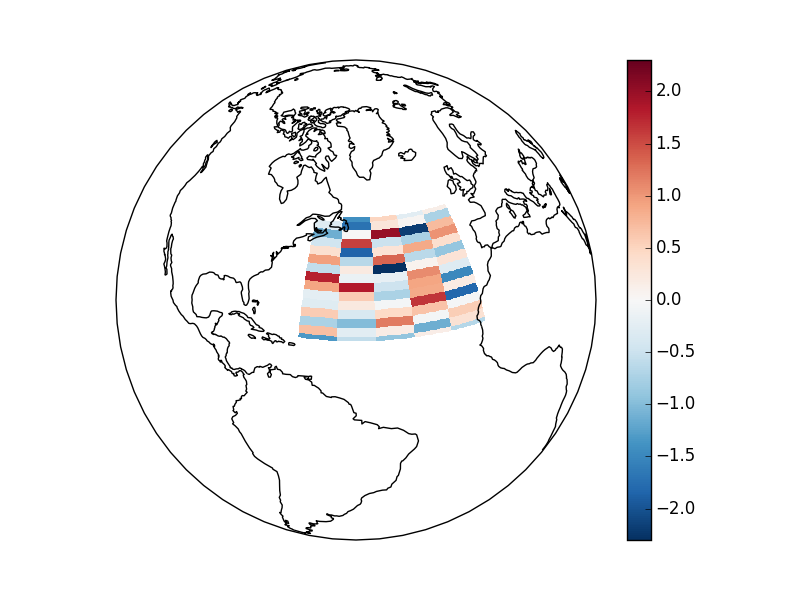

.. _plotting:

Plotting
========

.. note::
    Plotting will be under active development for August and September 2015.

Introduction
------------

Labeled data enables expressive computations. These same
labels can also be used to easily create informative plots.

Xray's plotting capabilities are centered around
:py:class:`xray.DataArray` objects.
To plot :py:class:`xray.Dataset` objects 
simply access the relevant DataArrays, ie ``dset['var1']``.

Xray plotting functionality is a thin wrapper around the popular
`matplotlib <http://matplotlib.org/>`_ library.
Matplotlib syntax and function names were copied as much as possible, which
makes for an easy transition between the two.
Matplotlib must be installed before xray can plot.

For more extensive plotting applications consider the following projects:

- `Seaborn <http://stanford.edu/~mwaskom/software/seaborn/>`_: "provides
  a high-level interface for drawing attractive statistical graphics."
  Integrates well with pandas.

- `Holoviews <http://ioam.github.io/holoviews/>`_: "Composable, declarative
  data structures for building even complex visualizations easily." Works
  for 2d datasets.

- `Cartopy <http://scitools.org.uk/cartopy/>`_: Provides cartographic
  tools.

Imports
~~~~~~~

.. ipython:: python
    :suppress:

    # Use defaults so we don't get gridlines in generated docs
    import matplotlib as mpl
    mpl.rcdefaults()

The following imports are necessary for all of the examples.

.. ipython:: python

    import numpy as np
    import matplotlib.pyplot as plt
    import xray

We'll use the North American air temperature dataset.

.. ipython:: python

    airtemps = xray.tutorial.load_dataset('air_temperature')
    airtemps

    # Convert to celsius
    air = airtemps.air - 273.15

One Dimension
-------------

Simple Example
~~~~~~~~~~~~~~

Xray uses the coordinate name to label the x axis.

.. ipython:: python

    air1d = air.isel(lat=10, lon=10)

    @savefig plotting_1d_simple.png width=4in
    air1d.plot()

Additional Arguments
~~~~~~~~~~~~~~~~~~~~~

Additional arguments are passed directly to the matplotlib function which
does the work.
For example, :py:func:`xray.plot.line` calls 
matplotlib.pyplot.plot_ passing in the index and the array values as x and y, respectively.
So to make a line plot with blue triangles a matplotlib format string
can be used:

.. _matplotlib.pyplot.plot: http://matplotlib.org/api/pyplot_api.html#matplotlib.pyplot.plot

.. ipython:: python

    @savefig plotting_1d_additional_args.png width=4in
    air1d[:200].plot.line('b-^')

.. note::
    Not all xray plotting methods support passing positional arguments
    to the wrapped matplotlib functions, but they do all
    support keyword arguments.

Keyword arguments work the same way, and are more explicit.

.. ipython:: python

    @savefig plotting_example_sin3.png width=4in
    air1d[:200].plot.line(color='purple', marker='o')

Adding to Existing Axis
~~~~~~~~~~~~~~~~~~~~~~~

To add the plot to an existing axis pass in the axis as a keyword argument
``ax``. This works for all xray plotting methods.
In this example ``axes`` is an array consisting of the left and right
axes created by ``plt.subplots``.

.. ipython:: python

    fig, axes = plt.subplots(ncols=2)

    axes

    air1d.plot(ax=axes[0])
    air1d.plot.hist(ax=axes[1])

    plt.tight_layout()

    @savefig plotting_example_existing_axes.png width=6in
    plt.show()

On the right is a histogram created by :py:func:`xray.plot.hist`.

Two Dimensions
--------------

Simple Example
~~~~~~~~~~~~~~

The default method :py:meth:`xray.DataArray.plot` sees that the data is
2 dimensional. If the coordinates are uniformly spaced then it
calls :py:func:`xray.plot.imshow`.

.. ipython:: python

    air2d = air.isel(time=500)

    @savefig 2d_simple.png width=4in
    air2d.plot()

All 2d plots in xray allow the use of the keyword arguments ``yincrease``
and ``xincrease``.

.. ipython:: python

    @savefig 2d_simple_yincrease.png width=4in
    air2d.plot(yincrease=False)

Missing Values
~~~~~~~~~~~~~~

Xray plots data with :ref:`missing_values`.

.. ipython:: python

    bad_air2d = air2d.copy()

    bad_air2d[dict(lat=slice(0, 10), lon=slice(0, 25))] = np.nan

    @savefig plotting_missing_values.png width=4in
    bad_air2d.plot()

Nonuniform Coordinates
~~~~~~~~~~~~~~~~~~~~~~

It's not necessary for the coordinates to be evenly spaced. If not, then
:py:meth:`xray.DataArray.plot` produces a filled contour plot by calling
:py:func:`xray.plot.contourf`. 

.. ipython:: python

    b = air2d.copy()
    # Apply a nonlinear transformation to one of the coords
    b.coords['lat'] = np.log(b.coords['lat'])

    @savefig plotting_nonuniform_coords.png width=4in
    b.plot()

Calling Matplotlib
~~~~~~~~~~~~~~~~~~

Since this is a thin wrapper around matplotlib, all the functionality of
matplotlib is available. 

.. ipython:: python

    air2d.plot(cmap=plt.cm.Blues)
    plt.title('These colors prove North America\nhas fallen in the ocean')
    plt.ylabel('latitude')
    plt.xlabel('longitude')

    @savefig plotting_2d_call_matplotlib.png width=4in
    plt.show()

.. note::

    Xray methods update label information and generally play around with the
    axes. So any kind of updates to the plot 
    should be done *after* the call to the xray's plot.
    In the example below, ``plt.xlabel`` effectively does nothing, since 
    ``d_ylog.plot()`` updates the xlabel.

    .. ipython:: python

        plt.xlabel('Never gonna see this.')
        air2d.plot()

        @savefig plotting_2d_call_matplotlib2.png width=4in
        plt.show()

Colormaps
~~~~~~~~~

Xray borrows logic from Seaborn to infer what kind of color map to use. For
example, consider the original data in Kelvins rather than Celsius:

.. ipython:: python

    @savefig plotting_kelvin.png width=4in
    airtemps.air.isel(time=0).plot()
 
The Celsius data contain 0, so a diverging color map was used. The
Kelvins do not have 0, so the default color map was used.

Discrete Colormaps
~~~~~~~~~~~~~~~~~~

It is often useful, when visualizing 2d data, to use a discrete colormap,
rather than the default continuous colormaps that matplotlib uses. The
``levels`` keyword argument can be used to generate plots with discrete
colormaps. For example, to make a plot with 8 discrete color intervals:

.. ipython:: python

    @savefig plotting_discrete_levels.png width=4in
    air2d.plot(levels=8)

It is also possible to use a list of levels to specify the boundaries of the
discrete colormap:

.. ipython:: python

    @savefig plotting_listed_levels.png width=4in
    air2d.plot(levels=[0, 12, 18, 30])

Finally, if you have `Seaborn <http://stanford.edu/~mwaskom/software/seaborn/>`_ installed, you can also specify a `seaborn` color palete or a list of colors as the ``cmap`` argument:

.. ipython:: python

    flatui = ["#9b59b6", "#3498db", "#95a5a6", "#e74c3c", "#34495e", "#2ecc71"]
    @savefig plotting_custom_colors_levels.png width=4in
    air2d.plot(levels=[0, 12, 18, 30], cmap=flatui)

Maps
----

TODO - Update this example to use the tutorial data.

To follow this section you'll need to have Cartopy installed and working.

This script will plot an image over the Atlantic ocean.

.. literalinclude:: examples/cartopy_atlantic.py

Here is the resulting image:

Details
-------

Ways to Use
~~~~~~~~~~~

There are three ways to use the xray plotting functionality:

1. Use ``plot`` as a convenience method for a DataArray.

2. Access a specific plotting method from the ``plot`` attribute of a
   DataArray.

3. Directly from the xray plot submodule.

These are provided for user convenience; they all call the same code.

.. ipython:: python

    import xray.plot as xplt
    da = xray.DataArray(range(5))
    fig, axes = plt.subplots(ncols=2, nrows=2)
    da.plot(ax=axes[0, 0])
    da.plot.line(ax=axes[0, 1])
    xplt.plot(da, ax=axes[1, 0])
    xplt.line(da, ax=axes[1, 1])
    plt.tight_layout()
    @savefig plotting_ways_to_use.png width=6in
    plt.show()

Here the output is the same. Since the data is 1 dimensional the line plot
was used.

The convenience method :py:meth:`xray.DataArray.plot` dispatches to an appropriate
plotting function based on the dimensions of the ``DataArray`` and whether
the coordinates are sorted and uniformly spaced. This table
describes what gets plotted:

=============== =========== ===========================
Dimensions      Coordinates Plotting function
--------------- ----------- ---------------------------
1                           :py:func:`xray.plot.line`
2               Uniform     :py:func:`xray.plot.imshow`
2               Irregular   :py:func:`xray.plot.contourf`
Anything else               :py:func:`xray.plot.hist`
=============== =========== ===========================

Coordinates
~~~~~~~~~~~

If you'd like to find out what's really going on in the coordinate system,
read on.

.. ipython:: python

    a0 = xray.DataArray(np.zeros((4, 3, 2)), dims=('y', 'x', 'z'),
            name='temperature')
    a0[0, 0, 0] = 1
    a = a0.isel(z=0)
    a

The plot will produce an image corresponding to the values of the array.
Hence the top left pixel will be a different color than the others.
Before reading on, you may want to look at the coordinates and
think carefully about what the limits, labels, and orientation for
each of the axes should be.

.. ipython:: python

    @savefig plotting_example_2d_simple.png width=4in
    a.plot()

It may seem strange that
the values on the y axis are decreasing with -0.5 on the top. This is because
the pixels are centered over their coordinates, and the
axis labels and ranges correspond to the values of the
coordinates. 
