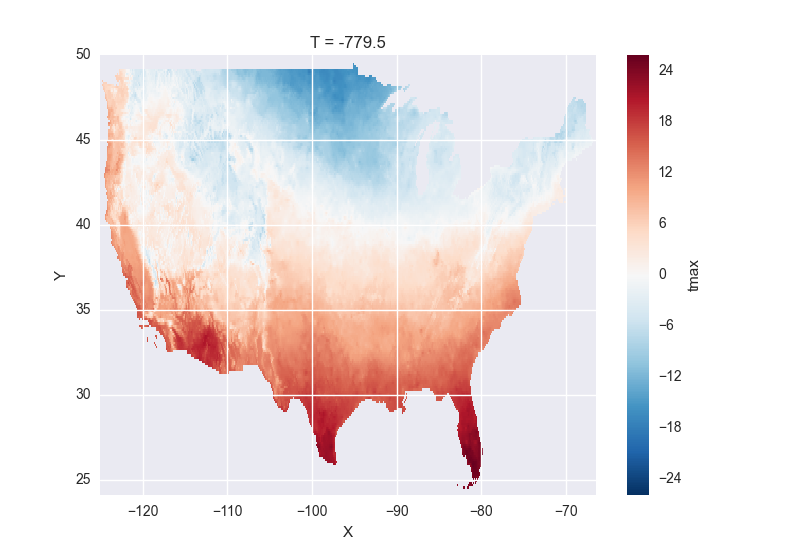

Tutorial
========

.. ipython:: python
   :suppress:

   import numpy as np
   np.random.seed(123456)

To get started, we will import numpy, pandas and xray:

.. ipython:: python

    import numpy as np
    import pandas as pd
    import xray

``DataArray``
-------------

:py:class:`xray.DataArray` is xray's implementation of a labeled,
multi-dimensional array. It has three key properties:

- ``values``: a numpy.ndarray holding the array's values
- ``dimensions``: names for each axis, e.g., ``('x', 'y', 'z')``
- ``coordinates``: tick labels along each dimension

xray uses ``dimensions`` and ``coordinates`` to enable its core metadata aware
operations. Dimensions provide names that xray uses instead of the ``axis``
argument found in many numpy functions. Coordinates enable fast label based
indexing and alignment, like the ``index`` found on a pandas
:py:class:`~pandas.DataFrame` and :py:class:`~pandas.Series`.

DataArray objects also can have a ``name`` and can hold arbitrary metadata in
the form of their ``attrs`` property (an ordered dictionary). Names and
attributes are strictly for users and user-written code: xray makes no attempt
to interpret them, and propagates them only in unambiguous cases.

Creating a DataArray
~~~~~~~~~~~~~~~~~~~~

The ``DataArray`` constructor takes a multi-dimensional array of values (e.g.,
a numpy ndarray), a list of coordinates labels and a list of dimension names:

.. ipython:: python

    data = np.random.rand(4, 3)
    locs = ['IA', 'IL', 'IN']
    times = pd.date_range('2000-01-01', periods=4)
    foo = xray.DataArray(data, coordinates=[times, locs],
                         dimensions=['time', 'space'])
    foo

All of these arguments (except for ``data``) are optional, and will be filled
in with default values:

.. ipython:: python

    xray.DataArray(data)

You can also create a ``DataArray`` by supplying a pandas
:py:class`~pandas.Series`, :py:class`~pandas.DataFrame` or
:py:class`~pandas.Panel`, in which case any non-specified arguments in the
``DataArray`` constructor will be filled in from the pandas object:

.. ipython:: python

    df = pd.DataFrame({'x': [0, 1], 'y': [2, 3]}, index=['a', 'b'])
    df.index.name = 'abc'
    df.columns.name = 'xyz'
    df
    xray.DataArray(df)

xray does not (yet!) support labeling coordinate values with a
:py:class:`pandas.MultiIndex` (see :issue:`164`).
However, the alternate ``from_series`` constructor will automatically unpack
any hierarchical indexes it encounters by expanding the series into a
multi-dimensional array, as described in `Working with pandas`_.

DataArray properties
~~~~~~~~~~~~~~~~~~~~

Let's take a look at the important properties on our array:

.. ipython:: python

    foo.values
    foo.dimensions
    foo.coordinates
    foo.attrs
    print(foo.name)

Now fill in some of that missing metadata:

.. ipython:: python

    foo.name = 'foo'
    foo.attrs['units'] = 'inches'
    foo

The ``coordinates`` property is ``dict`` like. Individual coordinates can be
accessed by name or axis number:

.. ipython:: python

    foo.coordinates['time']
    foo.coordinates[0]

These are :py:class:`xray.Coordinate` objects, which contain tick-labels for
each dimension.

You can also access coordinates by indexing a DataArray directly by name, in
which case it returns another DataArray:

.. ipython:: python

    foo['time']

``Dataset``
-----------

:py:class:`xray.Dataset` is xray's multi-dimensional equivalent of a
:py:class:`~pandas.DataFrame`. It is a dict-like
container of labeled arrays (:py:class:`~xray.DataArray` objects) with aligned
dimensions. It is designed as an in-memory representation of the data model
from the `NetCDF`__ file format.

__ http://www.unidata.ucar.edu/software/netcdf/

Creating a ``Dataset``
~~~~~~~~~~~~~~~~~~~~~~

To make an :py:class:`xray.Dataset` from scratch, pass in a dictionary with
values in the form ``(dimensions, data[, attrs])``:

.. ipython:: python

    times
    locs
    data
    ds = xray.Dataset({'time': ('time', times),
                       'space': ('space', locs),
                       'foo': (['time', 'space'], data)})
    ds

- ``dimensions`` should be a sequence of strings.
- ``data`` should be a numpy.ndarray (or array-like object) that has a
  dimensionality equal to the length of the dimensions list.

We can also use :py:class:`xray.Variable` or :py:class:`xray.DataArray`
objects instead of tuples:

.. ipython:: python

    xray.Dataset({'bar': foo})

You can also create an dataset from a :py:class:`pandas.DataFrame` with
:py:meth:`Dataset.from_dataframe <xray.Dataset.from_dataframe>` or from a
NetCDF file on disk with :py:func:`~xray.open_dataset`. See
`Working with pandas`_ and `Serialization and IO`_.

``Dataset`` contents
~~~~~~~~~~~~~~~~~~~~

:py:class:`~xray.Dataset` implements the Python dictionary interface, with
values given by :py:class:`xray.DataArray` objects:

.. ipython:: python

    'foo' in ds

    ds.keys()

    ds['foo']

The valid keys include each listed "coordinate" and "noncoordinate".
Coordinates are arrays that label values along a particular dimension, implemented
as a thin wrapper wrapper around a :py:class:`pandas.Index` object. They
are created automatically from dataset arrays whose name is equal to the one
item in their list of dimensions.

Noncoordinate include all arrays in a ``Dataset`` other than its coordinates.
These arrays can exist along multiple dimensions. The numbers in the columns in
the ``Dataset`` representation indicate the order in which dimensions appear
for each array (on a ``Dataset``, the dimensions are always listed in
alphabetical order).

We didn't explicitly include an coordinate for the "space" dimension, so it
was filled with an array of ascending integers of the proper length:

.. ipython:: python

    ds['space']

    ds['foo']

Noncoordinate and coordinates are listed explicitly by the
:py:attr:`~xray.Dataset.noncoordinates` and
:py:attr:`~xray.Dataset.coordinates` attributes.

There are also a few derived variables based on datetime coordinates that you
can access from a dataset (e.g., "year", "month" and "day"), even if you didn't
explicitly add them. These are known as
":py:attr:`~xray.Dataset.virtual_variables`":

.. ipython:: python

    ds['time.dayofyear']

Finally, datasets also store arbitrary metadata in the form of `attributes`:

.. ipython:: python

    ds.attrs

    ds.attrs['title'] = 'example attribute'
    ds

xray does not enforce any restrictions on attributes, but serialization to
some file formats may fail if you put in objects that are not strings, numbers
or :py:class:`numpy.ndarray` objects.

Modifying datasets
~~~~~~~~~~~~~~~~~~

We can update a dataset in-place using Python's standard dictionary syntax:

.. ipython:: python

    ds['numbers'] = ('time', [10, 10, 20, 20])
    ds['abc'] = ('space', ['A', 'B', 'C'])
    ds

It should be evident now how a ``Dataset`` lets you store many arrays along a
(partially) shared set of common dimensions and coordinates.

To change the variables in a ``Dataset``, you can use all the standard dictionary
methods, including ``values``, ``items``, ``__del__``, ``get`` and
``update``.

You also can select and drop an explicit list of variables by using the
:py:meth:`~xray.Dataset.select_vars` and :py:meth:`~xray.Dataset.drop_vars`
methods to return a new ``Dataset``. `select_vars` automatically includes the
relevant coordinates:

.. ipython:: python

    ds.select_vars('abc')

If an dimension name is given as an argument to `drop_vars`, it also drops all
variables that use that dimension:

.. ipython:: python

    ds.drop_vars('time', 'space')

You can copy a ``Dataset`` by using the :py:meth:`~xray.Dataset.copy` method:

.. ipython:: python

    ds2 = ds.copy()
    del ds2['time']
    ds2

By default, the copy is shallow, so only the container will be copied: the
contents of the ``Dataset`` will still be the same underlying
:py:class:`xray.Variable`. You can copy all data by supplying the argument
``deep=True``.

Indexing
--------

Indexing a :py:class:`~xray.DataArray` works (mostly) just like it does for
numpy arrays, except that the returned object is always another DataArray:

.. ipython:: python

    foo[:2]

    foo[0, 0]

    foo[:, [2, 1]]

xray also supports label based indexing, just like pandas. Because
:py:class:`~xray.Coordinate` is a thin wrapper around a
:py:class:`pandas.Index`, label based indexing is very fast. To do
label based indexing, use the :py:attr:`~xray.DataArray.loc` attribute:

.. ipython:: python

    foo.loc['2000-01-01':'2000-01-02', 'IA']

You can perform any of the label indexing operations `supported by pandas`__,
including indexing with individual, slices and arrays of labels, as well as
indexing with boolean arrays. Like pandas, label based indexing in xray is
*inclusive* of both the start and stop bounds.

__ http://pandas.pydata.org/pandas-docs/stable/indexing.html#indexing-label

Setting values with label based indexing is also supported:

.. ipython:: python

    foo.loc['2000-01-01', ['IL', 'IN']] = -10
    foo

With labeled dimensions, we do not have to rely on dimension order and can
use them explicitly to slice data with the :py:meth:`~xray.DataArray.sel`
and :py:meth:`~xray.DataArray.isel` methods:

.. ipython:: python

    # index by integer array indices
    foo.isel(space=0, time=slice(None, 2))

    # index by coordinate labels
    foo.sel(time=slice('2000-01-01', '2000-01-02'))

The arguments to these methods can be any objects that could index the array
along that dimension, e.g., labels for an individual value, Python ``slice``
objects or 1-dimensional arrays.

We can also use these methods to index all variables in a dataset
simultaneously, returning a new dataset:

.. ipython:: python

    ds.isel(space=[0], time=[0])
    ds.sel(time='2000-01-01')

Indexing with xray objects has one important difference from indexing numpy
arrays: you can only use one-dimensional arrays to index xray objects, and
each indexer is applied "orthogonally" along independent axes, instead of
using numpy's array broadcasting. This means you can do indexing like this,
which wouldn't work with numpy arrays:

.. ipython:: python

    foo[foo['time.day'] > 1, foo['space'] != 'IL']

This is a much simpler model than numpy's `advanced indexing`__,
and is basically the only model that works for labeled arrays. If you would
like to do advanced indexing, you can always index ``.values`` directly
instead:

__ http://docs.scipy.org/doc/numpy/reference/arrays.indexing.html

.. ipython:: python

    foo.values[foo.values > 0.5]

Computation
-----------

The metadata of :py:class:`~xray.DataArray` objects enables particularly nice
features for doing mathematical operations.

Basic math
~~~~~~~~~~

Basic math with DataArray objects works just as you would expect:

.. ipython:: python

    foo - 3

You can also use any of numpy's or scipy's many `ufunc`__ functions directly on
a DataArray:

__ http://docs.scipy.org/doc/numpy/reference/ufuncs.html

.. ipython:: python

    np.sin(foo)

``DataArray`` also has metadata aware versions of many
:py:class:`numpy.ndarray` methods:

.. ipython:: python

    foo.T
    foo.round(2)

It also has the ``isnull`` and ``notnull`` methods from pandas:

.. ipython:: python

    xray.DataArray([0, 1, np.nan, np.nan, 2]).isnull()

You cannot directly do math with ``Dataset`` objects (yet!), but you can map an
operation over any or all non-coordinates in a dataset by using
:py:meth:`~xray.Dataset.apply`:

.. ipython:: python

    ds.apply(lambda x: 2 * x, to=['foo', 'numbers'])

Aggregation
~~~~~~~~~~~

Aggregation methods from ndarray have been updated to take a `dimension`
argument instead of `axis`. This allows for very intuitive syntax for
aggregation methods that are applied along particular dimension(s):

.. ipython:: python

    foo.sum('time')
    foo.std(['time', 'space'])
    foo.min()

These operations also work on ``Dataset`` objects, by mapping over all
non-coordinates:

.. ipython:: python

    ds.mean('time')

If you need to figure out the axis number for a dimension yourself (say,
for wrapping code designed to work with numpy arrays), you can use the
:py:meth:`~xray.DataArray.get_axis_num` method:

.. ipython:: python

    foo.get_axis_num('space')

To perform a NA skipping aggregations, pass the NA aware numpy functions
directly to :py:attr:`~xray.DataArray.reduce` method:

.. ipython:: python

    foo.reduce(np.nanmean, 'time')

.. warning::

    Currently, xray uses the standard ndarray methods which do not
    automatically skip missing values, but we expect to switch the default
    to NA skipping versions (like pandas) in a future version (:issue:`130`).

Broadcasting
~~~~~~~~~~~~

``DataArray`` objects are automatically align themselves ("broadcasting" in
the numpy parlance) by dimension name instead of axis order. With xray, you
do not need to transpose arrays or insert dimensions of length 1 to get array
operations to work, as commonly done in numpy with :py:func:`np.reshape` or
:py:const:`np.newaxis`.

This is best illustrated by a few examples. Consider two one-dimensional
arrays with different sizes aligned along different dimensions:

.. ipython:: python

    a = xray.DataArray([1, 2, 3, 4], [['a', 'b', 'c', 'd']], ['x'])
    a
    b = xray.DataArray([-1, -2, -3], dimensions=['y'])
    b

With xray, we can apply binary mathematical operations to these arrays, and
their dimensions are expanded automatically:

.. ipython:: python

    a * b

Moreover, dimensions are always reordered to the order in which they first
appeared:

.. ipython:: python

    c = xray.DataArray(np.arange(12).reshape(3, 4), [b['y'], a['x']])
    c
    a + c

This means, for example, that you always subtract an array from its transpose!

.. ipython:: python

    c - c.T

Alignment
~~~~~~~~~

Performing most binary operations on xray objects requires that the all
coordinate values are equal:

.. ipython::

    @verbatim
    In [1]: a + a[:2]
    ValueError: coordinate 'x' is not aligned

However, xray does have some methods (copied from pandas) that make aligning
``DataArray`` and ``Dataset`` objects manually easy and fast.

.. warning::

    pandas does index based alignment automatically when doing math, using
    ``join='outer'``. xray doesn't have automatic alignment yet, but we do
    intend to enable it in a future version (:issue:`186`). Unlike pandas, we
    expect to default to ``join='inner'``.

Reindexing returns modified arrays with new coordinates, filling in missing
values with `NaN`. To reindex a particular dimension, use
:py:meth:`~xray.DataArray.reindex`:

.. ipython::

    foo.reindex(space=['IA', 'CA'])

The :py:meth:`~xray.DataArray.reindex_like` method is a useful shortcut.
To demonstrate, we will make a subset DataArray with new values:

.. ipython:: python

    baz = (10 * foo[:2, :2]).rename('baz')
    baz

Reindexing ``foo`` with ``baz`` selects out the first two values along each
dimension:

.. ipython:: python

    foo.reindex_like(baz)

The opposite operation asks us to reindex to a larger shape, so we fill in
the missing values with `NaN`:

.. ipython:: python

    baz.reindex_like(foo)

The :py:func:`~xray.align` function lets us perform more flexible
``'inner'``, ``'outer'``, ``'left'`` and ``'right'`` joins:

.. ipython:: python

    xray.align(foo, baz, join='inner')
    xray.align(foo, baz, join='outer')

Both ``reindex_like`` and ``align`` work interchangeably with DataArray and
:py:class:`xray.Dataset` objects with any number of overlapping dimensions:

.. ipython:: python

    ds
    ds.reindex_like(baz)

GroupBy: split-apply-combine
----------------------------

Pandas has very convenient support for `"group by"`__ operations, which
implement the `split-apply-combine`__ strategy for crunching data:

__ http://pandas.pydata.org/pandas-docs/stable/groupby.html
__ http://www.jstatsoft.org/v40/i01/paper

- Split your data into multiple independent groups.
- Apply some function to each group.
- Combine your groups back into a single data object.

xray implements this same pattern using very similar syntax to pandas. Group by
operations work on both :py:class:`~xray.Dataset` and
:py:class:`~xray.DataArray` objects. Note that currently, you can only group
by a single one-dimensional variable (eventually, we hope to remove this
limitation).

Split
~~~~~

Recall the "numbers" variable in our dataset:

.. ipython:: python

    ds['numbers']

If we groupby the name of a variable in a dataset (we can also use a DataArray
directly), we get back a :py:class:`xray.GroupBy` object:

.. ipython:: python

    ds.groupby('numbers')

This object works very similarly to a pandas GroupBy object. You can view
the group indices with the ``groups`` attribute:

.. ipython:: python

    ds.groupby('numbers').groups

You can also iterate over over groups in ``(label, group)`` pairs:

.. ipython:: python

    list(ds.groupby('numbers'))

Just like in pandas, creating a GroupBy object doesn't actually split the data
until you want to access particular values.

Apply
~~~~~

To apply a function to each group, you can use the flexible
:py:meth:`xray.GroupBy.apply` method. The resulting objects are automatically
concatenated back together along the group axis:

.. ipython:: python

    def standardize(x):
        return (x - x.mean()) / x.std()

    ds['foo'].groupby('numbers').apply(standardize)

GroupBy objects also have a :py:meth:`~xray.GroupBy.reduce` method and
methods like :py:meth:`~xray.GroupBy.mean` as shortcuts for applying an
aggregation function:

.. ipython:: python

    foo.groupby('time').mean()
    ds.groupby('numbers').reduce(np.nanmean)

Squeezing
~~~~~~~~~

When grouping over a dimension, you can control whether the dimension is
squeezed out or if it should remain with length one on each group by using
the ``squeeze`` parameter:

.. ipython:: python

    next(iter(foo.groupby('space')))

.. ipython:: python

    next(iter(foo.groupby('space', squeeze=False)))

Although xray will attempt to automatically
:py:attr:`~xray.DataArray.transpose` dimensions back into their original order
when you use apply, it is sometimes useful to set ``squeeze=False`` to
guarantee that all original dimensions remain unchanged.

You can always squeeze explicitly later with the Dataset or DataArray
:py:meth:`~xray.DataArray.squeeze` methods.

Combining data
--------------

Concatenate
~~~~~~~~~~~

To combine arrays along a dimension into a larger arrays, you can use the
:py:meth:`DataArray.concat <xray.DataArray.concat>` and
:py:meth:`Dataset.concat <xray.Dataset.concat>` class methods:

.. ipython:: python

    xray.DataArray.concat([foo[0], foo[1]], 'new_dim')

    xray.Dataset.concat([ds.sel(time='2000-01-01'), ds.sel(time='2000-01-03')],
                        'new_dim')

:py:meth:`Dataset.concat <xray.Dataset.concat>` has a number of options which
control how it combines data, and in particular, how it handles conflicting
variables between datasets.

Merge and update
~~~~~~~~~~~~~~~~

To combine multiple Datasets, you can use the
:py:meth:`~xray.Dataset.merge` and :py:meth:`~xray.Dataset.update` methods.
Merge checks for conflicting variables before merging and by
default it returns a new Dataset:

.. ipython:: python

    ds.merge({'hello': ('space', np.arange(3) + 10)})

In contrast, update modifies a dataset in-place without checking for conflicts,
and will overwrite any existing variables with new values:

.. ipython:: python

    ds.update({'space': ('space', [10.2, 9.4, 3.9])})

However, dimensions are still required to be consistent between different
Dataset variables, so you cannot change the size of a dimension unless you
replace all dataset variables that use it.

Equals and identical
~~~~~~~~~~~~~~~~~~~~

xray objects can be compared by using the :py:meth:`~xray.DataArray.equals`
and :py:meth:`~xray.DataArray.identical` methods.

``equals`` checks dimension names, indexes and array values:

.. ipython:: python

    foo.equals(foo.copy())

``identical`` also checks attributes, and the name of each object:

.. ipython:: python

    foo.identical(foo.rename('bar'))

In contrast, the ``==`` for ``DataArray`` objects performs element- wise
comparison (like numpy):

.. ipython:: python

    foo == foo.copy()

Like pandas objects, two xray objects are still equal or identical if they have
missing values marked by `NaN`, as long as the missing values are in the same
locations in both objects. This is not true for `NaN` in general, which usually
compares `False` to everything, including itself:

.. ipython:: python

    np.nan == np.nan

Working with ``pandas``
-----------------------

One of the most important features of xray is the ability to convert to and
from :py:mod:`pandas` objects to interact with the rest of the PyData
ecosystem. For example, for plotting labeled data, we highly recommend
using the visualization `built in to pandas itself`__ or provided by the pandas
aware libraries such as `Seaborn`__ and `ggplot`__.

__ http://pandas.pydata.org/pandas-docs/stable/visualization.html
__ http://stanford.edu/~mwaskom/software/seaborn/
__ http://ggplot.yhathq.com/

Fortunately, there are straightforward representations of
:py:class:`~xray.Dataset` and :py:class:`~xray.DataArray` in terms of
:py:class:`pandas.DataFrame` and :py:class:`pandas.Series`, respectively.
The representation works by flattening non-coordinates to 1D, and turning the
tensor product of coordinate indexes into a :py:class:`pandas.MultiIndex`.

.. note::

    If you want to convert a pandas data-structure into a ``DataArray`` with
    the same number of dimensions, you can simply use the `DataArray construtor
    directly`__

__ `Creating a DataArray`_

``pandas.DataFrame``
~~~~~~~~~~~~~~~~~~~~

To convert to a ``DataFrame``, use the :py:meth:`Dataset.to_dataframe()
<xray.Dataset.to_dataframe>` method:

.. ipython:: python

    df = ds.to_dataframe()
    df

We see that each nonindex in the Dataset is now a column in the DataFrame.
The ``DataFrame`` representation is reminiscent of Hadley Wickham's notion of
`tidy data`__. To convert the ``DataFrame`` to any other convenient representation,
use ``DataFrame`` methods like :py:meth:`~pandas.DataFrame.reset_index`,
:py:meth:`~pandas.DataFrame.stack` and :py:meth:`~pandas.DataFrame.unstack`.

__ http://vita.had.co.nz/papers/tidy-data.pdf

To create a ``Dataset`` from a ``DataFrame``, use the
:py:meth:`~xray.Dataset.from_dataframe` class method:

.. ipython:: python

    xray.Dataset.from_dataframe(df)

Notice that that dimensions of non-coordinates in the ``Dataset`` have now
expanded after the round-trip conversion to a ``DataFrame``. This is because
every object in a ``DataFrame`` must have the same indices, so needed to
broadcast the data of each array to the full size of the new ``MultiIndex``.

``pandas.Series``
~~~~~~~~~~~~~~~~~

``DataArray`` objects have a complementary representation in terms of a
:py:class:`pandas.Series`. Using a Series preserves the ``Dataset`` to
``DataArray`` relationship, because ``DataFrames`` are dict-like containers
of ``Series``. The methods are very similar to those for working with
DataFrames:

.. ipython:: python

    s = foo.to_series()
    s

    xray.DataArray.from_series(s)

Both the ``from_series`` and ``from_dataframe`` methods use reindexing, so they
works even if not the hierarchical index is not a full tensor product:

.. ipython:: python

    s[::2]
    xray.DataArray.from_series(s[::2])

Serialization and IO
--------------------

xray supports direct serialization and IO to several file formats. For more
options, consider exporting your objects to pandas (see the preceeding section)
and using its broad range of `IO tools`__.

__ http://pandas.pydata.org/pandas-docs/stable/io.html

Pickle
~~~~~~

The simplest way to serialize an xray object is to use Python's built-in pickle
module:

.. ipython:: python

    import cPickle as pickle

    pkl = pickle.dumps(ds)

    pickle.loads(pkl)

Pickle support is important because it doesn't require any external libraries
and lets you use xray objects with Python modules like ``multiprocessing``.
However, there are two important cavaets:

1. To simplify serialization, xray's support for pickle currently loads all
   array values into memory before dumping an object. This means it is not
   suitable for serializing datasets too big to load into memory (e.g., from
   NetCDF or OpenDAP).
2. Pickle will only work as long as the internal data structure of xray objects
   remains unchanged. Because the internal design of xray is still being
   refined, we make no guarantees (at this point) that objects pickled with
   this version of xray will work in future versions.

Reading and writing to disk (NetCDF)
~~~~~~~~~~~~~~~~~~~~~~~~~~~~~~~~~~~~

Currently, the only external serialization format that xray supports is
`NetCDF`__. NetCDF is a file format for fully self-described datasets that is
widely used in the geosciences and supported on almost all platforms. We use
NetCDF because xray was based on the NetCDF data model, so NetCDF files on disk
directly correspond to :py:class:`~xray.Dataset` objects. Recent versions
NetCDF are based on the even more widely used HDF5 file-format.

__ http://www.unidata.ucar.edu/software/netcdf/

Reading and writing NetCDF files with xray requires the
`Python-NetCDF4`__ library.

__ https://github.com/Unidata/netcdf4-python

We can save a Dataset to disk using the
:py:attr:`Dataset.to_netcdf <xray.Dataset.to_netcdf>` method:

.. use verbatim because readthedocs doesn't have netCDF4 support

.. ipython::
    :verbatim:

    In [1]: ds.to_netcdf('saved_on_disk.nc')

By default, the file is saved as NetCDF4.

We can load NetCDF files to create a new Dataset using the
:py:func:`~xray.open_dataset` function:

.. ipython::
    :verbatim:

    In [1]: ds_disk = xray.open_dataset('saved_on_disk.nc')

    In [2]: ds_disk
    Out[2]:
    <xray.Dataset>
    Dimensions:     (space: 4, time: 3)
    Coordinates:
        space            X
        time                      X
    Noncoordinates:
        foo              1        0
        numbers          0
        abc                       0
    Attributes:
        title: example attribute

A dataset can also be loaded from a specific group within a NetCDF
file. To load from a group, pass a ``group`` keyword argument to the
``open_dataset`` function. The group can be specified as a path-like
string, e.g., to access subgroup 'bar' within group 'foo' pass
'/foo/bar' as the ``group`` argument.

Data is loaded lazily from NetCDF files. You can manipulate, slice and subset
Dataset and DataArray objects, and no array values are loaded into memory until
necessary. For an example of how these lazy arrays work, see the OpenDAP
section below.

Datasets have a :py:meth:`~xray.Dataset.close` method to close the associated
NetCDF file. The preferred way to handle this is to use a context-manager:

.. ipython::
    :verbatim:

    In [100]: with xray.open_dataset('my_file.nc') as ds:
    ...           print(ds.keys())
    Out[100]: ['space', 'foo', 'time', 'numbers', 'abc']

.. note::

    Although xray provides reasonable support for incremental reads of files on
    disk, it does not yet support incremental writes, which is important for
    dealing with datasets that do not fit into memory. This is a significant
    shortcoming that we hope to resolve (:issue:`199`) by adding the ability to
    create ``Dataset`` objects directly linked to a NetCDF file on disk.

NetCDF files follow some conventions for encoding datetime arrays (as numbers
with a "units" attribute) and for packing and unpacking data (as
described by the "scale_factor" and "_FillValue" attributes). If the argument
``decode_cf=True`` (default) is given to ``open_dataset``, xray will attempt
to automatically decode the values in the NetCDF objects according to
`CF conventions`__. Sometimes this will fail, for example, if a variable
has an invalid "units" or "calendar" attribute. For these cases, you can
turn this decoding off manually.

__ http://cfconventions.org/

You can view this encoding information and control the details of how xray
serializes objects, by viewing and manipulating the
:py:attr:`DataArray.encoding <xray.DataArray.encoding>` attribute:

.. ipython::
    :verbatim:

    In [1]: ds_disk['time'].encoding
    Out[1]:
    {'calendar': u'proleptic_gregorian',
     'chunksizes': None,
     'complevel': 0,
     'contiguous': True,
     'dtype': dtype('float64'),
     'fletcher32': False,
     'least_significant_digit': None,
     'shuffle': False,
     'units': u'days since 2000-01-01 00:00:00',
     'zlib': False}

Working with remote datasets (OpenDAP)
~~~~~~~~~~~~~~~~~~~~~~~~~~~~~~~~~~~~~~

xray includes support for `OpenDAP`__ (via the NetCDF4 library or Pydap), which
lets us access large datasets over HTTP.

__ http://www.opendap.org/

For example, we can open a connetion to GBs of weather data produced by the
`PRISM`__ project, and hosted by
`International Research Institute for Climate and Society`__ at Columbia:

__ http://www.prism.oregonstate.edu/
__ http://iri.columbia.edu/

.. ipython::
    :verbatim:

    In [3]: remote_data = xray.open_dataset(
        'http://iridl.ldeo.columbia.edu/SOURCES/.OSU/.PRISM/.monthly/dods')

    In [4]: remote_data
    Out[4]:
    <xray.Dataset>
    Dimensions:     (T: 1432, X: 1405, Y: 621)
    Coordinates:
        T               X
        X                        X
        Y                                 X
    Noncoordinates:
        ppt             0        2        1
        tdmean          0        2        1
        tmax            0        2        1
        tmin            0        2        1
    Attributes:
        Conventions: IRIDL
        expires: 1401580800

    In [5]: remote_data['tmax']
    Out[5]:
    <xray.DataArray 'tmax' (T: 1432, Y: 621, X: 1405)>
    [1249427160 values with dtype=float64]
    Attributes:
        pointwidth: 120
        units: Celsius_scale
        missing_value: -9999
        standard_name: air_temperature
        expires: 1401580800

We can select and slice this data any number of times, and nothing is loaded
over the network until we look at particular values:

.. ipython::
    :verbatim:

    In [4]: tmax = remote_data['tmax'][:500, ::3, ::3]

    In [5]: tmax
    Out[5]:
    <xray.DataArray 'tmax' (T: 500, Y: 207, X: 469)>
    [48541500 values with dtype=float64]
    Attributes:
        pointwidth: 120
        units: Celsius_scale
        missing_value: -9999
        standard_name: air_temperature
        expires: 1401580800

Now, let's access and plot a small subset:

.. ipython::
    :verbatim:

    In [6]: tmax_ss = tmax[0]

For this dataset, we still need to manually fill in some of the values with
`NaN` to indicate that they are missing. As soon as we access
``tmax_ss.values``, the values are loaded over the network and cached on the
DataArray so they can be manipulated:

.. ipython::
    :verbatim:

    In [7]: tmax_ss.values[tmax_ss.values < -99] = np.nan

Finally, we can plot the values with matplotlib:

.. ipython::
    :verbatim:

    In [8]: import matplotlib.pyplot as plt

    In [9]: from matplotlib.cm import get_cmap

    In [10]: plt.figure(figsize=(9, 5))

    In [11]: plt.gca().patch.set_color('0')

    In [112]: plt.contourf(tmax_ss['X'], tmax_ss['Y'], tmax_ss.values, 20,
         ...:     cmap=get_cmap('RdBu_r'))

    In [113]: plt.colorbar()

Loading into memory
~~~~~~~~~~~~~~~~~~~

xray's lazy loading of remote or on-disk datasets is not always desirable.
In such cases, you can use the :py:meth:`~xray.Dataset.load_data` method to
force loading a Dataset or DataArray entirely into memory. In particular, this
can lead to significant speedups if done before performing array-based
indexing.

Notes on xray's internals
-------------------------

.. warning::

    These implementation details may be useful for advanced users, but are
    likely to change in future versions.

DataArray
~~~~~~~~~

In the current version of xray, DataArrays are simply pointers to a dataset
(the ``dataset`` attribute) and the name of a variable in the dataset (the
``name`` attribute), which indicates to which variable array operations should
be applied.

Usually, xray automatically manages the ``Dataset`` objects that data arrays
points to in a satisfactory fashion.

However, in some cases, particularly for performance reasons, you may want to
explicitly ensure that the dataset only includes the variables you are
interested in. For these cases, use the :py:meth:`xray.DataArray.select_vars`
method to select the names of variables you want to keep around, by default
including the name of only the DataArray itself:

.. ipython:: python

    foo2 = foo.select_vars()

    foo2

`foo2` is generally an equivalent labeled array to `foo`, but we dropped the
dataset variables that are no longer relevant:

.. ipython:: python

    foo.dataset.keys()

    foo2.dataset.keys()

Variable
~~~~~~~~

:py:class:`~xray.Variable` implements xray's basic building block for Dataset
and DataArray variables. It supports the numpy ndarray interface, but is
extended to support and use basic metadata (not including index values). It
consists of:

1. ``dimensions``: A tuple of dimension names.
2. ``values``: The N-dimensional array (for example, of type
   :py:class:`numpy.ndarray`) storing the array's data. It must have the same
   number of dimensions as the length of ``dimensions``.
3. ``attrs``: An ordered dictionary of additional metadata to associate
   with this array.

The main functional difference between Variables and numpy arrays is that
numerical operations on Variables implement array broadcasting by dimension
name. For example, adding an Variable with dimensions `('time',)` to another
Variable with dimensions `('space',)` results in a new Variable with dimensions
`('time', 'space')`. Furthermore, numpy reduce operations like ``mean`` or
``sum`` are overwritten to take a "dimension" argument instead of an "axis".

Variables are light-weight objects used as the building block for datasets.
They are more primitive objects, so operations with them provide marginally
higher performance than using DataArrays. **However, manipulating data in the
form of a Dataset or DataArray should almost always be preferred**, because
they can use more complete metadata in context of coordinate labels.
