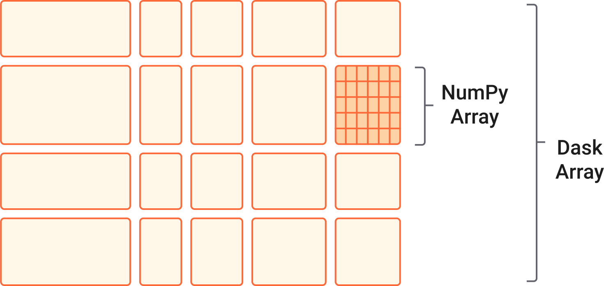

.. currentmodule:: xarray

.. _dask:

Parallel Computing with Dask
============================

Xarray integrates with `Dask <https://dask.org/?utm_source=xarray-docs>`__, a general purpose library for parallel computing, to handle larger-than-memory computations.

If you’ve been using Xarray to read in large datasets or split up data across a number of files, you may already be using Dask:

.. code-block:: python

    import xarray as xr

    ds = xr.open_zarr("/path/to/data.zarr")
    timeseries = ds["temp"].mean(dim=["x", "y"]).compute()  # Compute result

Using Dask with Xarray feels similar to working with NumPy arrays, but on much larger datasets. The Dask integration is transparent, so you usually don’t need to manage the parallelism directly; Xarray and Dask handle these aspects behind the scenes. This makes it easy to write code that scales from small, in-memory datasets on a single machine to large datasets that are distributed across a cluster, with minimal code changes.

Examples
--------

If you're new to using Xarray with Dask, we recommend the `Xarray + Dask Tutorial <https://tutorial.xarray.dev/intermediate/xarray_and_dask.html>`_.

Here are some examples for using Xarray with Dask at scale:

- `Zonal averaging with the NOAA National Water Model <https://docs.coiled.io/user_guide/xarray.html?utm_source=xarray-docs>`_
- `CMIP6 Precipitation Frequency Analysis <https://gallery.pangeo.io/repos/pangeo-gallery/cmip6/precip_frequency_change.html>`_
- `Using Dask + Cloud Optimized GeoTIFFs <https://gallery.pangeo.io/repos/pangeo-data/landsat-8-tutorial-gallery/landsat8.html#Dask-Chunks-and-Cloud-Optimized-Geotiffs>`_

Find more examples at the `Project Pythia cookbook gallery <https://cookbooks.projectpythia.org/>`_.

Using Dask with Xarray
----------------------

Dask divides arrays into smaller parts called chunks. These chunks are small, manageable pieces of the larger dataset, that Dask is able to process in parallel (see the `Dask Array docs on chunks <https://docs.dask.org/en/stable/array-chunks.html?utm_source=xarray-docs>`_). Commonly chunks are set when reading data, but you can also set the chunksize manually at any point in your workflow using :py:meth:`Dataset.chunk` and :py:meth:`DataArray.chunk`. See :ref:`dask.chunks` for more.

Xarray operations on Dask-backed arrays are lazy. This means computations are not executed immediately, but are instead queued up as tasks in a Dask graph.

When a result is requested (e.g., for plotting, writing to disk, or explicitly computing), Dask executes the task graph. The computations are carried out in parallel, with each chunk being processed independently. This parallel execution is key to handling large datasets efficiently.

Nearly all Xarray methods have been extended to work automatically with Dask Arrays. This includes things like indexing, concatenating, rechunking, grouped operations, etc. Common operations are covered in more detail in each of the sections below.

.. _dask.io:

Reading and writing data
~~~~~~~~~~~~~~~~~~~~~~~~

When reading data, Dask divides your dataset into smaller chunks. You can specify the size of chunks with the ``chunks`` argument. Specifying ``chunks="auto"`` will set the dask chunk sizes to be a multiple of the on-disk chunk sizes. This can be a good idea, but usually the appropriate dask chunk size will depend on your workflow.

.. tab:: Zarr

    The `Zarr <https://zarr.readthedocs.io/en/stable/>`_ format is ideal for working with large datasets. Each chunk is stored in a separate file, allowing parallel reading and writing with Dask. You can also use Zarr to read/write directly from cloud storage buckets (see the `Dask documentation on connecting to remote data <https://docs.dask.org/en/stable/how-to/connect-to-remote-data.html?utm_source=xarray-docs>`__)

    When you open a Zarr dataset with :py:func:`~xarray.open_zarr`, it is loaded as a Dask array by default (if Dask is installed)::

        ds = xr.open_zarr("path/to/directory.zarr")

    See :ref:`io.zarr` for more details.

.. tab:: NetCDF

    Open a single netCDF file with :py:func:`~xarray.open_dataset` and supplying a ``chunks`` argument::

        ds = xr.open_dataset("example-data.nc", chunks={"time": 10})

    Or open multiple files in parallel with py:func:`~xarray.open_mfdataset`::

        xr.open_mfdataset('my/files/*.nc', parallel=True)

    .. tip::

        When reading in many netCDF files with py:func:`~xarray.open_mfdataset`, using ``engine="h5netcdf"`` can
        be faster than the default which uses the netCDF4 package.

    Save larger-than-memory netCDF files::

        ds.to_netcdf("my-big-file.nc")

    Or set ``compute=False`` to return a dask.delayed object that can be computed later::

       delayed_write = ds.to_netcdf("my-big-file.nc", compute=False)
       delayed_write.compute()

    .. note::

        When using Dask’s distributed scheduler to write NETCDF4 files, it may be necessary to set the environment variable ``HDF5_USE_FILE_LOCKING=FALSE`` to avoid competing locks within the HDF5 SWMR file locking scheme. Note that writing netCDF files with Dask’s distributed scheduler is only supported for the netcdf4 backend.

    See :ref:`io.netcdf` for more details.

.. tab:: HDF5

    Open HDF5 files with :py:func:`~xarray.open_dataset`::

        xr.open_dataset("/path/to/my/file.h5", chunks='auto')

    See :ref:`io.hdf5` for more details.

.. tab:: GeoTIFF

    Open large geoTIFF files with rioxarray::

        xds = rioxarray.open_rasterio("my-satellite-image.tif", chunks='auto')

    See :ref:`io.rasterio` for more details.

Loading Dask Arrays
~~~~~~~~~~~~~~~~~~~

.. ipython:: python
    :suppress:

    import os

    import numpy as np
    import pandas as pd
    import xarray as xr

    np.random.seed(123456)
    np.set_printoptions(precision=3, linewidth=100, threshold=100, edgeitems=3)

    ds = xr.Dataset(
        {
            "temperature": (
                ("time", "latitude", "longitude"),
                np.random.randn(30, 180, 180),
            ),
            "time": pd.date_range("2015-01-01", periods=30),
            "longitude": np.arange(180),
            "latitude": np.arange(89.5, -90.5, -1),
        }
    )
    ds.to_netcdf("example-data.nc")

There are a few common cases where you may want to convert lazy Dask arrays into eager, in-memory Xarray data structures:

- You want to inspect smaller intermediate results when working interactively or debugging
- You've reduced the dataset (by filtering or with a groupby, for example) and now have something much smaller that fits in memory
- You need to compute intermediate results since Dask is unable (or struggles) to perform a certain computation. The canonical example of this is normalizing a dataset, e.g., ``ds - ds.mean()``, when ``ds`` is larger than memory. Typically, you should either save ``ds`` to disk or compute ``ds.mean()`` eagerly.

To do this, you can use :py:meth:`Dataset.compute` or :py:meth:`DataArray.compute`:

.. ipython:: python

    ds.compute()

.. note::

    Using :py:meth:`Dataset.compute` is preferred to :py:meth:`Dataset.load`, which changes the results in-place.

You can also access :py:attr:`DataArray.values`, which will always be a NumPy array:

.. ipython::
    :verbatim:

    In [5]: ds.temperature.values
    Out[5]:
    array([[[  4.691e-01,  -2.829e-01, ...,  -5.577e-01,   3.814e-01],
            [  1.337e+00,  -1.531e+00, ...,   8.726e-01,  -1.538e+00],
            ...
    # truncated for brevity

NumPy ufuncs like :py:func:`numpy.sin` transparently work on all xarray objects, including those
that store lazy Dask arrays:

.. ipython:: python

    import numpy as np

    np.sin(ds)

To access Dask arrays directly, use the :py:attr:`DataArray.data` attribute which exposes the DataArray's underlying array type.

If you're using a Dask cluster, you can also use :py:meth:`Dataset.persist` for quickly accessing intermediate outputs. This is most helpful after expensive operations like rechunking or setting an index. It's a way of telling the cluster that it should start executing the computations that you have defined so far, and that it should try to keep those results in memory. You will get back a new Dask array that is semantically equivalent to your old array, but now points to running data.

.. code-block:: python

    ds = ds.persist()

.. tip::

   Remember to save the dataset returned by persist! This is a common mistake.

.. _dask.chunks:

Chunking and performance
~~~~~~~~~~~~~~~~~~~~~~~~

The way a dataset is chunked can be critical to performance when working with large datasets. You'll want chunk sizes large enough to reduce the number of chunks that Dask has to think about (to reduce overhead from the task graph) but also small enough so that many of them can fit in memory at once.

.. tip::

    A good rule of thumb is to create arrays with a minimum chunk size of at least one million elements (e.g., a 1000x1000 matrix). With large arrays (10+ GB), you may need larger chunks. See `Choosing good chunk sizes in Dask <https://blog.dask.org/2021/11/02/choosing-dask-chunk-sizes?utm_source=xarray-docs>`_.

It can be helpful to choose chunk sizes based on your downstream analyses and to chunk as early as possible. Datasets with smaller chunks along the time axis, for example, can make time domain problems easier to parallelize since Dask can perform the same operation on each time chunk. If you're working with a large dataset with chunks that make downstream analyses challenging, you may need to rechunk your data. This is an expensive operation though, so is only recommended when needed.

You can chunk or rechunk a dataset by:

- Specifying the ``chunks`` kwarg when reading in your dataset. If you know you'll want to do some spatial subsetting, for example, you could use ``chunks={'latitude': 10, 'longitude': 10}`` to specify small chunks across space. This can avoid loading subsets of data that span multiple chunks, thus reducing the number of file reads. Note that this will only work, though, for chunks that are similar to how the data is chunked on disk. Otherwise, it will be very slow and require a lot of network bandwidth.
- Many array file formats are chunked on disk. You can specify ``chunks={}`` to have a single dask chunk map to a single on-disk chunk, and ``chunks="auto"`` to have a single dask chunk be a automatically chosen multiple of the on-disk chunks.
- Using :py:meth:`Dataset.chunk` after you've already read in your dataset. For time domain problems, for example, you can use ``ds.chunk(time=TimeResampler())`` to rechunk according to a specified unit of time. ``ds.chunk(time=TimeResampler("MS"))``, for example, will set the chunks so that a month of data is contained in one chunk.

For large-scale rechunking tasks (e.g., converting a simulation dataset stored with chunking only along time to a dataset with chunking only across space), consider writing another copy of your data on disk and/or using dedicated tools such as `Rechunker <https://rechunker.readthedocs.io/en/latest/>`_.

.. _dask.automatic-parallelization:

Parallelize custom functions with ``apply_ufunc`` and ``map_blocks``
~~~~~~~~~~~~~~~~~~~~~~~~~~~~~~~~~~~~~~~~~~~~~~~~~~~~~~~~~~~~~~~~~~~~

Almost all of Xarray's built-in operations work on Dask arrays. If you want to
use a function that isn't wrapped by Xarray, and have it applied in parallel on
each block of your xarray object, you have three options:

1. Use :py:func:`~xarray.apply_ufunc` to apply functions that consume and return NumPy arrays.
2. Use :py:func:`~xarray.map_blocks`, :py:meth:`Dataset.map_blocks` or :py:meth:`DataArray.map_blocks`
   to apply functions that consume and return xarray objects.
3. Extract Dask Arrays from xarray objects with :py:attr:`DataArray.data` and use Dask directly.

.. tip::

   See the extensive Xarray tutorial on `apply_ufunc <https://tutorial.xarray.dev/advanced/apply_ufunc/apply_ufunc.html>`_.

``apply_ufunc``
###############

:py:func:`~xarray.apply_ufunc` automates `embarrassingly parallel
<https://en.wikipedia.org/wiki/Embarrassingly_parallel>`__ "map" type operations
where a function written for processing NumPy arrays should be repeatedly
applied to Xarray objects containing Dask Arrays. It works similarly to
:py:func:`dask.array.map_blocks` and :py:func:`dask.array.blockwise`, but without
requiring an intermediate layer of abstraction. See the `Dask documentation <https://docs.dask.org/en/stable/array-gufunc.html?utm_source=xarray-docs>`__ for more details.

For the best performance when using Dask's multi-threaded scheduler, wrap a
function that already releases the global interpreter lock, which fortunately
already includes most NumPy and Scipy functions. Here we show an example
using NumPy operations and a fast function from
`bottleneck <https://github.com/pydata/bottleneck>`__, which
we use to calculate `Spearman's rank-correlation coefficient <https://en.wikipedia.org/wiki/Spearman%27s_rank_correlation_coefficient>`__:

.. code-block:: python

    import numpy as np
    import xarray as xr
    import bottleneck

    def covariance_gufunc(x, y):
        return (
            (x - x.mean(axis=-1, keepdims=True)) * (y - y.mean(axis=-1, keepdims=True))
        ).mean(axis=-1)

    def pearson_correlation_gufunc(x, y):
        return covariance_gufunc(x, y) / (x.std(axis=-1) * y.std(axis=-1))

    def spearman_correlation_gufunc(x, y):
        x_ranks = bottleneck.rankdata(x, axis=-1)
        y_ranks = bottleneck.rankdata(y, axis=-1)
        return pearson_correlation_gufunc(x_ranks, y_ranks)

    def spearman_correlation(x, y, dim):
        return xr.apply_ufunc(
            spearman_correlation_gufunc,
            x,
            y,
            input_core_dims=[[dim], [dim]],
            dask="parallelized",
            output_dtypes=[float],
        )

The only aspect of this example that is different from standard usage of
``apply_ufunc()`` is that we needed to supply the ``output_dtypes`` arguments.
(Read up on :ref:`comput.wrapping-custom` for an explanation of the
"core dimensions" listed in ``input_core_dims``.)

Our new ``spearman_correlation()`` function achieves near linear speedup
when run on large arrays across the four cores on my laptop. It would also
work as a streaming operation, when run on arrays loaded from disk:

.. ipython::
    :verbatim:

    In [56]: rs = np.random.RandomState(0)

    In [57]: array1 = xr.DataArray(rs.randn(1000, 100000), dims=["place", "time"])  # 800MB

    In [58]: array2 = array1 + 0.5 * rs.randn(1000, 100000)

    # using one core, on NumPy arrays
    In [61]: %time _ = spearman_correlation(array1, array2, 'time')
    CPU times: user 21.6 s, sys: 2.84 s, total: 24.5 s
    Wall time: 24.9 s

    In [8]: chunked1 = array1.chunk({"place": 10})

    In [9]: chunked2 = array2.chunk({"place": 10})

    # using all my laptop's cores, with Dask
    In [63]: r = spearman_correlation(chunked1, chunked2, "time").compute()

    In [64]: %time _ = r.compute()
    CPU times: user 30.9 s, sys: 1.74 s, total: 32.6 s
    Wall time: 4.59 s

One limitation of ``apply_ufunc()`` is that it cannot be applied to arrays with
multiple chunks along a core dimension:

.. ipython::
    :verbatim:

    In [63]: spearman_correlation(chunked1, chunked2, "place")
    ValueError: dimension 'place' on 0th function argument to apply_ufunc with
    dask='parallelized' consists of multiple chunks, but is also a core
    dimension. To fix, rechunk into a single Dask array chunk along this
    dimension, i.e., ``.rechunk({'place': -1})``, but beware that this may
    significantly increase memory usage.

This reflects the nature of core dimensions, in contrast to broadcast (non-core)
dimensions that allow operations to be split into arbitrary chunks for
application.

.. tip::

    When possible, it's recommended to use pre-existing ``dask.array`` functions, either with existing xarray methods or
    :py:func:`~xarray.apply_ufunc()` with ``dask='allowed'``. Dask can often
    have a more efficient implementation that makes use of the specialized
    structure of a problem, unlike the generic speedups offered by
    ``dask='parallelized'``.

``map_blocks``
##############

Functions that consume and return Xarray objects can be easily applied in parallel using :py:func:`map_blocks`.
Your function will receive an Xarray Dataset or DataArray subset to one chunk
along each chunked dimension.

.. ipython:: python

    ds.temperature

This DataArray has 3 chunks each with length 10 along the time dimension.
At compute time, a function applied with :py:func:`map_blocks` will receive a DataArray corresponding to a single block of shape 10x180x180
(time x latitude x longitude) with values loaded. The following snippet illustrates how to check the shape of the object
received by the applied function.

.. ipython:: python

    def func(da):
        print(da.sizes)
        return da.time

    mapped = xr.map_blocks(func, ds.temperature)
    mapped

Notice that the :py:meth:`map_blocks` call printed
``Frozen({'time': 0, 'latitude': 0, 'longitude': 0})`` to screen.
``func`` is received 0-sized blocks! :py:meth:`map_blocks` needs to know what the final result
looks like in terms of dimensions, shapes etc. It does so by running the provided function on 0-shaped
inputs (*automated inference*). This works in many cases, but not all. If automatic inference does not
work for your function, provide the ``template`` kwarg (see :ref:`below <template-note>`).

In this case, automatic inference has worked so let's check that the result is as expected.

.. ipython:: python

    mapped.load(scheduler="single-threaded")
    mapped.identical(ds.time)

Note that we use ``.load(scheduler="single-threaded")`` to execute the computation.
This executes the Dask graph in serial using a for loop, but allows for printing to screen and other
debugging techniques. We can easily see that our function is receiving blocks of shape 10x180x180 and
the returned result is identical to ``ds.time`` as expected.

Here is a common example where automated inference will not work.

.. ipython:: python
    :okexcept:

    def func(da):
        print(da.sizes)
        return da.isel(time=[1])

    mapped = xr.map_blocks(func, ds.temperature)

``func`` cannot be run on 0-shaped inputs because it is not possible to extract element 1 along a
dimension of size 0. In this case we need to tell :py:func:`map_blocks` what the returned result looks
like using the ``template`` kwarg. ``template`` must be an xarray Dataset or DataArray (depending on
what the function returns) with dimensions, shapes, chunk sizes, attributes, coordinate variables *and* data
variables that look exactly like the expected result. The variables should be dask-backed and hence not
incur much memory cost.

.. _template-note:

.. note::

    Note that when ``template`` is provided, ``attrs`` from ``template`` are copied over to the result. Any
    ``attrs`` set in ``func`` will be ignored.

.. ipython:: python

    template = ds.temperature.isel(time=[1, 11, 21])
    mapped = xr.map_blocks(func, ds.temperature, template=template)

Notice that the 0-shaped sizes were not printed to screen. Since ``template`` has been provided
:py:func:`map_blocks` does not need to infer it by running ``func`` on 0-shaped inputs.

.. ipython:: python

    mapped.identical(template)

:py:func:`map_blocks` also allows passing ``args`` and ``kwargs`` down to the user function ``func``.
``func`` will be executed as ``func(block_xarray, *args, **kwargs)`` so ``args`` must be a list and ``kwargs`` must be a dictionary.

.. ipython:: python

    def func(obj, a, b=0):
        return obj + a + b

    mapped = ds.map_blocks(func, args=[10], kwargs={"b": 10})
    expected = ds + 10 + 10
    mapped.identical(expected)

.. ipython:: python
    :suppress:

    ds.close()  # Closes "example-data.nc".
    os.remove("example-data.nc")

.. tip::

   As :py:func:`map_blocks` loads each block into memory, reduce as much as possible objects consumed by user functions.
   For example, drop useless variables before calling ``func`` with :py:func:`map_blocks`.

Deploying Dask
--------------

By default, Dask uses the multi-threaded scheduler, which distributes work across multiple cores on a single machine and allows for processing some datasets that do not fit into memory. However, this has two limitations:

- You are limited by the size of your hard drive
- Downloading data can be slow and expensive

Instead, it can be faster and cheaper to run your computations close to where your data is stored, distributed across many machines on a Dask cluster. Often, this means deploying Dask on HPC clusters or on the cloud. See the `Dask deployment documentation <https://docs.dask.org/en/stable/deploying.html?utm_source=xarray-docs>`__ for more details.

Best Practices
--------------

Dask is pretty easy to use but there are some gotchas, many of which are under active development. Here are some tips we have found through experience. We also recommend checking out the `Dask best practices <https://docs.dask.org/en/stable/array-best-practices.html?utm_source=xarray-docs>`_.

1. Do your spatial and temporal indexing (e.g. ``.sel()`` or ``.isel()``) early, especially before calling ``resample()`` or ``groupby()``. Grouping and resampling triggers some computation on all the blocks, which in theory should commute with indexing, but this optimization hasn't been implemented in Dask yet. (See `Dask issue #746 <https://github.com/dask/dask/issues/746>`_).

2. More generally, ``groupby()`` is a costly operation and will perform a lot better if the ``flox`` package is installed.
   See the `flox documentation <https://flox.readthedocs.io>`_ for more. By default Xarray will use ``flox`` if installed.

3. Save intermediate results to disk as a netCDF files (using ``to_netcdf()``) and then load them again with ``open_dataset()`` for further computations. For example, if subtracting temporal mean from a dataset, save the temporal mean to disk before subtracting. Again, in theory, Dask should be able to do the computation in a streaming fashion, but in practice this is a fail case for the Dask scheduler, because it tries to keep every chunk of an array that it computes in memory. (See `Dask issue #874 <https://github.com/dask/dask/issues/874>`_)

4. Use the `Dask dashboard <https://docs.dask.org/en/latest/dashboard.html?utm_source=xarray-docs>`_ to identify performance bottlenecks.

Here's an example of a simplified workflow putting some of these tips together:

.. code-block:: python

    import xarray

    ds = xr.open_zarr(  # Since we're doing a spatial reduction, increase chunk size in x, y
        "my-data.zarr", chunks={"x": 100, "y": 100}
    )

    time_subset = ds.sea_temperature.sel(
        time=slice("2020-01-01", "2020-12-31")  # Filter early
    )

    # faster resampling when flox is installed
    daily = ds.resample(time="D").mean()

    daily.load()  # Pull smaller results into memory after reducing the dataset
