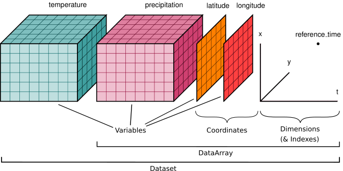

.. _data structures:

Data Structures
===============

.. ipython:: python
    :suppress:

    import numpy as np
    import pandas as pd
    import xarray as xr

    np.random.seed(123456)
    np.set_printoptions(threshold=10)

    %xmode minimal

DataArray
---------

:py:class:`xarray.DataArray` is xarray's implementation of a labeled,
multi-dimensional array. It has several key properties:

- ``values``: a :py:class:`numpy.ndarray` or
  :ref:`numpy-like array <userguide.duckarrays>` holding the array's values
- ``dims``: dimension names for each axis (e.g., ``('x', 'y', 'z')``)
- ``coords``: a dict-like container of arrays (*coordinates*) that label each
  point (e.g., 1-dimensional arrays of numbers, datetime objects or
  strings)
- ``attrs``: :py:class:`dict` to hold arbitrary metadata (*attributes*)

Xarray uses ``dims`` and ``coords`` to enable its core metadata aware operations.
Dimensions provide names that xarray uses instead of the ``axis`` argument found
in many numpy functions. Coordinates enable fast label based indexing and
alignment, building on the functionality of the ``index`` found on a pandas
:py:class:`~pandas.DataFrame` or :py:class:`~pandas.Series`.

DataArray objects also can have a ``name`` and can hold arbitrary metadata in
the form of their ``attrs`` property. Names and attributes are strictly for
users and user-written code: xarray makes no attempt to interpret them, and
propagates them only in unambiguous cases. For reading and writing attributes
xarray relies on the capabilities of the supported backends.
(see FAQ, :ref:`approach to metadata`).

.. _creating a dataarray:

Creating a DataArray
~~~~~~~~~~~~~~~~~~~~

The :py:class:`~xarray.DataArray` constructor takes:

- ``data``: a multi-dimensional array of values (e.g., a numpy ndarray,
  a :ref:`numpy-like array <userguide.duckarrays>`, :py:class:`~pandas.Series`,
  :py:class:`~pandas.DataFrame` or ``pandas.Panel``)
- ``coords``: a list or dictionary of coordinates. If a list, it should be a
  list of tuples where the first element is the dimension name and the second
  element is the corresponding coordinate array_like object.
- ``dims``: a list of dimension names. If omitted and ``coords`` is a list of
  tuples, dimension names are taken from ``coords``.
- ``attrs``: a dictionary of attributes to add to the instance
- ``name``: a string that names the instance

.. ipython:: python

    data = np.random.rand(4, 3)
    locs = ["IA", "IL", "IN"]
    times = pd.date_range("2000-01-01", periods=4)
    foo = xr.DataArray(data, coords=[times, locs], dims=["time", "space"])
    foo

Only ``data`` is required; all of other arguments will be filled
in with default values:

.. ipython:: python

    xr.DataArray(data)

As you can see, dimension names are always present in the xarray data model: if
you do not provide them, defaults of the form ``dim_N`` will be created.
However, coordinates are always optional, and dimensions do not have automatic
coordinate labels.

.. note::

  This is different from pandas, where axes always have tick labels, which
  default to the integers ``[0, ..., n-1]``.

  Prior to xarray v0.9, xarray copied this behavior: default coordinates for
  each dimension would be created if coordinates were not supplied explicitly.
  This is no longer the case.

Coordinates can be specified in the following ways:

- A list of values with length equal to the number of dimensions, providing
  coordinate labels for each dimension. Each value must be of one of the
  following forms:

  * A :py:class:`~xarray.DataArray` or :py:class:`~xarray.Variable`
  * A tuple of the form ``(dims, data[, attrs])``, which is converted into
    arguments for :py:class:`~xarray.Variable`
  * A pandas object or scalar value, which is converted into a ``DataArray``
  * A 1D array or list, which is interpreted as values for a one dimensional
    coordinate variable along the same dimension as its name

- A dictionary of ``{coord_name: coord}`` where values are of the same form
  as the list. Supplying coordinates as a dictionary allows other coordinates
  than those corresponding to dimensions (more on these later). If you supply
  ``coords`` as a dictionary, you must explicitly provide ``dims``.

As a list of tuples:

.. ipython:: python

    xr.DataArray(data, coords=[("time", times), ("space", locs)])

As a dictionary:

.. ipython:: python

    xr.DataArray(
        data,
        coords={
            "time": times,
            "space": locs,
            "const": 42,
            "ranking": ("space", [1, 2, 3]),
        },
        dims=["time", "space"],
    )

As a dictionary with coords across multiple dimensions:

.. ipython:: python

    xr.DataArray(
        data,
        coords={
            "time": times,
            "space": locs,
            "const": 42,
            "ranking": (("time", "space"), np.arange(12).reshape(4, 3)),
        },
        dims=["time", "space"],
    )

If you create a ``DataArray`` by supplying a pandas
:py:class:`~pandas.Series`, :py:class:`~pandas.DataFrame` or
``pandas.Panel``, any non-specified arguments in the
``DataArray`` constructor will be filled in from the pandas object:

.. ipython:: python

    df = pd.DataFrame({"x": [0, 1], "y": [2, 3]}, index=["a", "b"])
    df.index.name = "abc"
    df.columns.name = "xyz"
    df
    xr.DataArray(df)

DataArray properties
~~~~~~~~~~~~~~~~~~~~

Let's take a look at the important properties on our array:

.. ipython:: python

    foo.values
    foo.dims
    foo.coords
    foo.attrs
    print(foo.name)

You can modify ``values`` inplace:

.. ipython:: python

    foo.values = 1.0 * foo.values

.. note::

    The array values in a :py:class:`~xarray.DataArray` have a single
    (homogeneous) data type. To work with heterogeneous or structured data
    types in xarray, use coordinates, or put separate ``DataArray`` objects
    in a single :py:class:`~xarray.Dataset` (see below).

Now fill in some of that missing metadata:

.. ipython:: python

    foo.name = "foo"
    foo.attrs["units"] = "meters"
    foo

The :py:meth:`~xarray.DataArray.rename` method is another option, returning a
new data array:

.. ipython:: python

    foo.rename("bar")

DataArray Coordinates
~~~~~~~~~~~~~~~~~~~~~

The ``coords`` property is ``dict`` like. Individual coordinates can be
accessed from the coordinates by name, or even by indexing the data array
itself:

.. ipython:: python

    foo.coords["time"]
    foo["time"]

These are also :py:class:`~xarray.DataArray` objects, which contain tick-labels
for each dimension.

Coordinates can also be set or removed by using the dictionary like syntax:

.. ipython:: python

    foo["ranking"] = ("space", [1, 2, 3])
    foo.coords
    del foo["ranking"]
    foo.coords

For more details, see :ref:`coordinates` below.

Dataset
-------

:py:class:`xarray.Dataset` is xarray's multi-dimensional equivalent of a
:py:class:`~pandas.DataFrame`. It is a dict-like
container of labeled arrays (:py:class:`~xarray.DataArray` objects) with aligned
dimensions. It is designed as an in-memory representation of the data model
from the `netCDF`__ file format.

__ https://www.unidata.ucar.edu/software/netcdf/

In addition to the dict-like interface of the dataset itself, which can be used
to access any variable in a dataset, datasets have four key properties:

- ``dims``: a dictionary mapping from dimension names to the fixed length of
  each dimension (e.g., ``{'x': 6, 'y': 6, 'time': 8}``)
- ``data_vars``: a dict-like container of DataArrays corresponding to variables
- ``coords``: another dict-like container of DataArrays intended to label points
  used in ``data_vars`` (e.g., arrays of numbers, datetime objects or strings)
- ``attrs``: :py:class:`dict` to hold arbitrary metadata

The distinction between whether a variable falls in data or coordinates
(borrowed from `CF conventions`_) is mostly semantic, and you can probably get
away with ignoring it if you like: dictionary like access on a dataset will
supply variables found in either category. However, xarray does make use of the
distinction for indexing and computations. Coordinates indicate
constant/fixed/independent quantities, unlike the varying/measured/dependent
quantities that belong in data.

.. _CF conventions: https://cfconventions.org/

Here is an example of how we might structure a dataset for a weather forecast:

In this example, it would be natural to call ``temperature`` and
``precipitation`` "data variables" and all the other arrays "coordinate
variables" because they label the points along the dimensions. (see [1]_ for
more background on this example).

Creating a Dataset
~~~~~~~~~~~~~~~~~~

To make an :py:class:`~xarray.Dataset` from scratch, supply dictionaries for any
variables (``data_vars``), coordinates (``coords``) and attributes (``attrs``).

- ``data_vars`` should be a dictionary with each key as the name of the variable
  and each value as one of:

  * A :py:class:`~xarray.DataArray` or :py:class:`~xarray.Variable`
  * A tuple of the form ``(dims, data[, attrs])``, which is converted into
    arguments for :py:class:`~xarray.Variable`
  * A pandas object, which is converted into a ``DataArray``
  * A 1D array or list, which is interpreted as values for a one dimensional
    coordinate variable along the same dimension as its name

- ``coords`` should be a dictionary of the same form as ``data_vars``.

- ``attrs`` should be a dictionary.

Let's create some fake data for the example we show above. In this
example dataset, we will represent measurements of the temperature and
pressure that were made under various conditions:

* the measurements were made on four different days;
* they were made at two separate locations, which we will represent using
  their latitude and longitude; and
* they were made using instruments by three different manufacturers, which we
  will refer to as ``'manufac1'``, ``'manufac2'``, and ``'manufac3'``.

.. ipython:: python

    np.random.seed(0)
    temperature = 15 + 8 * np.random.randn(2, 3, 4)
    precipitation = 10 * np.random.rand(2, 3, 4)
    lon = [-99.83, -99.32]
    lat = [42.25, 42.21]
    instruments = ["manufac1", "manufac2", "manufac3"]
    time = pd.date_range("2014-09-06", periods=4)
    reference_time = pd.Timestamp("2014-09-05")

    # for real use cases, its good practice to supply array attributes such as
    # units, but we won't bother here for the sake of brevity
    ds = xr.Dataset(
        {
            "temperature": (["loc", "instrument", "time"], temperature),
            "precipitation": (["loc", "instrument", "time"], precipitation),
        },
        coords={
            "lon": (["loc"], lon),
            "lat": (["loc"], lat),
            "instrument": instruments,
            "time": time,
            "reference_time": reference_time,
        },
    )
    ds

Here we pass :py:class:`xarray.DataArray` objects or a pandas object as values
in the dictionary:

.. ipython:: python

    xr.Dataset(dict(bar=foo))

.. ipython:: python

    xr.Dataset(dict(bar=foo.to_pandas()))

Where a pandas object is supplied as a value, the names of its indexes are used as dimension
names, and its data is aligned to any existing dimensions.

You can also create an dataset from:

- A :py:class:`pandas.DataFrame` or ``pandas.Panel`` along its columns and items
  respectively, by passing it into the :py:class:`~xarray.Dataset` directly
- A :py:class:`pandas.DataFrame` with :py:meth:`Dataset.from_dataframe <xarray.Dataset.from_dataframe>`,
  which will additionally handle MultiIndexes See :ref:`pandas`
- A netCDF file on disk with :py:func:`~xarray.open_dataset`. See :ref:`io`.

Dataset contents
~~~~~~~~~~~~~~~~

:py:class:`~xarray.Dataset` implements the Python mapping interface, with
values given by :py:class:`xarray.DataArray` objects:

.. ipython:: python

    "temperature" in ds
    ds["temperature"]

Valid keys include each listed coordinate and data variable.

Data and coordinate variables are also contained separately in the
:py:attr:`~xarray.Dataset.data_vars` and :py:attr:`~xarray.Dataset.coords`
dictionary-like attributes:

.. ipython:: python

    ds.data_vars
    ds.coords

Finally, like data arrays, datasets also store arbitrary metadata in the form
of ``attributes``:

.. ipython:: python

    ds.attrs

    ds.attrs["title"] = "example attribute"
    ds

Xarray does not enforce any restrictions on attributes, but serialization to
some file formats may fail if you use objects that are not strings, numbers
or :py:class:`numpy.ndarray` objects.

As a useful shortcut, you can use attribute style access for reading (but not
setting) variables and attributes:

.. ipython:: python

    ds.temperature

This is particularly useful in an exploratory context, because you can
tab-complete these variable names with tools like IPython.

.. _dictionary_like_methods:

Dictionary like methods
~~~~~~~~~~~~~~~~~~~~~~~

We can update a dataset in-place using Python's standard dictionary syntax. For
example, to create this example dataset from scratch, we could have written:

.. ipython:: python

    ds = xr.Dataset()
    ds["temperature"] = (("loc", "instrument", "time"), temperature)
    ds["temperature_double"] = (("loc", "instrument", "time"), temperature * 2)
    ds["precipitation"] = (("loc", "instrument", "time"), precipitation)
    ds.coords["lat"] = (("loc",), lat)
    ds.coords["lon"] = (("loc",), lon)
    ds.coords["time"] = pd.date_range("2014-09-06", periods=4)
    ds.coords["reference_time"] = pd.Timestamp("2014-09-05")

To change the variables in a ``Dataset``, you can use all the standard dictionary
methods, including ``values``, ``items``, ``__delitem__``, ``get`` and
:py:meth:`~xarray.Dataset.update`. Note that assigning a ``DataArray`` or pandas
object to a ``Dataset`` variable using ``__setitem__`` or ``update`` will
:ref:`automatically align<update>` the array(s) to the original
dataset's indexes.

You can copy a ``Dataset`` by calling the :py:meth:`~xarray.Dataset.copy`
method. By default, the copy is shallow, so only the container will be copied:
the arrays in the ``Dataset`` will still be stored in the same underlying
:py:class:`numpy.ndarray` objects. You can copy all data by calling
``ds.copy(deep=True)``.

.. _transforming datasets:

Transforming datasets
~~~~~~~~~~~~~~~~~~~~~

In addition to dictionary-like methods (described above), xarray has additional
methods (like pandas) for transforming datasets into new objects.

For removing variables, you can select and drop an explicit list of
variables by indexing with a list of names or using the
:py:meth:`~xarray.Dataset.drop_vars` methods to return a new ``Dataset``. These
operations keep around coordinates:

.. ipython:: python

    ds[["temperature"]]
    ds[["temperature", "temperature_double"]]
    ds.drop_vars("temperature")

To remove a dimension, you can use :py:meth:`~xarray.Dataset.drop_dims` method.
Any variables using that dimension are dropped:

.. ipython:: python

    ds.drop_dims("time")

As an alternate to dictionary-like modifications, you can use
:py:meth:`~xarray.Dataset.assign` and :py:meth:`~xarray.Dataset.assign_coords`.
These methods return a new dataset with additional (or replaced) values:

.. ipython:: python

    ds.assign(temperature2=2 * ds.temperature)

There is also the :py:meth:`~xarray.Dataset.pipe` method that allows you to use
a method call with an external function (e.g., ``ds.pipe(func)``) instead of
simply calling it (e.g., ``func(ds)``). This allows you to write pipelines for
transforming your data (using "method chaining") instead of writing hard to
follow nested function calls:

.. ipython:: python

    # these lines are equivalent, but with pipe we can make the logic flow
    # entirely from left to right
    plt.plot((2 * ds.temperature.sel(loc=0)).mean("instrument"))
    (ds.temperature.sel(loc=0).pipe(lambda x: 2 * x).mean("instrument").pipe(plt.plot))

Both ``pipe`` and ``assign`` replicate the pandas methods of the same names
(:py:meth:`DataFrame.pipe <pandas.DataFrame.pipe>` and
:py:meth:`DataFrame.assign <pandas.DataFrame.assign>`).

With xarray, there is no performance penalty for creating new datasets, even if
variables are lazily loaded from a file on disk. Creating new objects instead
of mutating existing objects often results in easier to understand code, so we
encourage using this approach.

Renaming variables
~~~~~~~~~~~~~~~~~~

Another useful option is the :py:meth:`~xarray.Dataset.rename` method to rename
dataset variables:

.. ipython:: python

    ds.rename({"temperature": "temp", "precipitation": "precip"})

The related :py:meth:`~xarray.Dataset.swap_dims` method allows you do to swap
dimension and non-dimension variables:

.. ipython:: python

    ds.coords["day"] = ("time", [6, 7, 8, 9])
    ds.swap_dims({"time": "day"})

DataTree
--------

:py:class:`~xarray.DataTree` is ``xarray``'s highest-level data structure, able to
organise heterogeneous data which could not be stored inside a single
:py:class:`~xarray.Dataset` object. This includes representing the recursive structure
of multiple `groups`_ within a netCDF file or `Zarr Store`_.

.. _groups: https://www.unidata.ucar.edu/software/netcdf/workshops/2011/groups-types/GroupsIntro.html
.. _Zarr Store: https://zarr.readthedocs.io/en/stable/tutorial.html#groups

Each :py:class:`~xarray.DataTree` object (or "node") contains the same data that a single
:py:class:`xarray.Dataset` would (i.e. :py:class:`~xarray.DataArray` objects stored under hashable
keys), and so has the same key properties:

- ``dims``: a dictionary mapping of dimension names to lengths, for the
  variables in this node, and this node's ancestors,
- ``data_vars``: a dict-like container of DataArrays corresponding to variables
  in this node,
- ``coords``: another dict-like container of DataArrays, corresponding to
  coordinate variables in this node, and this node's ancestors,
- ``attrs``: dict to hold arbitrary metadata relevant to data in this node.

A single :py:class:`~xarray.DataTree` object acts much like a single :py:class:`~xarray.Dataset` object, and
has a similar set of dict-like methods defined upon it. However, :py:class:`~xarray.DataTree`\s
can also contain other :py:class:`~xarray.DataTree` objects, so they can be thought of as
nested dict-like containers of both :py:class:`xarray.DataArray`\s and :py:class:`~xarray.DataTree`\s.

A single datatree object is known as a "node", and its position relative to
other nodes is defined by two more key properties:

- ``children``: An dictionary mapping from names to other :py:class:`~xarray.DataTree`
  objects, known as its "child nodes".
- ``parent``: The single :py:class:`~xarray.DataTree` object whose children this datatree is a
  member of, known as its "parent node".

Each child automatically knows about its parent node, and a node without a
parent is known as a "root" node (represented by the ``parent`` attribute
pointing to ``None``). Nodes can have multiple children, but as each child node
has at most one parent, there can only ever be one root node in a given tree.

The overall structure is technically a connected acyclic undirected rooted graph,
otherwise known as a `"Tree" <https://en.wikipedia.org/wiki/Tree_(graph_theory)>`_.

:py:class:`~xarray.DataTree` objects can also optionally have a ``name`` as well as ``attrs``,
just like a :py:class:`~xarray.DataArray`. Again these are not normally used unless explicitly
accessed by the user.

.. _creating a datatree:

Creating a DataTree
~~~~~~~~~~~~~~~~~~~

One way to create a :py:class:`~xarray.DataTree` from scratch is to create each node individually,
specifying the nodes' relationship to one another as you create each one.

The :py:class:`~xarray.DataTree` constructor takes:

- ``dataset``: The data that will be stored in this node, represented by a single
  :py:class:`xarray.Dataset`, or a named :py:class:`xarray.DataArray`.
- ``children``: The various child nodes (if there are any), given as a mapping
  from string keys to :py:class:`~xarray.DataTree` objects.
- ``name``: A string to use as the name of this node.

Let's make a single datatree node with some example data in it:

.. ipython:: python

    ds1 = xr.Dataset({"foo": "orange"})
    dt = xr.DataTree(name="root", dataset=ds1)
    dt

At this point we have created a single node datatree with no parent and no children.

.. ipython:: python

    dt.parent is None
    dt.children

We can add a second node to this tree, assigning it to the parent node ``dt``:

.. ipython:: python

    dataset2 = xr.Dataset({"bar": 0}, coords={"y": ("y", [0, 1, 2])})
    dt2 = xr.DataTree(name="a", dataset=dataset2)
    # Add the child Datatree to the root node
    dt.children = {"child-node": dt2}
    dt

More idiomatically you can create a tree from a dictionary of ``Datasets`` and
``DataTrees``. In this case we add a new node under ``dt["child-node"]`` by
providing the explicit path under ``"child-node"`` as the dictionary key:

.. ipython:: python

    # create a third Dataset
    ds3 = xr.Dataset({"zed": np.nan})
    # create a tree from a dictionary of DataTrees and Datasets
    dt = xr.DataTree.from_dict({"/": dt, "/child-node/new-zed-node": ds3})

We have created a tree with three nodes in it:

.. ipython:: python

    dt

Consistency checks are enforced. For instance, if we try to create a cycle,
where the root node is also a child of a descendant, the constructor will raise
an (:py:class:`~xarray.InvalidTreeError`):

.. ipython:: python
    :okexcept:

    dt["child-node"].children = {"new-child": dt}

Alternatively you can also create a :py:class:`~xarray.DataTree` object from:

- A dictionary mapping directory-like paths to either :py:class:`~xarray.DataTree` nodes or data, using :py:meth:`xarray.DataTree.from_dict()`,
- A well formed netCDF or Zarr file on disk with :py:func:`~xarray.open_datatree()`. See :ref:`reading and writing files <io>`.

For data files with groups that do not not align see
:py:func:`xarray.open_groups` or target each group individually
:py:func:`xarray.open_dataset(group='groupname') <xarray.open_dataset>`. For
more information about coordinate alignment see :ref:`datatree-inheritance`

DataTree Contents
~~~~~~~~~~~~~~~~~

Like :py:class:`~xarray.Dataset`, :py:class:`~xarray.DataTree` implements the python mapping interface,
but with values given by either :py:class:`~xarray.DataArray` objects or other
:py:class:`~xarray.DataTree` objects.

.. ipython:: python

    dt["child-node"]
    dt["foo"]

Iterating over keys will iterate over both the names of variables and child nodes.

We can also access all the data in a single node, and its inherited coordinates, through a dataset-like view

.. ipython:: python

    dt["child-node"].dataset

This demonstrates the fact that the data in any one node is equivalent to the
contents of a single :py:class:`~xarray.Dataset` object. The :py:attr:`DataTree.dataset <xarray.DataTree.dataset>` property
returns an immutable view, but we can instead extract the node's data contents
as a new and mutable :py:class:`~xarray.Dataset` object via
:py:meth:`DataTree.to_dataset() <xarray.DataTree.to_dataset>`:

.. ipython:: python

    dt["child-node"].to_dataset()

Like with :py:class:`~xarray.Dataset`, you can access the data and coordinate variables of a
node separately via the :py:attr:`~xarray.DataTree.data_vars` and :py:attr:`~xarray.DataTree.coords` attributes:

.. ipython:: python

    dt["child-node"].data_vars
    dt["child-node"].coords

Dictionary-like methods
~~~~~~~~~~~~~~~~~~~~~~~

We can update a datatree in-place using Python's standard dictionary syntax,
similar to how we can for Dataset objects. For example, to create this example
DataTree from scratch, we could have written:

.. ipython:: python

    dt = xr.DataTree(name="root")
    dt["foo"] = "orange"
    dt["child-node"] = xr.DataTree(
        dataset=xr.Dataset({"bar": 0}, coords={"y": ("y", [0, 1, 2])})
    )
    dt["child-node/new-zed-node/zed"] = np.nan
    dt

To change the variables in a node of a :py:class:`~xarray.DataTree`, you can use all the
standard dictionary methods, including ``values``, ``items``, ``__delitem__``,
``get`` and :py:meth:`xarray.DataTree.update`.
Note that assigning a :py:class:`~xarray.DataTree` object to a :py:class:`~xarray.DataTree` variable using
``__setitem__`` or :py:meth:`~xarray.DataTree.update` will :ref:`automatically align <update>` the
array(s) to the original node's indexes.

If you copy a :py:class:`~xarray.DataTree` using the :py:func:`copy` function or the
:py:meth:`xarray.DataTree.copy` method it will copy the subtree,
meaning that node and children below it, but no parents above it.
Like for :py:class:`~xarray.Dataset`, this copy is shallow by default, but you can copy all the
underlying data arrays by calling ``dt.copy(deep=True)``.

.. _datatree-inheritance:

DataTree Inheritance
~~~~~~~~~~~~~~~~~~~~

DataTree implements a simple inheritance mechanism. Coordinates, dimensions and their
associated indices are propagated from downward starting from the root node to
all descendent nodes.  Coordinate inheritance was inspired by the NetCDF-CF
inherited dimensions, but DataTree's inheritance is slightly stricter yet
easier to reason about.

The constraint that this puts on a DataTree is that dimensions and indices that
are inherited must be aligned with any direct descendant node's existing
dimension or index.  This allows descendants to use dimensions defined in
ancestor nodes, without duplicating that information. But as a consequence, if
a dimension-name is defined in on a node and that same dimension-name
exists in one of its ancestors, they must align (have the same index and
size).

Some examples:

.. ipython:: python

    # Set up coordinates
    time = xr.DataArray(data=["2022-01", "2023-01"], dims="time")
    stations = xr.DataArray(data=list("abcdef"), dims="station")
    lon = [-100, -80, -60]
    lat = [10, 20, 30]

    # Set up fake data
    wind_speed = xr.DataArray(np.ones((2, 6)) * 2, dims=("time", "station"))
    pressure = xr.DataArray(np.ones((2, 6)) * 3, dims=("time", "station"))
    air_temperature = xr.DataArray(np.ones((2, 6)) * 4, dims=("time", "station"))
    dewpoint = xr.DataArray(np.ones((2, 6)) * 5, dims=("time", "station"))
    infrared = xr.DataArray(np.ones((2, 3, 3)) * 6, dims=("time", "lon", "lat"))
    true_color = xr.DataArray(np.ones((2, 3, 3)) * 7, dims=("time", "lon", "lat"))

    dt2 = xr.DataTree.from_dict(
        {
            "/": xr.Dataset(
                coords={"time": time},
            ),
            "/weather": xr.Dataset(
                coords={"station": stations},
                data_vars={
                    "wind_speed": wind_speed,
                    "pressure": pressure,
                },
            ),
            "/weather/temperature": xr.Dataset(
                data_vars={
                    "air_temperature": air_temperature,
                    "dewpoint": dewpoint,
                },
            ),
            "/satellite": xr.Dataset(
                coords={"lat": lat, "lon": lon},
                data_vars={
                    "infrared": infrared,
                    "true_color": true_color,
                },
            ),
        },
    )
    dt2

Here there are four different coordinate variables, which apply to variables in the DataTree in different ways:

``time`` is a shared coordinate used by both ``weather`` and ``satellite`` variables
``station`` is used only for ``weather`` variables
``lat`` and ``lon`` are only use for ``satellite`` images

Coordinate variables are inherited to descendent nodes, which is only possible because
variables at different levels of a hierarchical DataTree are always
aligned. Placing the ``time`` variable at the root node automatically indicates
that it applies to all descendent nodes. Similarly, ``station`` is in the base
``weather`` node, because it applies to all weather variables, both directly in
``weather`` and in the ``temperature`` sub-tree.  Notice the inherited coordinates are
explicitly shown in the tree representation under ``Inherited coordinates:``.

.. ipython:: python

    dt2["/weather"]

Accessing any of the lower level trees through the :py:func:`.dataset <xarray.DataTree.dataset>` property
automatically includes coordinates from higher levels (e.g., ``time`` and
``station``):

.. ipython:: python

    dt2["/weather/temperature"].dataset

Similarly, when you retrieve a Dataset through :py:func:`~xarray.DataTree.to_dataset`  , the inherited coordinates are
included by default unless you exclude them with the ``inherit`` flag:

.. ipython:: python

    dt2["/weather/temperature"].to_dataset()

    dt2["/weather/temperature"].to_dataset(inherit=False)

For more examples and further discussion see :ref:`alignment and coordinate inheritance <hierarchical-data.alignment-and-coordinate-inheritance>`.

.. _coordinates:

Coordinates
-----------

Coordinates are ancillary variables stored for ``DataArray`` and ``Dataset``
objects in the ``coords`` attribute:

.. ipython:: python

    ds.coords

Unlike attributes, xarray *does* interpret and persist coordinates in
operations that transform xarray objects. There are two types of coordinates
in xarray:

- **dimension coordinates** are one dimensional coordinates with a name equal
  to their sole dimension (marked by ``*`` when printing a dataset or data
  array). They are used for label based indexing and alignment,
  like the ``index`` found on a pandas :py:class:`~pandas.DataFrame` or
  :py:class:`~pandas.Series`. Indeed, these "dimension" coordinates use a
  :py:class:`pandas.Index` internally to store their values.

- **non-dimension coordinates** are variables that contain coordinate
  data, but are not a dimension coordinate. They can be multidimensional (see
  :ref:`/examples/multidimensional-coords.ipynb`), and there is no
  relationship between the name of a non-dimension coordinate and the
  name(s) of its dimension(s).  Non-dimension coordinates can be
  useful for indexing or plotting; otherwise, xarray does not make any
  direct use of the values associated with them.  They are not used
  for alignment or automatic indexing, nor are they required to match
  when doing arithmetic (see :ref:`coordinates math`).

.. note::

  Xarray's terminology differs from the `CF terminology`_, where the
  "dimension coordinates" are called "coordinate variables", and the
  "non-dimension coordinates" are called "auxiliary coordinate variables"
  (see :issue:`1295` for more details).

.. _CF terminology: https://cfconventions.org/cf-conventions/v1.6.0/cf-conventions.html#terminology

Modifying coordinates
~~~~~~~~~~~~~~~~~~~~~

To entirely add or remove coordinate arrays, you can use dictionary like
syntax, as shown above.

To convert back and forth between data and coordinates, you can use the
:py:meth:`~xarray.Dataset.set_coords` and
:py:meth:`~xarray.Dataset.reset_coords` methods:

.. ipython:: python

    ds.reset_coords()
    ds.set_coords(["temperature", "precipitation"])
    ds["temperature"].reset_coords(drop=True)

Notice that these operations skip coordinates with names given by dimensions,
as used for indexing. This mostly because we are not entirely sure how to
design the interface around the fact that xarray cannot store a coordinate and
variable with the name but different values in the same dictionary. But we do
recognize that supporting something like this would be useful.

Coordinates methods
~~~~~~~~~~~~~~~~~~~

``Coordinates`` objects also have a few useful methods, mostly for converting
them into dataset objects:

.. ipython:: python

    ds.coords.to_dataset()

The merge method is particularly interesting, because it implements the same
logic used for merging coordinates in arithmetic operations
(see :ref:`comput`):

.. ipython:: python

    alt = xr.Dataset(coords={"z": [10], "lat": 0, "lon": 0})
    ds.coords.merge(alt.coords)

The ``coords.merge`` method may be useful if you want to implement your own
binary operations that act on xarray objects. In the future, we hope to write
more helper functions so that you can easily make your functions act like
xarray's built-in arithmetic.

Indexes
~~~~~~~

To convert a coordinate (or any ``DataArray``) into an actual
:py:class:`pandas.Index`, use the :py:meth:`~xarray.DataArray.to_index` method:

.. ipython:: python

    ds["time"].to_index()

A useful shortcut is the ``indexes`` property (on both ``DataArray`` and
``Dataset``), which lazily constructs a dictionary whose keys are given by each
dimension and whose the values are ``Index`` objects:

.. ipython:: python

    ds.indexes

MultiIndex coordinates
~~~~~~~~~~~~~~~~~~~~~~

Xarray supports labeling coordinate values with a :py:class:`pandas.MultiIndex`:

.. ipython:: python

    midx = pd.MultiIndex.from_arrays(
        [["R", "R", "V", "V"], [0.1, 0.2, 0.7, 0.9]], names=("band", "wn")
    )
    mda = xr.DataArray(np.random.rand(4), coords={"spec": midx}, dims="spec")
    mda

For convenience multi-index levels are directly accessible as "virtual" or
"derived" coordinates (marked by ``-`` when printing a dataset or data array):

.. ipython:: python

    mda["band"]
    mda.wn

Indexing with multi-index levels is also possible using the ``sel`` method
(see :ref:`multi-level indexing`).

Unlike other coordinates, "virtual" level coordinates are not stored in
the ``coords`` attribute of ``DataArray`` and ``Dataset`` objects
(although they are shown when printing the ``coords`` attribute).
Consequently, most of the coordinates related methods don't apply for them.
It also can't be used to replace one particular level.

Because in a ``DataArray`` or ``Dataset`` object each multi-index level is
accessible as a "virtual" coordinate, its name must not conflict with the names
of the other levels, coordinates and data variables of the same object.
Even though xarray sets default names for multi-indexes with unnamed levels,
it is recommended that you explicitly set the names of the levels.

.. [1] Latitude and longitude are 2D arrays because the dataset uses
   `projected coordinates`__. ``reference_time`` refers to the reference time
   at which the forecast was made, rather than ``time`` which is the valid time
   for which the forecast applies.

__ https://en.wikipedia.org/wiki/Map_projection
