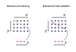

.. _interp:

Interpolating data
==================

.. ipython:: python
    :suppress:

    import numpy as np
    import pandas as pd
    import xarray as xr

    np.random.seed(123456)

Xarray offers flexible interpolation routines, which have a similar interface
to our :ref:`indexing <indexing>`.

.. note::

  ``interp`` requires ``scipy`` installed.

Scalar and 1-dimensional interpolation
--------------------------------------

Interpolating a :py:class:`~xarray.DataArray` works mostly like labeled
indexing of a :py:class:`~xarray.DataArray`,

.. ipython:: python

    da = xr.DataArray(
        np.sin(0.3 * np.arange(12).reshape(4, 3)),
        [("time", np.arange(4)), ("space", [0.1, 0.2, 0.3])],
    )
    # label lookup
    da.sel(time=3)

    # interpolation
    da.interp(time=2.5)

Similar to the indexing, :py:meth:`~xarray.DataArray.interp` also accepts an
array-like, which gives the interpolated result as an array.

.. ipython:: python

    # label lookup
    da.sel(time=[2, 3])

    # interpolation
    da.interp(time=[2.5, 3.5])

To interpolate data with a :py:doc:`numpy.datetime64 <numpy:reference/arrays.datetime>` coordinate you can pass a string.

.. ipython:: python

    da_dt64 = xr.DataArray(
        [1, 3], [("time", pd.date_range("1/1/2000", "1/3/2000", periods=2))]
    )
    da_dt64.interp(time="2000-01-02")

The interpolated data can be merged into the original :py:class:`~xarray.DataArray`
by specifying the time periods required.

.. ipython:: python

    da_dt64.interp(time=pd.date_range("1/1/2000", "1/3/2000", periods=3))

Interpolation of data indexed by a :py:class:`~xarray.CFTimeIndex` is also
allowed.  See :ref:`CFTimeIndex` for examples.

.. note::

  Currently, our interpolation only works for regular grids.
  Therefore, similarly to :py:meth:`~xarray.DataArray.sel`,
  only 1D coordinates along a dimension can be used as the
  original coordinate to be interpolated.

Multi-dimensional Interpolation
-------------------------------

Like :py:meth:`~xarray.DataArray.sel`, :py:meth:`~xarray.DataArray.interp`
accepts multiple coordinates. In this case, multidimensional interpolation
is carried out.

.. ipython:: python

    # label lookup
    da.sel(time=2, space=0.1)

    # interpolation
    da.interp(time=2.5, space=0.15)

Array-like coordinates are also accepted:

.. ipython:: python

    # label lookup
    da.sel(time=[2, 3], space=[0.1, 0.2])

    # interpolation
    da.interp(time=[1.5, 2.5], space=[0.15, 0.25])

:py:meth:`~xarray.DataArray.interp_like` method is a useful shortcut. This
method interpolates an xarray object onto the coordinates of another xarray
object. For example, if we want to compute the difference between
two :py:class:`~xarray.DataArray` s (``da`` and ``other``) staying on slightly
different coordinates,

.. ipython:: python

    other = xr.DataArray(
        np.sin(0.4 * np.arange(9).reshape(3, 3)),
        [("time", [0.9, 1.9, 2.9]), ("space", [0.15, 0.25, 0.35])],
    )

it might be a good idea to first interpolate ``da`` so that it will stay on the
same coordinates of ``other``, and then subtract it.
:py:meth:`~xarray.DataArray.interp_like` can be used for such a case,

.. ipython:: python

    # interpolate da along other's coordinates
    interpolated = da.interp_like(other)
    interpolated

It is now possible to safely compute the difference ``other - interpolated``.

Interpolation methods
---------------------

We use either :py:class:`scipy.interpolate.interp1d` or special interpolants from
:py:class:`scipy.interpolate` for 1-dimensional interpolation (see :py:meth:`~xarray.Dataset.interp`).
For multi-dimensional interpolation, an attempt is first made to decompose the
interpolation in a series of 1-dimensional interpolations, in which case
the relevant 1-dimensional interpolator is used. If a decomposition cannot be
made (e.g. with advanced interpolation), :py:func:`scipy.interpolate.interpn` is
used.

The interpolation method can be specified by the optional ``method`` argument.

.. ipython:: python

    da = xr.DataArray(
        np.sin(np.linspace(0, 2 * np.pi, 10)),
        dims="x",
        coords={"x": np.linspace(0, 1, 10)},
    )

    da.plot.line("o", label="original")
    da.interp(x=np.linspace(0, 1, 100)).plot.line(label="linear (default)")
    da.interp(x=np.linspace(0, 1, 100), method="cubic").plot.line(label="cubic")
    @savefig interpolation_sample1.png width=4in
    plt.legend()

Additional keyword arguments can be passed to scipy's functions.

.. ipython:: python

    # fill 0 for the outside of the original coordinates.
    da.interp(x=np.linspace(-0.5, 1.5, 10), kwargs={"fill_value": 0.0})
    # 1-dimensional extrapolation
    da.interp(x=np.linspace(-0.5, 1.5, 10), kwargs={"fill_value": "extrapolate"})
    # multi-dimensional extrapolation
    da = xr.DataArray(
        np.sin(0.3 * np.arange(12).reshape(4, 3)),
        [("time", np.arange(4)), ("space", [0.1, 0.2, 0.3])],
    )

    da.interp(
        time=4, space=np.linspace(-0.1, 0.5, 10), kwargs={"fill_value": "extrapolate"}
    )

Advanced Interpolation
----------------------

:py:meth:`~xarray.DataArray.interp` accepts :py:class:`~xarray.DataArray`
as similar to :py:meth:`~xarray.DataArray.sel`, which enables us more advanced interpolation.
Based on the dimension of the new coordinate passed to :py:meth:`~xarray.DataArray.interp`, the dimension of the result are determined.

For example, if you want to interpolate a two dimensional array along a particular dimension, as illustrated below,
you can pass two 1-dimensional :py:class:`~xarray.DataArray` s with
a common dimension as new coordinate.

For example:

.. ipython:: python

    da = xr.DataArray(
        np.sin(0.3 * np.arange(20).reshape(5, 4)),
        [("x", np.arange(5)), ("y", [0.1, 0.2, 0.3, 0.4])],
    )
    # advanced indexing
    x = xr.DataArray([0, 2, 4], dims="z")
    y = xr.DataArray([0.1, 0.2, 0.3], dims="z")
    da.sel(x=x, y=y)

    # advanced interpolation, without extrapolation
    x = xr.DataArray([0.5, 1.5, 2.5, 3.5], dims="z")
    y = xr.DataArray([0.15, 0.25, 0.35, 0.45], dims="z")
    da.interp(x=x, y=y)

where values on the original coordinates
``(x, y) = ((0.5, 0.15), (1.5, 0.25), (2.5, 0.35), (3.5, 0.45))`` are obtained
by the 2-dimensional interpolation and mapped along a new dimension ``z``. Since
no keyword arguments are passed to the interpolation routine, no extrapolation
is performed resulting in a ``nan`` value.

If you want to add a coordinate to the new dimension ``z``, you can supply
:py:class:`~xarray.DataArray` s with a coordinate. Extrapolation can be achieved
by passing additional arguments to SciPy's ``interpnd`` function,

.. ipython:: python

    x = xr.DataArray([0.5, 1.5, 2.5, 3.5], dims="z", coords={"z": ["a", "b", "c", "d"]})
    y = xr.DataArray(
        [0.15, 0.25, 0.35, 0.45], dims="z", coords={"z": ["a", "b", "c", "d"]}
    )
    da.interp(x=x, y=y, kwargs={"fill_value": None})

For the details of the advanced indexing,
see :ref:`more advanced indexing <more_advanced_indexing>`.

Interpolating arrays with NaN
-----------------------------

Our :py:meth:`~xarray.DataArray.interp` works with arrays with NaN
the same way that
`scipy.interpolate.interp1d <https://docs.scipy.org/doc/scipy/reference/generated/scipy.interpolate.interp1d.html>`_ and
`scipy.interpolate.interpn <https://docs.scipy.org/doc/scipy/reference/generated/scipy.interpolate.interpn.html>`_ do.
``linear`` and ``nearest`` methods return arrays including NaN,
while other methods such as ``cubic`` or ``quadratic`` return all NaN arrays.

.. ipython:: python

    da = xr.DataArray([0, 2, np.nan, 3, 3.25], dims="x", coords={"x": range(5)})
    da.interp(x=[0.5, 1.5, 2.5])
    da.interp(x=[0.5, 1.5, 2.5], method="cubic")

To avoid this, you can drop NaN by :py:meth:`~xarray.DataArray.dropna`, and
then make the interpolation

.. ipython:: python

    dropped = da.dropna("x")
    dropped
    dropped.interp(x=[0.5, 1.5, 2.5], method="cubic")

If NaNs are distributed randomly in your multidimensional array,
dropping all the columns containing more than one NaNs by
:py:meth:`~xarray.DataArray.dropna` may lose a significant amount of information.
In such a case, you can fill NaN by :py:meth:`~xarray.DataArray.interpolate_na`,
which is similar to :py:meth:`pandas.Series.interpolate`.

.. ipython:: python

    filled = da.interpolate_na(dim="x")
    filled

This fills NaN by interpolating along the specified dimension.
After filling NaNs, you can interpolate:

.. ipython:: python

    filled.interp(x=[0.5, 1.5, 2.5], method="cubic")

For the details of :py:meth:`~xarray.DataArray.interpolate_na`,
see :ref:`Missing values <missing_values>`.

Example
-------

Let's see how :py:meth:`~xarray.DataArray.interp` works on real data.

.. ipython:: python

    # Raw data
    ds = xr.tutorial.open_dataset("air_temperature").isel(time=0)
    fig, axes = plt.subplots(ncols=2, figsize=(10, 4))
    ds.air.plot(ax=axes[0])
    axes[0].set_title("Raw data")

    # Interpolated data
    new_lon = np.linspace(ds.lon[0].item(), ds.lon[-1].item(), ds.sizes["lon"] * 4)
    new_lat = np.linspace(ds.lat[0].item(), ds.lat[-1].item(), ds.sizes["lat"] * 4)
    dsi = ds.interp(lat=new_lat, lon=new_lon)
    dsi.air.plot(ax=axes[1])
    @savefig interpolation_sample3.png width=8in
    axes[1].set_title("Interpolated data")

Our advanced interpolation can be used to remap the data to the new coordinate.
Consider the new coordinates x and z on the two dimensional plane.
The remapping can be done as follows

.. ipython:: python

    # new coordinate
    x = np.linspace(240, 300, 100)
    z = np.linspace(20, 70, 100)
    # relation between new and original coordinates
    lat = xr.DataArray(z, dims=["z"], coords={"z": z})
    lon = xr.DataArray(
        (x[:, np.newaxis] - 270) / np.cos(z * np.pi / 180) + 270,
        dims=["x", "z"],
        coords={"x": x, "z": z},
    )

    fig, axes = plt.subplots(ncols=2, figsize=(10, 4))
    ds.air.plot(ax=axes[0])
    # draw the new coordinate on the original coordinates.
    for idx in [0, 33, 66, 99]:
        axes[0].plot(lon.isel(x=idx), lat, "--k")
    for idx in [0, 33, 66, 99]:
        axes[0].plot(*xr.broadcast(lon.isel(z=idx), lat.isel(z=idx)), "--k")
    axes[0].set_title("Raw data")

    dsi = ds.interp(lon=lon, lat=lat)
    dsi.air.plot(ax=axes[1])
    @savefig interpolation_sample4.png width=8in
    axes[1].set_title("Remapped data")
